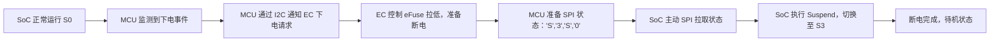

---
title: "理想汽车 嵌入式软件岗位"
date: 2025-07-26
categories: Fall_Reviews
tags: [面经, 理想汽车, 嵌入式软件]
layout: note
excerpt: 两面，一面仔细拷打，二面主要问你什么时候来，开的快就开。
---

# 理想汽车 社招面试记录总结

---

## 🧭 面试概况概览

* **6月23日 一面（技术侧）**：

  * 全程围绕智能座舱项目展开
  * 主要考察项目细节理解、硬件架构关系、通信协议原理与实现
  * 无八股文，纯项目逻辑 + 实操细节 + 角色理解
  * 提及是否有其他 offer，暗示未准备充分

* **6月25日 二面（非校招/急用人）**：

  * 重点问 **入职时间** 与是否能立即到岗
  * 技术提问较少，仅涉及 SoC 下电逻辑 & GPIO 配置

---

## 🛠 项目背景（智能座舱）

* 所属项目：Intel 为 Zeekr 定制的智能座舱硬件方案
* 本人职责：功能验证、Demo 开发（基于 AUTOSAR），调试硬件功能是否符合预期

---

## 🔌 硬件架构关系（SoC / EC / MCU）

### 三者关系：

| 模块                      | 角色定位    | 核心职责                           |
| ----------------------- | ------- | ------------------------------ |
| SoC（主控）                 | 操作系统执行体 | Linux / QNX 执行主系统逻辑            |
| EC（Embedded Controller） | 平台管理者   | 电源管理、电池监测、状态监控、接收 MCU 命令       |
| MCU（如 TC387）            | 功能执行者   | CAN、SPI、I2C 控制，逻辑判断，控制 EC / 外设 |

> **主从关系：** MCU 为主控，EC 为从机，MCU 可通过 I2C 控制 EC 状态（如下电、心跳检测）

---

## 🚗 电源状态转换逻辑（S0 → S3 / S5）

### 唤醒机制：

* **CAN 收发器（如 TJA1043）** 持续监听总线，符合 wakeup 帧拉高 WAKEUP 引脚
* **MCU** 被唤醒 → I2C 读取 EC 状态 → SPI 填写 {‘S’,’0’,’S’,’3’} 等状态帧 → SoC 拉取后唤醒流程

---

## 🧩 通信协议细节整理

### 1. CAN 总线

* **收发器层**：物理信号监听，dominant/recessive 转数字电平
* **TC387 MCMCAN**：过滤器设定，仅接受合法 ID + 格式
* **ISR 服务**：接收中断 → 读取数据 → 判断指令 → 执行对应操作

#### 典型字段说明：

| 字段           | 含义               |
| ------------ | ---------------- |
| Message ID   | 硬件过滤依据（如来源/命令类型） |
| Data Payload | 如“关机请求”、“唤醒状态”   |
| 帧类型          | 标准/扩展帧           |

---

### 2. SPI 驱动逻辑

#### 角色定义：

* **主机（Master）**：SoC（控制 SCLK + CS）
* **从机（Slave）**：MCU（使用 QSPI\_Slave 模式）

#### 典型流程：

1. MCU 调用 `initQSPISlaveBuffers()` 准备 TxBuffer 内容
2. MCU 拉高 `P21.3` 通知主控有新数据
3. SoC 拉低 CS，发起 SPI 通信
4. 双向传输（MOSI+MISO）
5. 中断触发 `RxISR` / `TxISR`

#### 示例内容：

| 状态        | 内容              |
| --------- | --------------- |
| SPI 初始化就绪 | 'S','P','I','1' |
| 请求休眠 S3   | 'S','0','S','3' |
| 请求关机 S5   | 'S','0','S','5' |

---

### 3. I2C 驱动设计

1. 选择 I2C 引脚 / 模块（如 TC387 I2C0）
2. 设置 EC 的地址
3. 实现 `I2C_WriteCommand()` 与 `I2C_ReadStatus()`
4. （项目中未加入中断机制）
5. 加入错误处理机制（如超时、重试）

---

## ⚡ 电源检测机制（VIN 采样）

* **模块**：EVADC + GPIO 控制 eFuse
* **电压阈值：**

  * > 1.65V：断电保护
  * <0.85V：断电保护
  * 恢复：>0.9V
* **防抖机制**：三次连续采样均异常 → 执行动作（每次间隔 10ms）

---

## 🔋 GPIO 配置（初始化表）

* 维护引脚配置表（Pin, Mode, 初始电平）
* 如：PHY\_RST 设置为高电平
* eFuse 控制脚配置为强推拉输出

---

## 🤖 TC387 & MCU 开发关注点

* 更倾向于哪类 MCU 开发方向？

  * 通信栈（SPI/CAN/I2C）
  * 驱动开发
  * RTOS 集成任务管理

---

## 📝 面试改进建议

* [ ] 梳理智能座舱项目的完整逻辑流程图（上电 / 下电 / 通信）
* [ ] 准备关键模块（SPI / CAN / 电源检测）的示意图 + 状态转换图
* [ ] 用清晰语言准备项目介绍，避免靠临时回忆
* [ ] 明确各模块的职责与互动机制（SoC, EC, MCU）

---

## 📌 后续建议

* 若再有面试，一定详备 SPI 通信流程 & 电源控制流程
* 准备一页纸项目简介（包含角色、逻辑、模块分工、难点）
* 入职时间弹性建议提前准备说明，如能实习先行更好

---

*本记录由张子健整理，用于面试复盘与自我提升，欢迎交流改进意见。*
