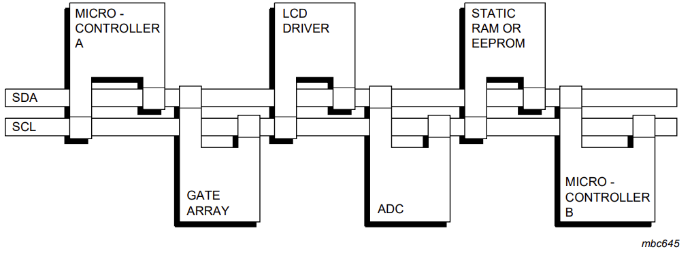

# I2C（Inter-Integrated Circuit）

[官方文档](https://www.nxp.com/docs/en/user-guide/UM10204.pdf)

## 1.I2C 协议基础架构

物理层设计

* 双线制通信：

SDA（Serial Data Line）：数据传输线，双向开漏输出

SCL（Serial Clock Line）：时钟信号线，由主设备控制

它使用一种主从结构，其中有一个主设备（Master）和一个或多个从设备（Slave）。主设备控制通信过程，而从设备被动地接受主设备的控制并进行数据的发送和接收。

下面是I2C通信的基本步骤：

1. 主设备发送一个开始信号，表示开始通信。
2. 主设备发送一个从设备的地址和读/写位。地址用于选中特定的从设备，读/写位用于指示数据的方向（读或写）。
3. 选中的从设备确认收到地址并发送应答信号。
4. 主设备继续发送或接收数据。
5. 数据传输完成后，主设备发送停止信号，表示通信结束。

## 2.I2C的特性

I2C具有以下几个重要的特性，使其成为广泛应用的串行通信协议：

1. 双向通信: I2C支持双向数据传输，即主设备既可以发送数据给从设备，也可以接收从设备发送的数据。
2. 多主模式: I2C允许多个主设备连接到同一条总线上，通过仲裁机制来选择唯一的主设备进行通信，其余的主设备则成为从设备。
3. 多从模式: I2C总线可连接多个从设备，每个从设备都有唯一的7位或10位地址，主设备通过地址来选择要与之通信的从设备。
4. 速率灵活: I2C总线的速率可以根据应用需求进行灵活调整，常见的速率有100 kHz、400 kHz和1 MHz。
5. 低成本: I2C总线只需要两根线来进行通信，降低了硬件成本和复杂性。

## 3.I2C的应用场景

I2C广泛应用于各种电子设备和系统中，常见的应用场景包括但不限于：

1. 传感器与微控制器之间的通信: 例如温度传感器、湿度传感器、加速度计等。传感器作为从设备连接到总线上，微控制器作为主设备进行数据采集和控制。

2. 存储器芯片: I2C被用于与存储器芯片（如EEPROM和RTC芯片）进行通信，实现数据的读写和时钟的管理。

3. 控制外设设备: I2C可以用于与各种外围设备进行通信，如LED驱动器、LCD控制器、扩展IO芯片等，实现控制和数据传输。

4. 显示器控制器: 很多液晶显示器控制器也使用I2C协议进行配置和控制，如OLED显示屏、液晶显示模块等。

5. 工业自动化领域: I2C在工业自动化领域广泛应用，例如工业传感器、PLC等。

