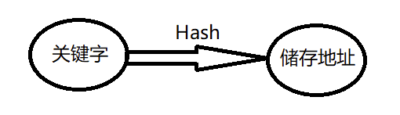

---
title:"Hash map"
layout:note
date: 2025-08-04
excerpt:"hash"
categories: embedded
tags:
  - C++
  - 嵌入式
  - 基础知识
  - hash
---

# Hash

## 1. 哈希表的定义

（1）哈希表的作用

哈希表就是在关键字和存储位置之间建立对应关系，使得元素的**查找可以以O(1)的效率**进行， 其中关键字和存储位置之间是通过散列函数建立关系，记为:

$$
\mathrm{Loc}(i) = \mathrm{Hash}(\mathrm{key}_i)
$$

详细的实现细节不过分赘述，之后如果有时间会进行补充。

