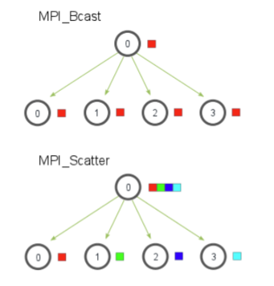
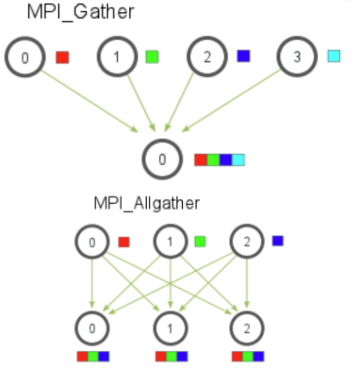

>学习路线，先学习OPENMP，之后学习MPI。


## 1.什么是并行计算

并行计算是一种通过将任务分解为多个子任务并同时在多个处理器或计算节点上执行的计算方式。它的主要目标是提高计算速度和效率，解决那些单一处理器难以快速处理的大规模问题。简而言之就是充分动用服务器硬件资源，将很大计算量的问题分解给不同的核心完成一部分，最终所有核心协作完成所有任务，以起到加速程序运行的效果。

**并行计算的核心内容：计算任务分解、内存访问模型、并行单元间的通信（MPI）**。


## 2.并行计算的基本概念

* 并行性与并发性:
  * 并行性指的是多个任务在同一时间同时执行。
  * 并发性指的是多个任务在系统中交替进行，但这些任务并不一定同时运行。
* 任务划分：
  * 负载均衡：确保任务均匀地分配到所有处理器或核心，避免某些处理器过载而其他处理器闲置。
  * 任务粒度：选择适当的任务粒度，以平衡任务的管理开销和计算效率。粒度过细可能导致管理开销过高，粒度过粗可能导致负载不均。
  * 通信开销：尽量减少处理器之间的数据交换，优化数据局部性，以降低通信开销。
  * 同步开销：减少不同任务之间的同步需求，避免不必要的等待和阻塞。
  * 可扩展性：确保任务划分策略能够适应处理器数量的增加，保持系统性能的可扩展性。
* 并行架构（共享内存与分布式内存）
  * 共享内存架构（对应 OpenMP）：所有处理器共享同一块物理内存。处理器可以直接访问和修改共享的数据。数据共享和同步机制较为直接，不需要显式通信操作。
  * 分布式内存架构（对应 MPI）：每个处理器或计算节点有独立的内存空间。处理器之间通过消息传递进行数据交换。数据交换和通信需要显式管理。
  （举例：翻译100页，每个小组10页，但是10和11有内容想关，必须知道信息，涉及到传输）


## 3.OpenMP

1）OpenMP 概述
* 什么是 OpenMP？
  * OpenMP（Open Multi-Processing）是一种应用程序接口（API），用于在共享内存的多处理器系统上进行并行编程。它通过在代码中添加指令（pragmas）的方式，让程序员能够简单地将串行代码并行化，而不需要深入底层硬件或复杂的多线程管理。OpenMP 支持 C、C++ 和 Fortran 等语言。
* 适用场景：共享内存并行模型

2）OpenMP 编程模型
* 共享内存模型
  * 共享内存模型指的是所有线程在同一个地址空间中共享数据。这意味着不同线程可以访问相同的内存位置，并且可以共享变量的值。
  * 共享变量：在并行区域中，默认情况下，大多数变量是共享的，即所有线程都可以访问和修改这些变量的值。
  * 私有变量：某些情况下，我们可能希望每个线程拥有变量的私有副本，这样不同线程之间不会相互干扰。OpenMP 通过 private 指令指定这些变量。
  * 数据竞争（Race Condition）：由于多个线程同时访问和修改共享变量，可能会导致数据竞争问题。为了避免这种情况，OpenMP 提供了同步机制，如 critical 和 atomic 等。
* 并行区域（Parallel Region）
  * 并行区域是 OpenMP 编程的核心概念。它是由编译器指令#pragma omp parallel 指定的一段代码，告诉 OpenMP 在这段代码中创建多个线程并行执行。


3）OpenMP 基本指令

* #pragma omp parallel
  * 定义一个并行区域，启动多个线程并行执行该区域中的代码。
```
  #pragma omp parallel
{
    // 并行执行的部分
}
```
* #pragma omp parallel for
  * 将循环的迭代分配给多个线程并行执行。

* #pragma omp single
  * 指定代码块只由第一个到达线程执行，其他线程跳过该代码块。


4) OpenMP 中的同步机制
* #pragma omp critical
  * 定义一个临界区，保证代码块在同一时刻只被一个线程执行，以防止竞争条件。
* pragma omp barrier  
  * 强制所有线程在此处同步，确保所有线程都执行到这一步后，才继续执行后续代码。

5) 变量的作用域
* shared：默认情况下，并行区域外申明的变量在并行区域中是共享的，可以使用 shared 子句显式指定变量为共享的。
  ```
  int a;
  #pragma omp parallel for shared(a)
  for (int i = 0; i < n; i++) {
      // a为公有变量
  }
  ```
* private：每个线程在并行区域中有自己独立的变量副本，线程之间相互独立，互不干扰。并行区域内申明的变量默认为私有的，并行区域外申明的变量需要显式申明 private
  ```
  int a;
  #pragma omp parallel for private(a)
  for (int i = 0; i < n; i++) {
      int b;
      //a,b均为私有变量
  }
  ```
* reduction： 用于将每个线程的私有变量在并行区域结束时进行归约（如求和、求最大值等），最终将结果存储到共享变量中。
  ```
  int sum = 0;
  #pragma omp parallel for reduction(+:sum)
  for (int i = 0; i < 10; i++) {
      sum += i;
  }
  ```
6) 调度方法
* static：静态调度将循环的迭代均匀分配给所有线程，并且相邻的迭代会被分配在同一个线程，分配方式在程序开始执行时就已经确定。
  ```
  #pragma omp parallel for schedule(static, 3)
  for (int i = 0; i < n; i++) {
      // 每个线程执行3个连续的迭代
  }
  ```
* dynamic：动态调度在执行时分配迭代，每当一个线程完成当前分配的迭代时，它会动态获取下一个块的迭代。

* guided：引导调度是一种动态调度的变体，但块大小（chunk size）随着任务的完成而逐渐减小。

* auto：自动调度将调度策略的选择权交给编译器或运行时库，由它们决定最佳的调度方式。

* runtime：运行时调度允许在程序运行时通过环境变量设置调度策略。

7) 环境变量
* OMP_SCHEDULE：负责规定调度方式。
* OMP_NUM_THREADS：设置执行期间要使用的最大线程数。
* OMP_PROC_BIND：启用或禁用线程绑定到处理器。有效值为 TRUE 或 FALSE。
* OMP_STACKSIZE：控制创建（非主）线程的堆栈大小。


## 4. MPI

1） MPI 概述
* 什么是 MPI？
  * MPI（Message Passing Interface，消息传递接口）为在分布式内存架构下的进程间通信提供了规范和库支持。在程序的角度，MPI 就是一系列函数接口，他们可以实现不同进程（不同内存区域）之间的消息传递
* 适用场景：分布式内存并行模型


2）MPI 编程模型

* 分布式内存模型
  * 在分布式内存模型中，各个处理节点可以独立运行自己的进程，使用自己的本地内存来存储和处理数据。每个进程的内存是私有的，其他进程无法直接访问它们。如果一个进程需要访问另一个进程的数据，就必须通过显式的消息传递机制将数据从一个进程发送到另一个进程。同一个节点（服务器）内部需要借助高速数据总线等硬件实现，而跨节点的通信通常由网络连接来实现，比如通过高速以太网、IB（InfiniBand）等。
* MPI 的核心概念
  * 进程: 在 MPI 中，每个计算任务由一个或多个进程执行。进程是独立的计算实体，有自己的内存空间。MPI 程序通常启动多个进程，这些进程在分布式内存系统中运行。
  * 通信: MPI 通过消息传递的方式进行进程间通信。主要有两种通信方式
    * 点对点通信（Point-to-Point Communication）: 两个进程之间直接传递消息。例如，进程 A 发送数据给进程 B。
    * 集体通信（Collective Communication）: 多个进程之间进行数据传递或同步操作。例如，广播（broadcast）、归约（reduce）等操作。
  * 通信协议: MPI 提供了多种通信协议，如阻塞通信（Blocking）、非阻塞通信（Non-blocking）、同步通信（Synchronous）等。


* 安装与运行 MPI
  * 晚一些时候进行测试
* MPI 基础函数接口
  * 初始化与终止
    * MPI_Init：初始化 MPI 环境，必须在任何 MPI 调用之前调用。MPI_Init(&argc, &argv);
    * MPI_Finalize：结束 MPI 环境，释放 MPI 使用的资源。MPI_Finalize();
  * 获取进程信息
    * MPI_Comm_size：获取通信子（communicator）中进程的总数。
    ```
    int world_size;
    MPI_Comm_size(MPI_COMM_WORLD, &world_size);
    ```
    * MPI_Comm_rank：获取当前进程在通信子中的编号（从 0 开始）。
    ```
    int world_rank;
    MPI_Comm_rank(MPI_COMM_WORLD, &world_rank);
    ```
  * 点对点通信
    * MPI_Send：发送消息到指定的进程。
    * MPI_Recv：接收来自指定进程的消息。
    ```
    //接口细节
    int MPI_Send(const void *buf, int count, MPI_Datatype datatype, int dest, int tag, MPI_Comm comm);
    /*
    buf: 发送数据的起始地址。
    count: 要发送的数据元素个数。
    datatype: 数据类型（如MPI_INT、MPI_FLOAT）。
    dest: 目标进程的编号。
    tag: 消息标识，用于匹配接收消息。
    comm: 通信子
    */
    //示例
    int number = 42;
    MPI_Send(&number, 1, MPI_INT, 1, 0, MPI_COMM_WORLD);
    ```

* 集合通信
  * MPI_Bcast：将一条消息从一个进程广播到通信子中的所有进程。
  * MPI_Scatter：将根进程的数据分散（scatter）到所有进程中。每个进程接收根进程提供的数据的一部分。  
  
  * MPI_Reduce：对来自所有进程的数据进行归约操作（如求和、求最小值），并将结果发送到根进程。
  * MPI_Gather：将各进程的数据收集到根进程中。
  * MPI_Allgather：将所有进程的部分数据汇总到所有进程。每个进程在所有进程中接收到所有其他进程的数据。
  


## 5.向量化（SIMD）

* 向量化简介
  * 向量化是实现 SIMD 的一种方法，它通过使用特殊的 CPU 指令集来处理数据向量。这些指令集能够一次性对多个数据元素执行相同的操作，从而提高数据处理的效率。
* SIMD
  * 在现代计算中，SIMD（单指令多数据）是一种并行计算技术，它允许单个指令同时对多个数据执行操作。这种技术通过在单个指令周期内处理多个数据来提高性能，特别适合于图像处理、音频处理、科学计算等领域，其中有许多可以并行处理的数据。
* 常见的 SIMD 指令集
  * AVX-512：支持 512 位宽的 SIMD 操作，常见于 Intel 与 AMD 服务器级处理器中。
  * ARM NEON：ARM 架构的 SIMD 指令集，支持 128 位宽的操作。
* 向量化使用方法
  * 通过内联汇编写入代码中：
  * 让编译器自动优化
> Tips:如果你尝试运行了上述的代码并和普通版本的比较，你可能会发现两者速度并没有较大区别。这是因为现代编译器往往集成了自动向量化的能力，能够自动检测可以向量化的部分并在编译时完成向量化。
> 但是编译器只能完成在简单的场景下的自动向量化，如果代码略微复杂，则不能自动向量化。此时我们可以通过修改代码引导编译器完成优化。


## Reference

https://xflops.sjtu.edu.cn/hpc-start-guide/parallel-computing/basic/