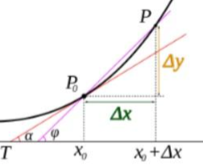
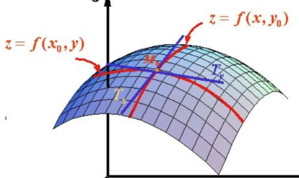
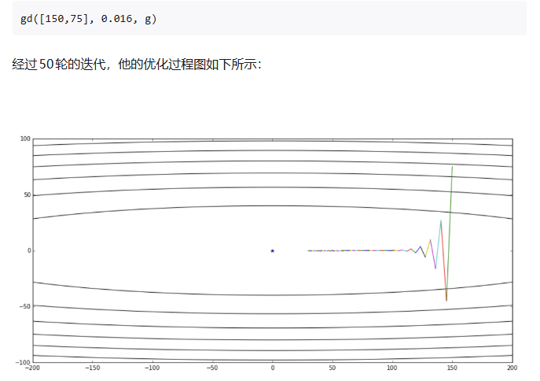
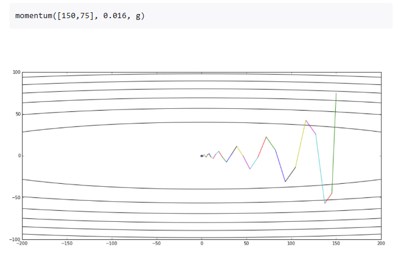
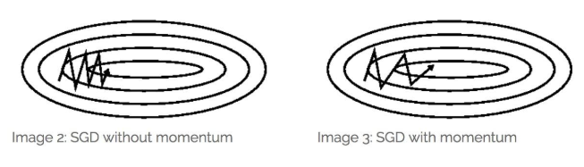

# 梯度优化算法前世今生 （最后是APGD）

## Introduction
APGD (Accelerated Projected Gradient Descent)

在介绍这个进阶算法之前，我们首先需要对其中最基础的算法GD做讲解，然后介绍动量，结合动量从而有Nertrov优化算法，最后结合投影进行优化。

## Gradient Descent
梯度下降算法，是在神经网络，深度学习，计算机图形学，仿真等所有涉及到数值优化领域方向最基础的算法，我们从它入手，解开数值优化的神秘面纱。

### 什么是梯度？

在数学领域，有四个名词很像，分别是导数，偏导数，方向导数，梯度。

* 导数：导数可以表示函数曲线上的切线斜率。
  
* 偏导数: 如果函数的维度上升，存在多变量的函数，那么就存在对不同变量求导这种情况，所以我们选择对其中一个变量求导，计算它的斜率，几何意义是表示固定面上一点的切线斜率。
  

这个时候你是不是应该去问一个问题：我这个偏导数只能表示两个固定方向的斜率，x或y，但是对于一个平面上的一个点，他可能存在无数个方向上的切线，怎么去表示呢？

ok， 为了解决这个问题，数学家提出了一个概念叫方向导数。

* 方向导数：某个方向的导数，本质就是函数在A点上无数个切线的斜率的定义，每个切线都代表一个方向，每个方向都是有方向导数的。

举个例子来展示求解方式：

u=f(x,y) ，二元函数；

对于二元函数，求某点 $\left(x_{0}, y_{0}\right)$ 沿某方向 l 的方向导数：
$$
\begin{array}{c} \left.\frac{\partial f}{\partial l}\right|_{\left(x_{0}, y_{0}\right)}= f_{x}^{\prime}\left(x_{0}, y_{0}\right) \cos \alpha+f_{y}^{\prime}\left(x_{0}, y_{0}\right) \cos \beta \end{array}
$$
其中：l 方向上单位向量是 $\vec{e_l}=\left(\cos \alpha ,\cos \beta \right)，cos\alpha,cos\beta$ 是方向余弦。

最后，把所有方向函数这个标量收集起来，写成一个带方向的矢量，把方向导数这个线性算子编码起来，就是最重要的梯度！

* 梯度：梯度是一个矢量，在其方向上的方向导数最大，也就是函数在该点处沿着梯度的方向变化最快，变化率最大。

现在你是不是还应该有个问题？

为什么梯度告诉你“往哪走最快、能快到什么程度”？

why? Tell me Why??
因为，任意方向的瞬时上升速度（方向导数）都等于梯度和该方向的点积；而点积在单位向量集合上的最大值

ok! 它的特性就可以被我们使用，在机器学习中逐步逼近、迭代求解最优化时，使用梯度，沿着梯度向量的方向是函数增加的最快，更容易找到函数的最大值，反过来，沿着梯度向量相反的地方，梯度减少的最快，更容易找到最小值。

### 什么是梯度下降？
举个常见的例子：你站在山上某处，想要尽快下山，于是决定走一步算一步，也就是每走到一个位置时，求解当前位置的梯度，沿着梯度的负方向，也就是当前最陡峭的位置向下走，这样一直走下去，很可能走不到山脚，而是某个局部的山峰最低处。（也就是我们说的陷入局部最优）。

梯度下降法就是沿着梯度下降的方向求解极小值，沿着梯度上升的方向可以求得最大值，这种方法叫梯度上升。

收敛终点是**梯度绝对小*或者根据你自己设置，小于你的设定值。

**那么什么情况才可以拜托局部最优呢？**

这个与损失函数有关，当损失函数是凸函数的话，可以找到全局最优。

了解如下几个梯度下降相关的重要概念：(结合动力学仿真和机器学习一起讲)

* 步长（Learning rate / 迭代步长）: 按照刚才的例子，步长就是你得到最佳的行走方向后，这步你走多大，很重要！我会在之后告诉你为什么重要。

不同的场景中步长的选择需要实验和权衡，步长越长，在陡峭区域下降的越快，但在平缓区容易出现反复抖动而找不到最优点；步长越短越不易产生抖动，但是容易陷入局部最优解。

如果不明白，我在具体的说一下：

当你选择步长太大，你可能走过了最佳点，然后再反向走回来，再走过去，出现抖动；

当你选择步长太小，可能走到一个山谷后走不出去，已经看作了最优解，出现了局部最优解的情况。

学习率（step size、迭代步长）本质上就是你在“这一步要走多远”。

* 假设函数（hypothesis function） ：也就是我们要求解的目标函数。

### 梯度下降的例子：

最小化
$$
[
f(x_0,x_1)=x_0^2+50x_1^2
]
$$

它的梯度是

$$
\nabla f(x)=\begin{bmatrix}2x_0\\100x_1\end{bmatrix}
$$

梯度下降更新公式

选择步长（学习率）(\alpha>0)，迭代
$$
x^{k+1}=x^{k}-\alpha\,\nabla f(x^{k})
$$

 具体数值演示（从 ([150,75]) 出发，取 $(\alpha=0.01)$）

* **初始：** $(x^{(0)}=(150,75))$
  函数值
  $$
  f(x^{(0)})=150^2+50\cdot 75^2=22500+281250=303750
  $$

  梯度
  $$
  \nabla f(x^{(0)})=(300,\;7500)
  $$

  一步更新
  $$
  x^{(1)}=(147,\,0)
  $$

* **第 1 步后：**
  函数值
  $$
  f(x^{(1)})=147^2=21609
  $$

  梯度
  $$
  \nabla f(x^{(1)})=(294,\,0)
  $$

  再更新
  $$
  x^{(2)}=(144.06,\,0)
  $$

* **第 2 步后：**
  函数值（只剩 (x_0) 方向在慢慢降）
  $$
  f(x^{(2)})=144.06^2\approx 20753.2836
  $$

你会发现：第一步把“陡峭”的 ($x_1$) 方向（权重 50）**迅速拉到 0**，随后在“平缓”的 ($x_0$) 方向上**稳步减小**，直到收敛到最小点 ((0,0))。

## Momentum 动量
上面讲了关于梯度算法，我们发现它存在很多问题，第一就是收敛慢，第二是容易陷入局部最优解，所有在数学家聪明的大脑下，诞生了一种新的算法思路，借助物理上的动量的概念把之前的信息记录来加速求解。

什么是动量：我用我自己的理解来说，不一定准确，你把一个没有质量点，给予一个虚拟的质量，那么他在进行梯度下降的算法运动时，就会拥有动量的概念，从而可以记录之前的运动状态，因此一个已经完成的梯度+步长的组合不会立刻消失，只是会以一定的形式衰减，剩下的能量将继续发挥余热。

动量在“对的方向”叠加推进、在“错的方向”抵消抖动；

下面是博主提供的例子：

梯度下降：

momentum

震荡明显偏少，但是还是存在不少问题，会让过冲冲的更猛。但是优势就是可以让收敛速度加快。

## Nesterov Accelerated Gradient

这个算法，神奇就神奇在几乎没有改变动量算法，只做了一点点微小的工作，形式上发生了一点看似无关痛痒的改变，却能够显著地提高优化效果。

Momentum的想法很简单，就是多更新一部分上一次迭代的更新量，来平滑这一次迭代的梯度。

动量算法的公式：
$$
d_i=\beta\, d_{i-1}+g(\theta_{i-1}),\qquad

\theta_i=\theta_{i-1}-\alpha\, d_i
$$

我现在知道你每次迭代都会多走$\alpha\beta\, d_{i-1}$，那我为什么不先走怎么多，在这个中间点，再计算新的梯度去求解呢？为什么还要拿之前的梯度呢？ok，现在你已经领悟了Nestrov的精髓。

所以我们就能得出新的公式如下：
$$
d_i=\beta\, d_{i-1}+g\!\left(\theta_{i-1}-\alpha\beta\, d_{i-1}\right),\qquad
\theta_i=\theta_{i-1}-\alpha\, d_i
$$
所以你能看出，NAG和Momentum的区别就是在梯度更新的位置不同，它相当于内置了一个中间点，在这个中间点的位置计算新的梯度。

我们对公式进行一下推导：给出NAG的原始形式到等效形式的推导

原始形式：
$$
\begin{aligned}
d_i &= \beta d_{i-1} + g\!\bigl(\theta_{i-1}-\alpha\beta d_{i-1}\bigr),\\
\theta_i &= \theta_{i-1}-\alpha d_i .
\end{aligned}
$$

可得：

$$
\begin{aligned}
\theta_i-\alpha\beta d_i
&= \theta_{i-1}-\alpha(\beta+1)d_i \\[2pt]
&= \theta_{i-1}-\alpha(\beta+1)\!\left[\beta d_{i-1}+g\!\bigl(\theta_{i-1}-\alpha\beta d_{i-1}\bigr)\right] \\[2pt]
&= \theta_{i-1}-\alpha\beta d_{i-1}-\alpha\beta^2 d_{i-1}-\alpha(\beta+1)\,g\!\bigl(\theta_{i-1}-\alpha\beta d_{i-1}\bigr).
\end{aligned}
$$

记：
$$
\boxed{
\begin{aligned}
\hat{\theta}_i &\triangleq \theta_i-\alpha\beta d_i,\\
\hat{\theta}_{i-1} &\triangleq \theta_{i-1}-\alpha\beta d_{i-1},\\
\hat{d}_i &\triangleq \beta^2 d_{i-1}+(\beta+1)\,g(\hat{\theta}_{i-1}).
\end{aligned}}
$$

上式代入上上式，就得到了NAG等效形式的第二个式子：

$$
\boxed{\ \hat{\theta}_i=\hat{\theta}_{i-1}-\alpha\,\hat{d}_i\ }.
$$

展开$\hat d_i$：

$$
\begin{aligned}
\hat d_i
&= \beta^2 d_{i-1}+(\beta+1)g(\hat{\theta}_{i-1}) \\
&= (\beta+1)g(\hat{\theta}_{i-1})+\beta^2\!\left(\beta d_{i-2}+g(\hat{\theta}_{i-2})\right) \\
&= (\beta+1)g(\hat{\theta}_{i-1})+\beta^2 g(\hat{\theta}_{i-2})+\beta^3 d_{i-2} \\
&= (\beta+1)g(\hat{\theta}_{i-1})+\beta^2 g(\hat{\theta}_{i-2})+\beta^3\!\left(\beta d_{i-3}+g(\hat{\theta}_{i-3})\right) \\
&= (\beta+1)g(\hat{\theta}_{i-1})+\beta^2 g(\hat{\theta}_{i-2})+\beta^3 g(\hat{\theta}_{i-3})+\beta^4 d_{i-3}\\
&\ \ \vdots \\
&= (\beta+1)g(\hat{\theta}_{i-1})+\beta^2 g(\hat{\theta}_{i-2})
   +\beta^3 g(\hat{\theta}_{i-3})+\beta^4 g(\hat{\theta}_{i-4})+\beta^5 g(\hat{\theta}_{i-5})+\cdots
\end{aligned}
$$

于是我们可以写出$\hat d_{i-1}$的形式，然后用$\hat d_i$减去$\beta\hat d_{i-1}$消去后面的无穷多项，就得到了NAG等效形式的第一个式子：

$$
\beta\hat d_{i-1}
= \beta(\beta+1)g(\hat{\theta}_{i-2})+\beta^3 g(\hat{\theta}_{i-3})
+\beta^4 g(\hat{\theta}_{i-4})+\beta^5 g(\hat{\theta}_{i-5})+\cdots
$$

$$
\begin{aligned}
\hat d_i-\beta\hat d_{i-1}
&= (\beta+1)g(\hat{\theta}_{i-1})-\beta g(\hat{\theta}_{i-2}) \\
&= g(\hat{\theta}_{i-1})+\beta\!\left[g(\hat{\theta}_{i-1})-g(\hat{\theta}_{i-2})\right].
\end{aligned}
$$

这个NAG的等效形式与Momentum的区别在于，本次更新方向多加了一个$\beta\!\left[g(\hat{\theta}_{i-1})-g(\hat{\theta}_{i-2})\right]$, 它的直观含义就很明显了：如果这次的梯度比上次的梯度变大了，那么有理由相信它会继续变大下去，那我就把预计要增大的部分提前加进来；如果相比上次变小了，也是类似的情况。

这个就是用梯度近似的二阶导的信息（利用了一阶梯度的变化量即二阶导数。），所以NAG本质上是多考虑了目标函数的二阶导信息，怪不得可以加速收敛了！其实所谓“往前看”的说法，在牛顿法这样的二阶方法中也是经常提到的，比喻起来是说“往前看”，数学本质上则是利用了目标函数的二阶导信息。

## APGD
基于Nestrov我们可以进一步的应用到我们的多体动力学仿真上，也就是把摩擦锥加进去。

## Reference
* [什么是梯度下降](https://zhuanlan.zhihu.com/p/113714840)

* [方向导数怎么求（计算公式直接代）](https://www.zhihu.com/tardis/zm/art/539530037?source_id=1005)

* [路遥知马力——Momentum](https://zhuanlan.zhihu.com/p/21486826)

* [比Momentum更快：揭开Nesterov Accelerated Gradient的真面目](https://zhuanlan.zhihu.com/p/22810533) 