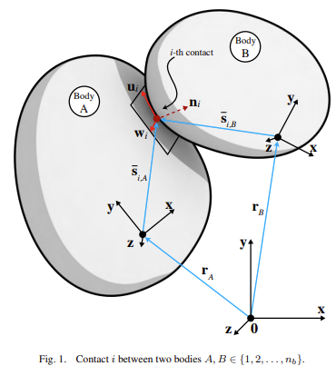

## 2. 背景（Background）

在三维欧氏空间中描述刚体 $j$ 的位置与姿态的**广义坐标**分别为 $\mathbf{r}_j \in \mathbb{R}^3$ 与 $\boldsymbol{\varepsilon}_j \in \mathbb{R}^4$。前者给出刚体 $j$ 质心的绝对位置，后者为一组**欧拉参数（四元数）**，用于在全局参考系下表征刚体的取向。由 $n_b$ 个刚体组成的系统，其广义坐标集合写作

$$
\mathbf{q}=\begin{bmatrix}
\mathbf{r}_1^{\mathsf T},\ \boldsymbol{\varepsilon}_1^{\mathsf T},\ \ldots,\ \mathbf{r}_{n_b}^{\mathsf T},\ \boldsymbol{\varepsilon}_{n_b}^{\mathsf T}
\end{bmatrix}^{\mathsf T}\in\mathbb{R}^{7n_b},
$$

其时间导数为

$$
\dot{\mathbf{q}}=\begin{bmatrix}
\dot{\mathbf{r}}_1^{\mathsf T},\ \dot{\boldsymbol{\varepsilon}}_1^{\mathsf T},\ \ldots,\ \dot{\mathbf{r}}_{n_b}^{\mathsf T},\ \dot{\boldsymbol{\varepsilon}}_{n_b}^{\mathsf T}
\end{bmatrix}^{\mathsf T}\in\mathbb{R}^{7n_b}.
$$

为了建立牛顿–欧拉方程，本文不直接使用 $\dot{\mathbf{q}}$，而改用

$$
\mathbf{v}=\begin{bmatrix}
\dot{\mathbf{r}}_1^{\mathsf T},\ \boldsymbol{\omega}_1^{\mathsf T},\ \ldots,\ \dot{\mathbf{r}}_{n_b}^{\mathsf T},\ \boldsymbol{\omega}_{n_b}^{\mathsf T}
\end{bmatrix}^{\mathsf T}\in\mathbb{R}^{6n_b},
$$

其优点在于：（i）未知量更少；（ii）可得到**常数、对称且正定**的质量矩阵。

对每一个刚体 $B$，存在一个简单的**线性变换**，将其以**体固系**表达的角速度 $\bar{\boldsymbol{\omega}}_B$ 与欧拉参数的时间导数 $\dot{\boldsymbol{\varepsilon}}_B$ 相联系。具体为

$$
\bar{\boldsymbol{\omega}}_B = 2\,\mathbf{G}\!\left(\boldsymbol{\varepsilon}_B\right)\,\dot{\boldsymbol{\varepsilon}}_B,
$$

其中矩阵 $\mathbf{G}\in\mathbb{R}^{3\times4}$ 的各元素**线性依赖**于欧拉参数 $\boldsymbol{\varepsilon}_B$。

$$
\mathbf G(\boldsymbol\varepsilon)=
\begin{bmatrix}
-e_1 & e_0 & e_3 & -e_2\\
-e_2 & -e_3 & e_0 & e_1\\
-e_3 & e_2 & -e_1 & e_0
\end{bmatrix}.
$$   
（不同版本可能只差符号或行列顺序，本质等价。）

定义分块对角矩阵

$$
\mathbf{L}(\mathbf{q}) \equiv \mathrm{diag}\!\Big[
\mathbf{I}_{3\times3},\ \tfrac{1}{2}\mathbf{G}^{\mathsf T}(\boldsymbol{\varepsilon}_1),\ \ldots,\ 
\mathbf{I}_{3\times3},\ \tfrac{1}{2}\mathbf{G}^{\mathsf T}(\boldsymbol{\varepsilon}_{n_b})
\Big]\in\mathbb{R}^{7n_b\times6n_b},
$$

其中 $\mathbf{I}_{3\times3}$ 为单位阵，则有

$$
\dot{\mathbf{q}}=\mathbf{L}(\mathbf{q})\,\mathbf{v}.
$$

把“物理速度”转换成“参数速度”

**因为建模/求解用 $\mathbf v$ 更舒服，但积分与几何都离不开 $\dot{\mathbf q}$。**

所以做法是“混合坐标”：方程里用 $\mathbf v=[\dot{\mathbf r};\boldsymbol\omega]$ 去写牛顿–欧拉方程，解完后再用

$$
\dot{\mathbf q}=\mathbf L(\mathbf q)\,\mathbf v
$$

把它变回“参数速度”，以更新位姿、计算雅可比与约束速度。

---

### 2.1 建模要点（Modeling Aspects）

考虑图 1 中所示的两刚体 $A$ 与 $B$ 的接触。对物体 $A$，在接触点 $i$ 处取法向量 $\mathbf{n}_{i,A}$，其与该点的切平面正交，并指向**物体 $A$ 的外部**。再选取两条互相正交的单位向量 $\mathbf{u}_{i,A}$ 与 $\mathbf{w}_{i,A}$，与 $\mathbf{n}_{i,A}$ 一起在 $A$ 上构成右手坐标系，作为接触点 $i$ 的局部参考系。对物体 $B$ 亦按同样步骤定义，以 $\mathbf{n}_{i,B},\,\mathbf{u}_{i,B},\,\mathbf{w}_{i,B}\in\mathbb{R}^3$ 构成其局部系。

与接触 $i$ 相关联的**拉格朗日乘子** $\hat{\gamma}_i$ 被用来就**间隙（距离）**函数 $\Phi$ 在两物体 $A$ 与 $B$ 之间建立**互补性条件**：

$$
0 \le \hat{\gamma}_{i,n}\ \perp\ \Phi_i(\mathbf{q}) \ge 0 .
$$

当两物体**恰好接触**时，$\Phi_i(\mathbf{q})=0$；否则 $\Phi_i(\mathbf{q})>0$。若接触几何在接触处**光滑且凸**，则构造 $\Phi_i(\mathbf{q})$ 相对直接。对于**复杂且/或非凸**的几何，精确定义 $\Phi_i(\mathbf{q})$ 可能较为困难，这超出了本文讨论范围。

约定，$\alpha_i \equiv \alpha_i,A$，其中 $\alpha \in \{\mathbf n,\mathbf u,\mathbf w\}$。与接触点 $i$ 相关的接触力可分解为**法向分量**与**切向分量**。
法向分量：

$$
\mathbf F_{i,N}=\hat\gamma_{i,n}\,\mathbf n_i,
$$

切向分量：

$$
\mathbf F_{i,T}=\hat\gamma_{i,u}\,\mathbf u_i+\hat\gamma_{i,w}\,\mathbf w_i,
$$

其中乘子 $\hat\gamma_{i,n}\ge 0,\ \hat\gamma_{i,u},\ \hat\gamma_{i,w}$ 表示各方向上的力幅值。摩擦力假设满足**库仑干摩擦模型**可写为

> 互补条件（粘—滑切换）
> 
> 方向对齐（反向做功）
$$
\|\mathbf v_{i,T}\|\!
\left(\sqrt{\hat\gamma_{i,u}^{\,2}+\hat\gamma_{i,w}^{\,2}}-\mu_i\,\hat\gamma_{i,n}\right)=0,\qquad
\left\langle \mathbf F_{i,T},\,\mathbf v_{i,T}\right\rangle=-\|\mathbf F_{i,T}\|\,\|\mathbf v_{i,T}\|,
\tag{1}
$$

并满足
> 圆锥约束（不等式）
$$
\sqrt{\hat\gamma_{i,u}^{\,2}+\hat\gamma_{i,w}^{\,2}}\le \mu_i\,\hat\gamma_{i,n}.
$$

其中 $\mathbf v_{i,T}$ 为在接触点处刚体 $A$ 与 $B$ 的**相对切向速度**。以上方程是如下**优化问题**的一阶 Karush–Kuhn–Tucker（KKT）**最优性条件**，该优化问题在两个虚变量 $y,z\in\mathbb R$ 上定义：

$$
\big(\hat\gamma_{i,u},\hat\gamma_{i,w}\big)
=\operatorname*{arg\,min}_{\sqrt{y^{2}+z^{2}}\le \mu_i\,\hat\gamma_{i,n}}
\ \mathbf v_{i,T}^{\top}\big(y\,\mathbf u_i+z\,\mathbf w_i\big).

$$

第 $i$ 个接触点的合力记为 $\mathbf F_i=\mathbf F_{i,N}+\mathbf F_{i,T}$，并满足
$\mathbf F_{i,T}=\hat\gamma_{i,n}\,\mathbf n_i+\hat\gamma_{i,u}\,\mathbf u_i+\hat\gamma_{i,w}\,\mathbf w_i$，
即 $\mathbf F_i\in\mathcal C_i$。其中 $\mathcal C_i$ 是一枚**圆锥**：其半角斜率为 $\tan^{-1}\mu_i$，顶点在接触点 $i$，轴线沿 $\mathbf n_i$ 指向外侧。形式化地，

$$
\mathcal C_i=\left\{\,\mathbf x=[y,z,t]^{\top}\in\mathbb R^3\ \big|\ y^2+z^2\le \mu_i^2\,t^2,\ t\ge 0\,\right\},
$$

并以接触点为锥尖、$\mathbf n_i$ 为锥轴方向。

---

