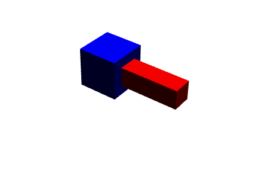

---
title: 毕设第11周工作
date: 2025-07-21
layout: note
excerpt: 测试其他的等式约束的关节及摩擦锥投影。:)
---

# WEEK 11  （21.06.2025-25.07.2025）

- [x] 测试其他的等式约束的关节

- [x] 加入摩擦力，做这些测试，按道理来时没问题

## TASK:测试其他的等式约束关节

以下这些关节：

- **01_Hinge**：铰链关节（Revolute Joint），允许绕单一轴旋转；  
- **02_Prismatic**：棱柱关节（Prismatic/Slider Joint），允许沿单一方向平移；  
- **03_Rigid**：刚性约束，将两个物体固定在一起不发生相对运动；  
- **04_BallInSocket**：球窝关节（Spherical Joint），允许在所有方向上自由转动。

主要是使用自己写的APGD的solver和dantzig做对比。

### **01_Hinge**

迭代次数调整成500没问题。100会有问题，找不到最佳结果，所以需要调整到500。

测试正常，没有问题。

<video width="640" height="360" controls>
  <source src="../MA_weeklyplan_image/JointHinge.mp4" type="video/mp4">
  你的浏览器不支持 Video 标签。
</video>

### **02_Prismatic**

<video width="640" height="360" controls>
  <source src="../MA_weeklyplan_image/Prismatic.mp4" type="video/mp4">
  你的浏览器不支持 Video 标签。
</video>

### **03_Rigid**

固定不动。

### **04_BallInSocket**

<video width="640" height="360" controls>
  <source src="../MA_weeklyplan_image/BallInSocket.mp4" type="video/mp4">
  你的浏览器不支持 Video 标签。
</video>

测试没问题

现在去围绕摩擦力去做分析：摩擦力也是没问题的，可以作为一个问题去讨论。

尝试打开摩擦投影，查看是不是会失效。

测试通过，没有任何问题。