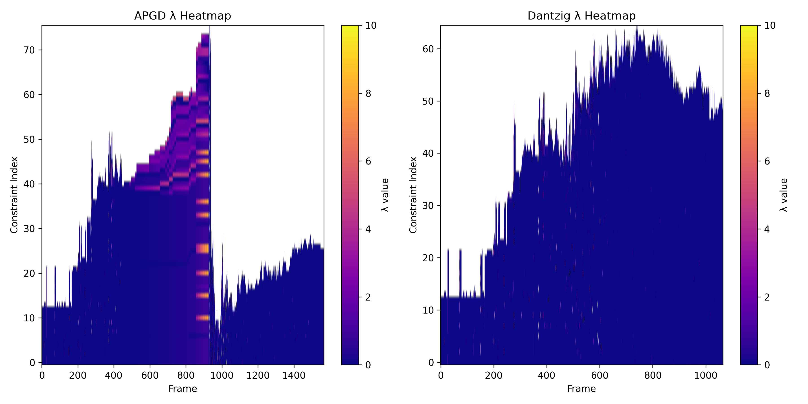
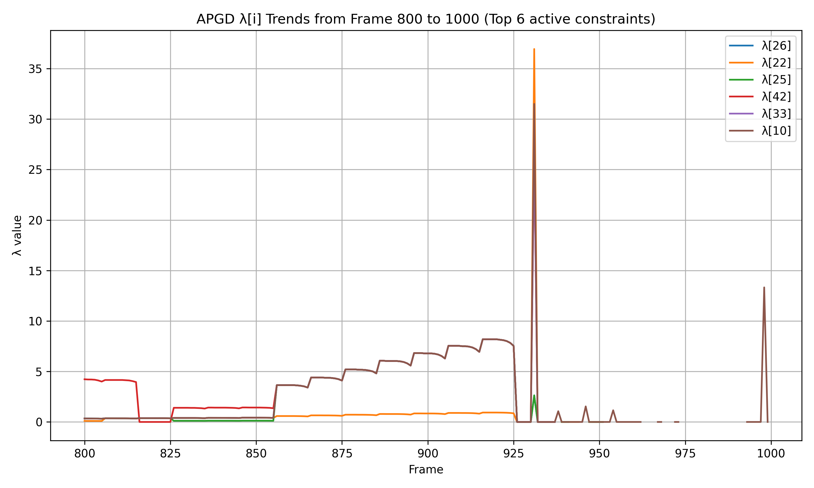
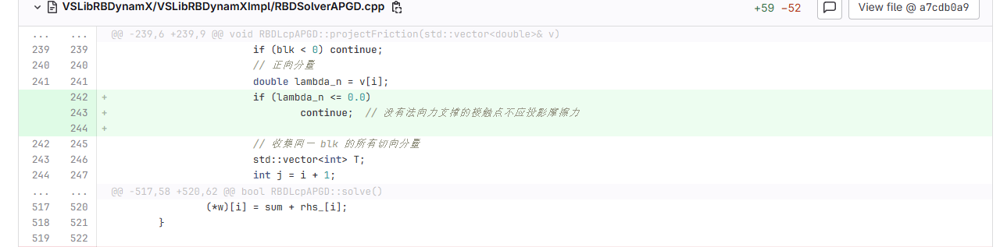

---
title: 毕设第12周工作
date: 2025-07-26
layout: note
excerpt: 已初步完成求解器的工作，现阶段工作为继续完善，以及解决一些bugs。:)
---


# WEEK 12（25.06.2025-01.08.2025）

>**考证：我查了下 APGD在处理大规模碰撞问题时比PGS快一个数量级  ,有可能是因为CCP摩擦你还木有加进去  或者其他人用了并行运算**

> *情况说明：因为本周一和周二，个人出去玩请假两天，所以需要在周末补工作量，所以将周计划调整到周五到下周五*

- [x] 解决问题3个
  - [x] 1.为什么在迭代次数增加后反而会出现刚体弹飞的现象
  - [x] 2.为什么在加入摩擦力后，所有的碰撞算法是正常的，在没加入contact friction 的时候，第二个和第三个碰撞算法是不可行的。
  - [x] 3.求证是否可以微调参数，来增加实时性
- [ ] motor velocity的模型测试
- [ ] 关节内部的friction(另外三个)测试，不用作fix的
- [ ] spring damping 测试（优先级低）
- [ ] APGD算法部分的论文
- [ ] 证明算法更好（100刚体），想办法，出图，数据罗列等，去证明这个问题。
- [ ] CCP转化QP建模(可以后续去做)

## 2025.07.25

### Task: 解决bug
BUG1 - 为什么在迭代次数增加后反而会出现刚体弹飞的现象?

测试模式： CDTest6.vme

现象如下列视频：
<video width="640" height="360" controls>
  <source src="../MA_weeklyplan_image/迭代次数增加，弹飞问题.mp4" type="video/mp4">
  你的浏览器不支持 Video 标签。
</video>


尝试打开warm-start在最后一个时刻崩飞，开和不开区别不大。

将两个求解器，Dantzig和APGD打上时间步长后，输出两个两个数据文件，进行可视化分析。

[Google Colab 可视化 .dat](https://colab.research.google.com)

 


两种求解器热力图对比：

可视化结果如下：


结果分析：

 - 横轴：时间帧（仿真 step）
 - 纵轴：λ 分量编号（即约束 index）
 - 颜色亮度：λ 值大小，越亮表示反作用力越大


🔍 APGD λ Heatmap（左图）分析

特征1：第 600 \~ 900 帧，λ 逐步增强（横向阶梯）

* 对应约束编号：**约 50 \~ 70**
* 现象：出现了**持续上升的阶梯状高 λ**
* 可能原因：

  * 刚体系统在这段时间发生了接触积累、约束饱和，λ 被“撑起来”
  * 多个摩擦锥或者接触点 λ\[i] 在逐帧累加发力（典型的投影震荡或刚性炸裂）

特征2：第 900 帧瞬间 λ 全黑 → 突然归零

* 说明此时 APGD 解出的 λ 突然全部接近 0，**可能是发生了刚体脱落、求解器失败、或被强行 reset**
* 你应该重点去看 **第 900 帧** 的：

  * 解是否收敛？
  * 刚体是否“飞走”了？
  * 是否手动重置了系统状态？

特征3：第 800 帧某些 λ\[i] 高亮（λ > 8）

* 明显看到几列接近亮白（颜色条上限是 10），说明这些 λ 非常大
* 高风险区域：λ\[60] \~ λ\[70]，是 **主要爆点**


对800-1000帧进行分析：

 APGD λ 向量中最活跃的分量（即变化最明显/值最大的分量）在第800到1000帧之间的趋势



| λ\[i] 分量               | 行为                                            | 关键帧       | 可能原因                    |
| ---------------------- | --------------------------------------------- | --------- | ----------------------- |
| **λ\[22]**             | ⚠️ 在 **第927帧** 突然飙升至 **约36**，随后掉回0            | 帧927      | 投影失败 or 接触剧烈插入，系统瞬间冲击   |
| **λ\[10]**             | ⚠️ 从 **帧850开始逐帧爬升**，在 **帧922急剧掉到0**，之后仍断断续续出现 | 帧850\~922 | 接触力逐步累积，帧922接触可能解除或系统崩溃 |
| **λ\[25]**             | 💥 帧927突刺（10以上），瞬时接触或摩擦冲击                     | 帧927      | 接触碰撞瞬间高 λ               |
| **λ\[42]**             | ⚠️ 帧800开始λ较高（约4），后逐渐下降、稳定                     | 帧800\~820 | 接触存在但被快速稳定吸收            |
| **λ\[33]**, **λ\[26]** | 变化不大，仅有小幅波动，未导致异常                             | /         | 稳定约束分量                  |


代码中是完成了，摩擦锥的建模的，所以应该不是没有摩擦锥建模而导致单一方向数值跑飞的这种情况。


OK！！！！！！！！！！！

BUG修复，原因如下：



在没有这段判断之前，你的 `projectFriction` 会 **不分状况地** 对所有块（block）做摩擦投影——即便此时 **法向 λₙ 已经是 0 或负值**（表示两刚体已经分离或者根本没接触），你仍然在切向上给它们“施加”摩擦缩放。这会带来两个恶果：

1. **人为制造摩擦力**
   当 `λₙ ≤ 0` 时，物理上根本没有接触，摩擦应当为零。但如果不跳过，你就会对切向 λ 做缩放投影，给出一个错误的非零摩擦力，反而把系统“拉”向错误的方向。

2. **累积数值误差导致发散**
   这些非物理的摩擦力在 APGD 的投影-加速循环里被不断放大／叠加，最终演化成越来越大的 λ，直到把刚体“弹飞”。

加上

```cpp
if (lambda_n <= 0.0)
    continue;
```

后，你就 **完全跳过了分离状态下的摩擦投影**，保证只有在真正有接触（λₙ>0）时才施加摩擦锥约束。这样：

* 切向分量不会因“无接触”而被错误缩放，
* 也就不会产生那种离谱的摩擦冲量去破坏系统平衡，
* APGD 迭代中停止了这股“黑箱”错误扭曲力的注入，数值才恢复稳定，刚体不再弹飞。

**所以，这个判断一加上，就根本切断了非物理摩擦生成的根源，Bug 自然被修复了。**


BUG 2.为什么在加入摩擦力后，所有的碰撞算法是正常的，在没加入contact friction 的时候，第二个和第三个碰撞算法是不可行的。

也已经被解决


BUG3.求证是否可以微调参数，来增加实时性

先做简单尝试，在后期在作为工作做比对

 - 对tol进行了调小，主要是速度从0.16  -  0.18 变化不大
 - 加上warmstart，没变化，可能更慢

本问题之后求证