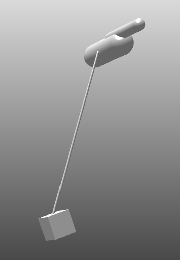

---
title: 毕设第12周工作
date: 2025-07-26
layout: note
excerpt: 已初步完成求解器的工作，现阶段工作为继续完善，以及解决一些bugs。:)
---


# WEEK 12（25.06.2025-01.08.2025）

>**考证：我查了下 APGD在处理大规模碰撞问题时比PGS快一个数量级  ,有可能是因为CCP摩擦你还木有加进去  或者其他人用了并行运算**

> *情况说明：因为本周一和周二，个人出去玩请假两天，所以需要在周末补工作量，所以将周计划调整到周五到下周五*

- [x] 解决问题3个
  - [x] 1.为什么在迭代次数增加后反而会出现刚体弹飞的现象
  - [x] 2.为什么在加入摩擦力后，所有的碰撞算法是正常的，在没加入contact friction 的时候，第二个和第三个碰撞算法是不可行的。
  - [x] 3.求证是否可以微调参数，来增加实时性
- [x] motor velocity的模型测试
- [x] 关节内部的friction(另外三个)测试，不用作fix的
- [x] spring damping 测试（优先级低）
- [ ] APGD算法部分的论文
- [ ] 证明算法更好（100刚体），想办法，出图，数据罗列等，去证明这个问题。
- [ ] CCP转化QP建模(可以后续去做)

---

## 2025.07.25

### Task: 解决bug
BUG1 - 为什么在迭代次数增加后反而会出现刚体弹飞的现象?

测试模式： CDTest6.vme

现象如下列视频：
<video width="640" height="360" controls>
  <source src="../MA_weeklyplan_image/迭代次数增加，弹飞问题.mp4" type="video/mp4">
  你的浏览器不支持 Video 标签。
</video>


尝试打开warm-start在最后一个时刻崩飞，开和不开区别不大。

将两个求解器，Dantzig和APGD打上时间步长后，输出两个两个数据文件，进行可视化分析。

[Google Colab 可视化 .dat](https://colab.research.google.com)

 


两种求解器热力图对比：

可视化结果如下：


结果分析：

 - 横轴：时间帧（仿真 step）
 - 纵轴：λ 分量编号（即约束 index）
 - 颜色亮度：λ 值大小，越亮表示反作用力越大


🔍 APGD λ Heatmap（左图）分析

特征1：第 600 \~ 900 帧，λ 逐步增强（横向阶梯）

* 对应约束编号：**约 50 \~ 70**
* 现象：出现了**持续上升的阶梯状高 λ**
* 可能原因：

  * 刚体系统在这段时间发生了接触积累、约束饱和，λ 被“撑起来”
  * 多个摩擦锥或者接触点 λ\[i] 在逐帧累加发力（典型的投影震荡或刚性炸裂）

特征2：第 900 帧瞬间 λ 全黑 → 突然归零

* 说明此时 APGD 解出的 λ 突然全部接近 0，**可能是发生了刚体脱落、求解器失败、或被强行 reset**
* 你应该重点去看 **第 900 帧** 的：

  * 解是否收敛？
  * 刚体是否“飞走”了？
  * 是否手动重置了系统状态？

特征3：第 800 帧某些 λ\[i] 高亮（λ > 8）

* 明显看到几列接近亮白（颜色条上限是 10），说明这些 λ 非常大
* 高风险区域：λ\[60] \~ λ\[70]，是 **主要爆点**


对800-1000帧进行分析：

 APGD λ 向量中最活跃的分量（即变化最明显/值最大的分量）在第800到1000帧之间的趋势


| λ\[i] 分量               | 行为                                            | 关键帧       | 可能原因                    |
| ---------------------- | --------------------------------------------- | --------- | ----------------------- |
| **λ\[22]**             | ⚠️ 在 **第927帧** 突然飙升至 **约36**，随后掉回0            | 帧927      | 投影失败 or 接触剧烈插入，系统瞬间冲击   |
| **λ\[10]**             | ⚠️ 从 **帧850开始逐帧爬升**，在 **帧922急剧掉到0**，之后仍断断续续出现 | 帧850\~922 | 接触力逐步累积，帧922接触可能解除或系统崩溃 |
| **λ\[25]**             | 💥 帧927突刺（10以上），瞬时接触或摩擦冲击                     | 帧927      | 接触碰撞瞬间高 λ               |
| **λ\[42]**             | ⚠️ 帧800开始λ较高（约4），后逐渐下降、稳定                     | 帧800\~820 | 接触存在但被快速稳定吸收            |
| **λ\[33]**, **λ\[26]** | 变化不大，仅有小幅波动，未导致异常                             | /         | 稳定约束分量                  |


代码中是完成了，摩擦锥的建模的，所以应该不是没有摩擦锥建模而导致单一方向数值跑飞的这种情况。


OK！！！！！！！！！！！

BUG修复，原因如下：


在没有这段判断之前，你的 `projectFriction` 会 **不分状况地** 对所有块（block）做摩擦投影——即便此时 **法向 λₙ 已经是 0 或负值**（表示两刚体已经分离或者根本没接触），你仍然在切向上给它们“施加”摩擦缩放。这会带来两个恶果：

1. **人为制造摩擦力**
   当 `λₙ ≤ 0` 时，物理上根本没有接触，摩擦应当为零。但如果不跳过，你就会对切向 λ 做缩放投影，给出一个错误的非零摩擦力，反而把系统“拉”向错误的方向。

2. **累积数值误差导致发散**
   这些非物理的摩擦力在 APGD 的投影-加速循环里被不断放大／叠加，最终演化成越来越大的 λ，直到把刚体“弹飞”。

加上

```cpp
if (lambda_n <= 0.0)
    continue;
```

后，你就 **完全跳过了分离状态下的摩擦投影**，保证只有在真正有接触（λₙ>0）时才施加摩擦锥约束。这样：

* 切向分量不会因“无接触”而被错误缩放，
* 也就不会产生那种离谱的摩擦冲量去破坏系统平衡，
* APGD 迭代中停止了这股“黑箱”错误扭曲力的注入，数值才恢复稳定，刚体不再弹飞。

**所以，这个判断一加上，就根本切断了非物理摩擦生成的根源，Bug 自然被修复了。**


BUG 2.为什么在加入摩擦力后，所有的碰撞算法是正常的，在没加入contact friction 的时候，第二个和第三个碰撞算法是不可行的。

也已经被解决


BUG3.求证是否可以微调参数，来增加实时性

先做简单尝试，在后期在作为工作做比对

 - 对tol进行了调小，主要是速度从0.16  -  0.18 变化不大
 - 加上warmstart，没变化，可能更慢

本问题之后求证


## 2025.07.26

### Task: motor velocity的模型测试

1. 什么是“motor velocity”功能？

在 VeroSIM 或类似物理引擎中，motor velocity constraint 一般指的是一种主动驱动型约束，用来指定某两个物体间的相对速度（而非被动地让它们自由运动或由碰撞决定）。

 **motor（电机、驱动器）** 是一种**主动控制的约束机制**，它的核心作用是：

> “**不依赖力或碰撞等被动因素，而是明确规定某种相对运动行为（如速度、位置、力矩等）**。”


 在仿真中，motor 是什么？

Chrono 中的 “motor” 本质上是一个 **约束（constraint）+ 控制函数（function）** 的组合，通常用于：

| 类型             | 意图              | 典型表达方式                                       | 约束类型                  |
| -------------- | --------------- | -------------------------------------------- | --------------------- |
| **速度 motor**   | 控制两个物体的相对速度为期望值 | $\dot{x}_A - \dot{x}_B = v_\text{target}(t)$ | `LOCK` 模式约束           |
| **位置 motor**   | 控制两个物体的相对位置变化   | $x_A - x_B = x_\text{target}(t)$             | `LOCK` 模式约束           |
| **力矩/力 motor** | 施加一个控制力或力矩      | $f = f_\text{target}(t)$                     | 直接加在刚体上，不是 constraint |


 作用：为何在仿真中引入 motor？

* **驱动机械系统**：例如电机带动转盘旋转、滑块直线运动。
* **测试力学响应**：例如强迫一个物体做周期运动，观察系统反应（阻尼、共振等）。
* **模拟控制系统**：与PID控制器等联动使用，做闭环仿真。


 
#### 思路设计：对比可以正常的运行的dantzig进行实验，


dantzig中，他在代码实现中支持motor，虽然它没有显式写 motor 这个词，但通过对 LCP 矩阵 b 向量和上下界 lo, hi 的设计，就已经实现了 motor 功能。


关于这部分设计的详解：

你的 `RBDLcpDantzig` 实现中确实**支持 motor（主动驱动约束）**，虽然它没有显式写 `motor` 这个词，但通过对 LCP 矩阵 `b` 向量和上下界 `lo`, `hi` 的设计，**就已经实现了 motor 功能**。

下面我详细给你指出：**它是在哪里设计并支持 motor 的**。

---

1. motor 的本质 —— 非零 b 向量，LOCK 模式

在 Dantzig 求解器中，motor 被建模为：

* 一个普通的 **LOCK 类型约束**
* 并且该约束的右端项 $b_i = -v_{\text{target}}$（或位置误差）
* 对应的 lambda 没有正负限制（即上下界为 $-\infty, +\infty$）

---

2. 在代码中，motor 的核心出现在这里：

`b` 向量的设定：

```cpp
rowbx[PBX_B] = b[index];
```

这里 `b[index]` 是约束右端项，其意义就是约束项：

$$
c_i = [Cq_i] \cdot q + b_i = 0
\quad\Rightarrow\quad
[Cq_i] \cdot q = -b_i
$$

 如果你在构造系统时设置了某个 motor 约束的 $b_i = -\omega_{\text{target}}$，就自动代表你希望当前约束强制系统满足该速度差（即 motor）。

---

`myLo`, `myHi` 控制 lambda 的上下限

在你调用：

```cpp
dSolveLCP(..., myLo, myHi, ...)
```

这些上下限控制了每个约束的 Lagrange multiplier $\lambda_i$ 的取值范围：

* 如果约束是普通 LOCK motor，它允许 λ ∈ (−∞, +∞)（设置为 lo=−∞, hi=+∞）
* 如果是接触力，则 λ ≥ 0
* 如果是摩擦力，则 λ ∈ \[−μλₙ, +μλₙ]

所以 **是否是 motor，本质上是由 `b` 非零 + lo/hi 无限决定的**。

你可以通过如下方式构造 motor：

```cpp
constraint->SetMode(LOCK);
constraint->SetRightHandSide(-v_target);  // motor velocity
constraint->SetLagrangeLimit(-1e20, 1e20); // no bounds on lambda
```

在你这套系统中应该是在系统组装阶段将这些 b、lo、hi 传入 `RBDLcpDantzig::setHighVector`, `setLowVector`, `b[]` 等。

---


补充：怎么验证某个约束是不是 motor？

在组装阶段打印每个约束项：

```cpp
for (int i = 0; i < size(); ++i) {
    std::cout << "Constraint " << i 
              << " b_i=" << b[i] 
              << " lo=" << myLo[i] 
              << " hi=" << myHi[i] << std::endl;
}
```

* 如果 b ≠ 0 且 lo = -∞，hi = +∞ → 就是 motor。
* 如果 b = 0 且 lo = 0，hi = ∞ → 就是接触。
* 如果 b = 0 且 lo, hi = ±μλₙ → 就是摩擦。


---


## 2025.07.29

### Task: 在APGD中实现motor，并测试velo，测试关节

主要是在RBDClusterLagrangeMultipliers.cpp中，motor 是通过 addEqualityConstraintsToSystem() 添加进来的！

~~~
int number = constraintRes->addEqualityConstraintsToSystem(
	J,
	constraintsRightSide,
	delta_t,
	currentRow);
~~~


Dantzig 和 APGD 都是基于 同一份建模代码 RBDClusterLagrangeMultipliers，看上去输入完全一样，但 motor 在 Dantzig 中生效，在 APGD 中却“没效果”。

 不是建模问题，而是求解器行为不同导致的 motor 不起作用！

motor 在 APGD 中不起作用，是因为 APGD 对 “无界约束” 的处理与 Dantzig 不一样：
如果约束的 lambda 没有上下界，APGD 会忽略它们，不把它当作 LCP 求解的问题！


> ✅ **确实设置了上下界：**

```cpp
for (int i = 0; i < size; ++i) {
	myLo[i] = -1e10;
	myHi[i] = +1e10;
}
```

这在你构造 APGD（`RBDLcpAPGD`）时看似已经设置好了 motor 的上下界。

---

❗但为什么 APGD **还是不支持 motor**？

这段代码虽然写了上下界，但：

 🚫 **它可能**在 motor 实际加入 `lambdaLow / lambdaHigh` 的过程中 **被覆盖了！**

---

 看你真实建模流程：

在 `RBDClusterLagrangeMultipliers::doTimeStep()` 中，真正设置上下界的是：

```cpp
myLcp->setLowVector(lambdaLow);
myLcp->setHighVector(lambdaHigh);
```

而这两个变量 `lambdaLow`, `lambdaHigh` 是在这个函数里构建的：

```cpp
VSM::VectorNDynamic lambdaLow(-VSM::maxDouble);
VSM::VectorNDynamic lambdaHigh(VSM::maxDouble);
```

这意味着：

 ⚠️ **你前面构造的 `myLo = -1e10` 其实被 `lambdaLow = -1e308` 覆盖了！！**

而 `-VSM::maxDouble` ≈ `-1e308`，对于 APGD 而言就是 **无边界**，projection 不生效。

---

 ✅ 解决方案：在 `doTimeStep()` 中，把 motor 的上下界从 `±1e308` 改为 `±1e6`

你可以在构建 `lambdaLow`, `lambdaHigh` 后这样处理 motor：

```cpp
// 在处理 motor 的时候
lambdaLow[i] = -1e6;
lambdaHigh[i] = +1e6;
```

这一步必须在 **真正 push 到 lambdaLow / lambdaHigh 的时候执行**！

---


> **不动建模层（即不修改 `lambdaLow`/`lambdaHigh` 的生成方式），而仅在 APGD 启用时对其做“兼容性修复”**，使得 motor（等式约束、无上下界）在 APGD 中能生效，但 Dantzig 等其他求解器照常运行。

---

 解决方案：只在 APGD 启用时修正 motor 的上下界

你可以在 **设置 `lambdaLow`, `lambdaHigh` 到 `myLcp` 之前**，加上一段 patch 代码。

---

 在 `RBDClusterLagrangeMultipliers::doTimeStep()` 中找到这段：

```cpp
myLcp->setLowVector(lambdaLow);
myLcp->setHighVector(lambdaHigh);
```

---

 **就在这之前**，加上以下代码段：

```cpp
// --- Only patch for APGD: Fix unbounded constraints (e.g., motors) ---
if (dynamic_cast<RBDLcpAPGD*>(myLcp)) {
    const double kMotorClamp = 1e6;
    for (int i = 0; i < lambdaLow.size(); ++i) {
        // 检查是否是“无边界”约束（motor、LOCK类型常见）
        if (lambdaLow[i] < -1e308 && lambdaHigh[i] > 1e308) {
            lambdaLow[i] = -kMotorClamp;
            lambdaHigh[i] = +kMotorClamp;
        }
    }
}
```

---

工作原理说明：

* `dynamic_cast<RBDLcpAPGD*>`：确保只对 APGD 起作用。
* 检查：`lambdaLow[i] < -1e308 && lambdaHigh[i] > 1e308` → 表示这行 λ 是“无边界”，典型是 motor。
* 替换成：`[-1e6, +1e6]` → APGD 可以做投影。

---

好处：

| 优点       | 说明                        |
| -------- | ------------------------- |
| 不修改建模层   | 所有其他求解器（Dantzig、GS）行为完全不变 |
| 针对 APGD  | 只影响 APGD，其他求解器仍可处理无界约束    |
| motor 生效 | motor 的目标速度/位置开始影响系统了     |


依旧这样：



我不进行任何边界的更改，只增加100迭代到500迭代，仿真速度很慢，但是效果正常。如下：


***！这里对实时性先不做要求，只做基础功能测试***


***因为 APGD 是一种渐进迭代法，当迭代次数不足时，它无法充分计算出满足系统约束（如 motor、碰撞、关节等）的拉格朗日乘子（λ），系统就没有足够的“约束力”来拉住或维持结构，表现为物体穿透、摆杆断开、约束失效；迭代越多，λ 趋近正确，仿真才趋于物理正确。***


**测试motor velocity的模型: 03_Motor_VelocityBased_Hinge**

迭代次数：500

<video width="640" height="360" controls>
  <source src="../MA_weeklyplan_image/MotorVelo.mp4" type="video/mp4">
  你的浏览器不支持 Video 标签。
</video>


**测试motor velocity的模型: 04_Motor_VelocityBased_Prismatic**

迭代次数：500

<video width="640" height="360" controls>
  <source src="../MA_weeklyplan_image/Motor_VelocityBased_Prismatic.mp4" type="video/mp4">
  你的浏览器不支持 Video 标签。
</video>

测试无误。


- [x] 关节内部的friction(另外三个)测试，不用作fix的
-  01_Friction_Hinge 正常 迭代500次
-  02_Friction_Prismatic  正常
-  03_Friction_BallInSocket  正常


- [x] spring damping 测试（优先级低）

Spring damping（弹簧阻尼） 是指一个系统中既包含弹性力（Spring Force），又包含阻尼力（Damping Force）的模型，用于模拟物体间的弹性连接和能量耗散行为。

效果：
<video width="640" height="360" controls>
  <source src="../MA_weeklyplan_image/Spring damping.mp4" type="video/mp4">
  你的浏览器不支持 Video 标签。
</video>


## 2025.07.30

### TASK：APGD部分，论文初稿


1.[APGD算法](../论文草稿/APGD.md)


## 2025.08.01


研究具体的建模CCP