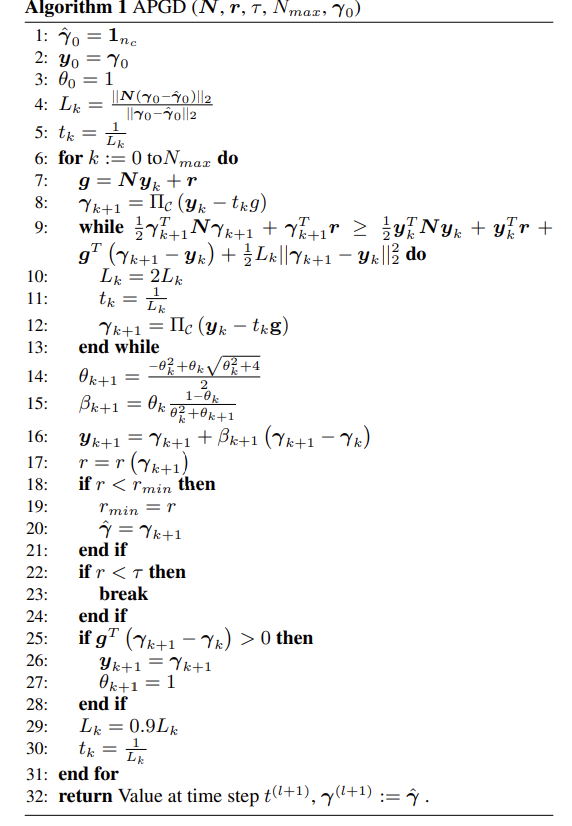

---
title: 毕设第13周工作
date: 2025-08-04
layout: note
excerpt: APGD收尾工作，做一个PPT展示:)
---

# WEEK 13（04.08.2025-09.08.2025）

- [ ] 步长问题（怎么传给VEROSIM）

- [ ] PPT (公式加思路)
- [ ] 关节问题，计算速度，APGD处理这种问题是否存在劣势
- [ ] 搞清楚堆叠体问题
- [ ] 证明算法更好（100刚体），想办法，出图，数据罗列等，去证明这个问题。
- [ ] CCP转化QP建模(可以后续去做)

## 2025.08.04

### TASK: PPT

## 2025.08.05

### 对比一些chrono看看是不是少东西（漏了某些特性）

## 2025.08.06

### TASK: chrono

## 2025.08.08

1. 关于LCP和QP问题的转化是否是近似的？

    
