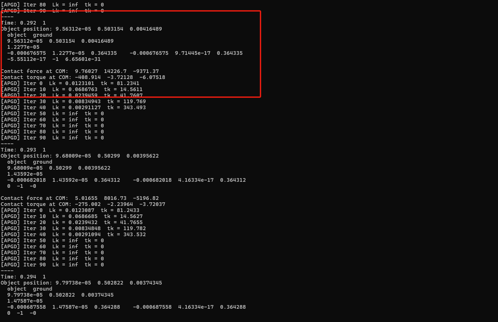

---
title: 毕设第14周工作
date: 2025-08-11
layout: note
excerpt: APGD查漏补缺。:)
---

# WEEK 14（11.08.2025-15.08.2025）

- [x] 1.LCP → QP (多体系统LCP模型转换为QP的严格性分析)
- [x] 继续步长问题
- [ ] 对比一些chrono看看是不是少东西（漏了某些特性）


## 2025.08.11

### Task: LCP -> QP

1. 关于LCP和QP问题的转化是否是近似的？

[LCP -> QP](../论文草稿/LCPQP.md)

详细回答了这个问题。


## 2025.08.12

### Task: 步长问题

在探讨步长问题时，我在思考 **外部时间步 ℎ（物理/积分层）来自RBDClusterLagrangeMultipliers 及上层**，
和APGD求解器中的步长更新是否是一个值，内部是指的迭代步长。

我现在去重新理解伪代码，从而来解决这个问题：

[APGD伪代码](../论文草稿/APGD.md#伪代码)


两个“步长”其实是两个不同层面的概念，一个是外部仿真时间步长，一个是APGD 算法内部的迭代步长


1. 外部时间步长（simulation time step, Δt）

* 由你的物理系统或仿真主循环控制，比如 RBDClusterLagrangeMultipliers 上层代码设置的 `h = 0.001` s。
* 这个 Δt 决定了 **一次物理积分要前进多少真实时间**。
* 在每一个 Δt 内，求解器（APGD、Dantzig 等）会被调用一次，用来解这一步的约束方程。
* 它不会随着 APGD 的迭代改变，是**固定的外部参数**。


2. 内部迭代步长（APGD 的梯度步长，t 或 tk）

* 是 APGD 算法内部用来更新解向量 $\lambda$ 的“学习率”。

* 计算方式通常是：

  $$
  t_k = \frac{1}{L_k}
  $$

  其中 $L_k$ 是 Lipschitz 常数的估计值（梯度变化的“斜率”上界）。

* 在你的实现里，可能会有：

  ```cpp
  Lk = 0.9 * L_temp;
  tk = 1.0 / Lk;
  ```

  这个 tk 是 **每一次迭代**用来控制更新幅度的参数。

* 它是数值优化里的步长（step size in optimization），与外部 Δt 没有直接耦合，但 **Δt 越大，梯度值会变大，可能间接影响到 Lk 的估计**。


3. 它们的关系

* **外部 Δt** 决定物理系统积分的稳定性和精度。
* **内部 tk** 决定 APGD 每次迭代更新的快慢。
* 外部 Δt 变大 → 系统矩阵 Z、右端项 b 会变化 → 梯度的 Lipschitz 常数 Lk 可能变大 → 内部 tk 变小。
* 两个步长**不直接等价**，但是外部 Δt 会通过物理方程影响到内部 tk 的取值范围。


📌 **直观类比**

* 外部 Δt：你开车时每秒看一次地图（仿真采样频率）。
* 内部 tk：你每次修正方向盘的力度（算法迭代更新幅度）。
* 看得太慢（Δt 太大）会让方向修正困难，需要更小的转向幅度（tk 更小）才能不翻车。


**这段迭代的目的，就是在一次物理时间步内，通过多轮更新和步长调整，让 APGD 收敛到一个稳定、可行、下降充分的解，确保数值稳定性和收敛速度。**


**关于步长问题总结**

外部也就是我们在UI界面设置，RBDscene中传进来的外部时间步长，是固定的，而内部时间步长和这个完全不一样。

 - 外部时间步长：仿真每一步推进的物理时间长度。
 - 内部时间步长：在同一 Δt 内不断调整 λ，用步长 tk 控制每次走多远，直到找到收敛解。

也就是每个外部的时间步长，我都需要从头去计算一次最优解，而内部时间步长的意义是为了不断调节每步的大小，更快，
更准的找到最优解。


## 2025.08.13

### task:测试chrono demo 用来验证步长是否发生了变化


实验详解：

 **Chrono 小实验总结：APGD 求解器在接触场景中的表现**

 1. 实验目的

* 验证在 Chrono 框架中使用 **APGD（Accelerated Projected Gradient Descent）** 作为接触求解器的运行情况。
* 理解外部时间步长（`time_step`）与 APGD 内部数学步长（`t_k`）的区别。
* 检查 `L_k`（Lipschitz 常数）和 `t_k` 在实际仿真中的变化规律。

 2. 场景搭建

* 使用 **NSC（Non-Smooth Contact）** 接触模型。
* 切换求解器为 `ChSolver::Type::APGD`，最大迭代次数设为 100。
* 场景元素：

  * **圆柱体**：质量 1500 kg，半径 0.5 m，高度 0.8 m，从高度 2.65 m 自由下落。
  * **地面**：固定刚体，尺寸 2×1×2 m。
* 碰撞系统：`MULTICORE` + `HYBRID` 窄相算法。
* 可视化：Irrlicht 渲染，实时显示接触力。

 3. 关键观测

 **接触未发生时**

   * `sys->GetNumContacts() = 0`
   * APGD 内部 `nc = CountActiveConstraints()` 为 0
   * 初始化 Lk 时：

     $$
     L = \frac{\| N (\gamma - \hat{\gamma}) \|}{\|\gamma - \hat{\gamma}\|} 
     $$

     因分母为 0 → `Lk = inf`，`t_k = 0`
   * 打印结果恒为：

     ```
     Lk = inf   tk = 0
     ```

 **接触发生后**

   * `nc > 0` 时，才会计算出有效的 Lk 和 tk。
   * 如果打印逻辑没有加 `nc` 检查，就会在无约束时也输出无效值。

 **外部步长 vs 内部步长**

   * 外部时间步长：`time_step = 1e-3` s（积分推进量）。
   * 内部步长：APGD 的 `t_k`，由 1/Lk 决定，是数学迭代参数，与物理时间步长无关。


最终效果图：




## 2025.08.14

### task: chrono src


## 2025.08.15

### task:右端项 𝑟（即 Chrono 的 𝑏schur）的构造

改了一天，改崩了，现在还原版本，周一在继续尝试。

