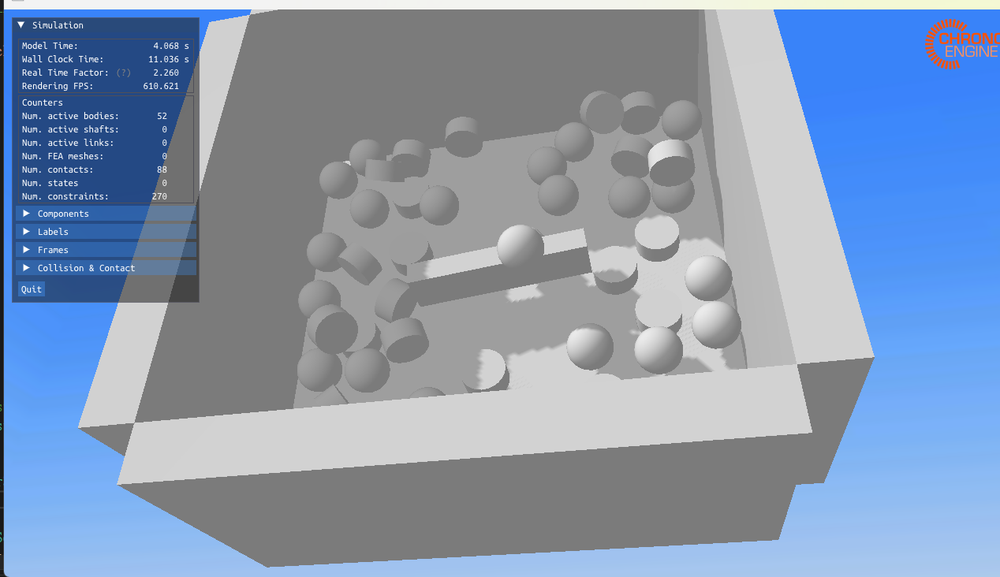
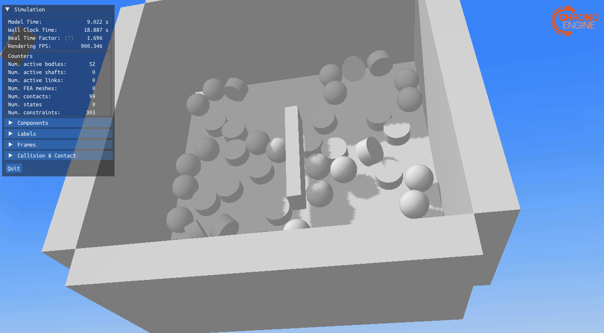
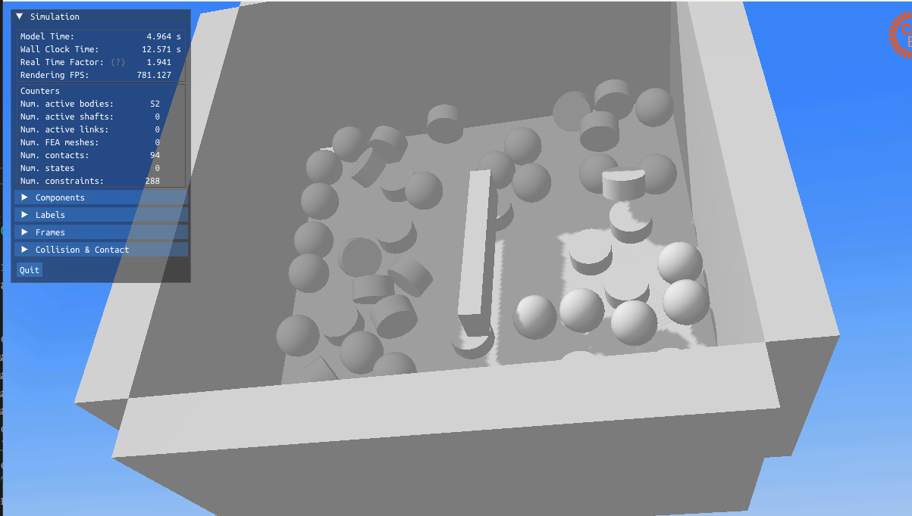
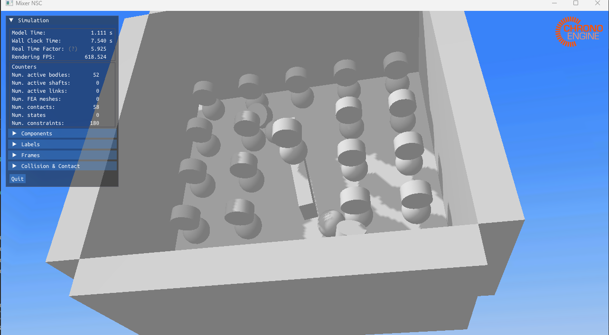
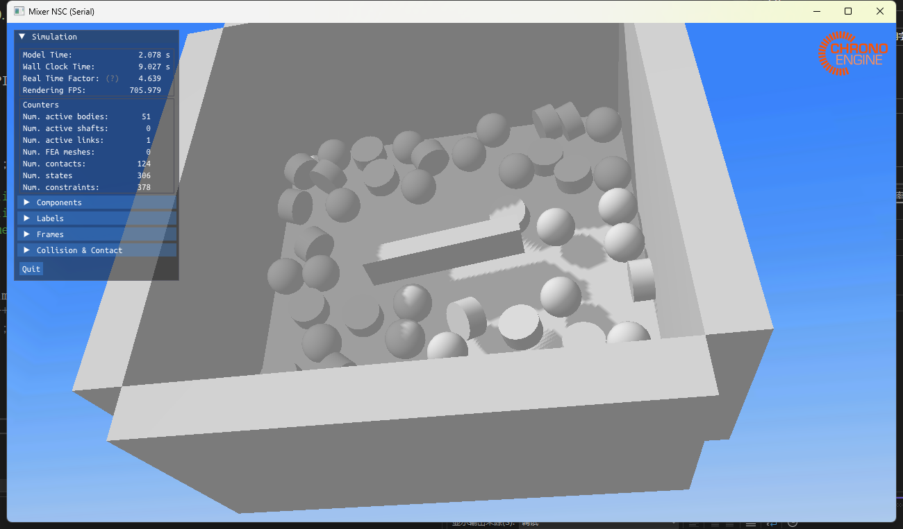

## 删除/解耦impulsebased求解器

1. RBDScene.cpp

   ```cpp
   #include "./RBDColliderGroup.h"
   #include "./RBDClusterLagrangeMultipliers.h"
   //#include "./RBDClusterImpulseBased.h"
   #include "./RBDClusterPenalty.h"
   #include "../RBDClusterSequentialImpulse.h"

   ```

   ```cpp
   const CONSTRAINTSOLVERTYPE t = this->constraintSolverType();
      //if (t == CST_IMPULSEBASED)
      //{
         //return new RBDClusterImpulseBased(this);
      //}
      else if (t == CST_PENALTY)
      {
         return new RBDClusterPenalty(this);
      }
      //(ci) use the attached LagrangeDebugObserver
      else if (myLDOPtr)
      {
         return new RBDClusterLagrangeMultipliers(this, myLDOPtr);
      }
   ```
2. RBDScene.h

   ```cpp
    enum CONSTRAINTSOLVERTYPE
      {
         CST_LAGRANGEDANTZIG, 
         CST_LAGRANGEGS, 
         CST_LAGRANGEAUTO, 
         //CST_IMPULSEBASED, 
         CST_PENALTY,
         CST_SEQUENTIALIMPULSE
      }; 

   ```
3. VSPluginRBDynamXMainSimStateExtension.cpp

   ```cpp
     else if (solverName.toLower() == "penalty")
      {
         myRBDScene->setConstraintSolverType(VSLibRBDynamX::RBDScene::CST_PENALTY);
      }
      /*else if (solverName.toLower() == "impulsebased")
      {
         myRBDScene->setConstraintSolverType(VSLibRBDynamX::RBDScene::CST_IMPULSEBASED);
      }*/
      else if (solverName.toLower() == "sequentialimpulse") {
         myRBDScene->setConstraintSolverType(VSLibRBDynamX::RBDScene::CST_SEQUENTIALIMPULSE);
      }
      else
   ```
4. VSPluginRBDynamXOptions.cpp

```cpp
 constraintSolverValues.append(VSLibGUI::SettingsWrapper::ComboBox::Pair("lagrangeauto", tr("Lagrange Multipliers, Auto"))); 
   constraintSolverValues.append(VSLibGUI::SettingsWrapper::ComboBox::Pair("lagrangedantzig", tr("Lagrange Multipliers, Dantzig"))); 
   constraintSolverValues.append(VSLibGUI::SettingsWrapper::ComboBox::Pair("lagrangegs", tr("Lagrange Multipliers, Projected Gauss-Seidel"))); 
  // constraintSolverValues.append(VSLibGUI::SettingsWrapper::ComboBox::Pair("impulsebased",
 // tr("Impulsbasiert, Iterativ"))); 
   constraintSolverValues.append(VSLibGUI::SettingsWrapper::ComboBox::Pair("penalty", tr("Penalty"))); 
   constraintSolverValues.append(VSLibGUI::SettingsWrapper::ComboBox::Pair("sequentialimpulse", tr("Sequential Impulse, Projected Gauss-Seidel")));

```

最后要删除pro文件清除Cmake

测试模型为：MCORE_mixerNSC,并作了一些修改以适配串行

并行代码：

```
// =============================================================================
// PROJECT CHRONO - http://projectchrono.org
//
// Copyright (c) 2014 projectchrono.org
// All rights reserved.
//
// Use of this source code is governed by a BSD-style license that can be found
// in the LICENSE file at the top level of the distribution and at
// http://projectchrono.org/license-chrono.txt.
//
// =============================================================================
// Authors: Radu Serban, Hammad Mazhar
// =============================================================================
//
// Chrono::Multicore test program using penalty method for frictional contact.
//
// The model simulated here consists of a number of spherical objects falling
// onto a mixer blade attached through a revolute joint to the ground.
//
// The global reference frame has Z up.
// =============================================================================

#include <cstdio>
#include <vector>
#include <cmath>

#include "chrono_multicore/physics/ChSystemMulticore.h"

#include "chrono/ChConfig.h"
#include "chrono/physics/ChBodyEasy.h"
#include "chrono/physics/ChLinkMotorRotationAngle.h"
#include "chrono/utils/ChUtilsCreators.h"
#include "chrono/utils/ChUtilsInputOutput.h"

#include "chrono/assets/ChVisualSystem.h"
#ifdef CHRONO_VSG
    #include "chrono_vsg/ChVisualSystemVSG.h"
using namespace chrono::vsg3d;
#endif

using namespace chrono;

// -----------------------------------------------------------------------------
// Create a bin consisting of five boxes attached to the ground and a mixer
// blade attached through a revolute joint to ground. The mixer is constrained
// to rotate at constant angular velocity.
// -----------------------------------------------------------------------------
std::shared_ptr<ChBody> AddContainer(ChSystemMulticoreNSC* sys) {
    // Create a common material
    auto mat = chrono_types::make_shared<ChContactMaterialNSC>();
    mat->SetFriction(0.4f);

    // Create the containing bin (2 x 2 x 1)
    auto bin = chrono_types::make_shared<ChBody>();
    bin->SetMass(100);
    bin->SetPos(ChVector3d(0, 0, 0));
    bin->SetRot(ChQuaternion<>(1, 0, 0, 0));
    bin->EnableCollision(true);
    bin->SetFixed(true);

    utils::AddBoxContainer(bin, mat,                                 //
                           ChFrame<>(ChVector3d(0, 0, 0.5), QUNIT),  //
                           ChVector3d(2, 2, 1), 0.2,                 //
                           ChVector3i(2, 2, -1));
    bin->GetCollisionModel()->SetFamily(1);
    bin->GetCollisionModel()->DisallowCollisionsWith(2);

    sys->AddBody(bin);

    // The rotating mixer body (1.6 x 0.2 x 0.4)
    auto mixer = chrono_types::make_shared<ChBody>();
    mixer->SetMass(10.0);
    mixer->SetInertiaXX(ChVector3d(50, 50, 50));
    mixer->SetPos(ChVector3d(0, 0, 0.205));
    mixer->SetFixed(false);
    mixer->EnableCollision(true);

    ChVector3d hsize(0.8, 0.1, 0.2);

    utils::AddBoxGeometry(mixer.get(), mat, hsize);
    mixer->GetCollisionModel()->SetFamily(2);

    sys->AddBody(mixer);

    // Create a motor between the two bodies, constrained to rotate at 90 deg/s
    auto motor = chrono_types::make_shared<ChLinkMotorRotationAngle>();
    motor->Initialize(mixer, bin, ChFrame<>(ChVector3d(0, 0, 0), ChQuaternion<>(1, 0, 0, 0)));
    motor->SetAngleFunction(chrono_types::make_shared<ChFunctionRamp>(0, CH_PI / 2));
    sys->AddLink(motor);

    return mixer;
}

// -----------------------------------------------------------------------------
// Create the falling spherical objects in a uniform rectangular grid.
// -----------------------------------------------------------------------------
void AddFallingBalls(ChSystemMulticore* sys) {
    // Shared contact materials
    auto ball_mat = chrono_types::make_shared<ChContactMaterialNSC>();
    ball_mat->SetFriction(0.4f);
    ball_mat->SetRestitution(0.5f);
    auto cyl_mat = chrono_types::make_shared<ChContactMaterialNSC>();

    // Create the falling objects
    for (int ix = -2; ix < 3; ix++) {
        for (int iy = -2; iy < 3; iy++) {
            ChVector3d b_pos(0.4 * ix, 0.4 * iy, 1);
            ChVector3d c_pos(0.4 * ix, 0.4 * iy, 1.4);

            auto ball = chrono_types::make_shared<ChBodyEasySphere>(0.1, 2000, ball_mat);
            ball->SetPos(b_pos);
            sys->AddBody(ball);

            auto cyl = chrono_types::make_shared<ChBodyEasyCylinder>(ChAxis::Y, 0.1, 0.1, 2000, cyl_mat);
            cyl->SetPos(c_pos);
            sys->AddBody(cyl);
        }
    }
}

// -----------------------------------------------------------------------------
// Create the system, specify simulation parameters, and run simulation loop.
// -----------------------------------------------------------------------------
int main(int argc, char* argv[]) {
    std::cout << "Copyright (c) 2017 projectchrono.org\nChrono version: " << CHRONO_VERSION << std::endl;

    // Simulation parameters
    // ---------------------

    double gravity = 9.81;
    double time_step = 1e-3;

    uint max_iteration = 30;
    real tolerance = 1e-3;

    // Create system
    // -------------

    ChSystemMulticoreNSC sys;

    // Set number of threads
    sys.SetNumThreads(8);

    // Set associated collision detection system
    sys.SetCollisionSystemType(ChCollisionSystem::Type::MULTICORE);

    // Set gravitational acceleration
    sys.SetGravitationalAcceleration(ChVector3d(0, 0, -gravity));

    // Set solver parameters
    sys.GetSettings()->solver.solver_mode = SolverMode::SLIDING;
    sys.GetSettings()->solver.max_iteration_normal = max_iteration / 3;
    sys.GetSettings()->solver.max_iteration_sliding = max_iteration / 3;
    sys.GetSettings()->solver.max_iteration_spinning = 0;
    sys.GetSettings()->solver.max_iteration_bilateral = max_iteration / 3;
    sys.GetSettings()->solver.tolerance = tolerance;
    sys.GetSettings()->solver.alpha = 0;
    sys.GetSettings()->solver.contact_recovery_speed = 10000;
    sys.ChangeSolverType(SolverType::APGD);
    sys.GetSettings()->collision.narrowphase_algorithm = ChNarrowphase::Algorithm::HYBRID;

    sys.GetSettings()->collision.collision_envelope = 0.01;
    sys.GetSettings()->collision.bins_per_axis = vec3(10, 10, 10);

    // Enable active bounding box
    ////sys.GetSettings()->collision.use_aabb_active = true;
    ////sys.GetSettings()->collision.aabb_min = real3(-1, -1, -1.5);
    ////sys.GetSettings()->collision.aabb_max = real3(+1, +1, +1.5);

    // Create the fixed and moving bodies
    // ----------------------------------

    auto mixer = AddContainer(&sys);
    AddFallingBalls(&sys);

    // Perform the simulation
    // ----------------------

#ifdef CHRONO_VSG
    auto vis = chrono_types::make_shared<ChVisualSystemVSG>();
    vis->AttachSystem(&sys);
    vis->SetWindowTitle("Mixer NSC");
    vis->SetCameraVertical(CameraVerticalDir::Y);
    vis->AddCamera(ChVector3d(0.6, -2, 3), ChVector3d(0, 0, 0));
    vis->SetWindowSize(1280, 720);
    vis->SetBackgroundColor(ChColor(0.8f, 0.85f, 0.9f));
    vis->EnableSkyBox();
    vis->SetCameraAngleDeg(40.0);
    vis->SetLightIntensity(0.75f);
    vis->SetLightDirection(1.5 * CH_PI_2, CH_PI / 6);
    vis->EnableShadows();
    vis->Initialize();

    while (vis->Run()) {
        sys.DoStepDynamics(time_step);
        vis->Render();

        ////auto frc = mixer->GetAppliedForce();
        ////auto trq = mixer->GetAppliedTorque();
        ////std::cout << sys.GetChTime() << "  force: " << frc << "  torque: " << trq << std::endl;
    }
#else
    // Run simulation for specified time
    double time_end = 1;
    int num_steps = (int)std::ceil(time_end / time_step);
    double time = 0;
    for (int i = 0; i < num_steps; i++) {
        sys.DoStepDynamics(time_step);
        time += time_step;
    }
#endif

    return 0;
}
```

所以需要比较的是RTF

Real Time Factor (RTF): 墙钟时间 / 本帧推进的仿真时间 > 1 表示比实时慢（算 1s 仿真，要花 >1s 墙钟）；< 1 表示比实时快。

chrono需要自己手动设置线程

16线程


我们可以看到RTF的值主要在2.4左右

8线程



经过测量大部分时间，RTF的值维持在1.8左右

1线程：


RTF的值维持在1.8左右，单线程和8线程差距不明显，可能是模型中物体数量不多的原因。

128线程：



RTF的值已经接近6.5，说明过量的线程已经影响了运行效果。

串行效果：

代码：

```
// =============================================================================
// PROJECT CHRONO - http://projectchrono.org
// =============================================================================
//
// 传统串行（ChSystemNSC）版本：与原多核示例的几何/材料/电机完全一致
// - 碰撞：BULLET
// - 求解器：ChSolverAPGD
//
// =============================================================================

#include <cstdio>
#include <vector>
#include <cmath>
#include <memory>

#include "chrono/ChConfig.h"
#include "chrono/physics/ChSystemNSC.h"         // 串行系统
#include "chrono/solver/ChSolverAPGD.h"         // 串行 APGD 求解器
#include "chrono/collision/ChCollisionModel.h"  // 可选：默认包络/边距

#include "chrono/physics/ChBodyEasy.h"
#include "chrono/physics/ChLinkMotorRotationAngle.h"
#include "chrono/utils/ChUtilsCreators.h"
#include "chrono/utils/ChUtilsInputOutput.h"

#include "chrono/assets/ChVisualSystem.h"
#ifdef CHRONO_VSG
    #include "chrono_vsg/ChVisualSystemVSG.h"
using namespace chrono::vsg3d;
#endif

using namespace chrono;

// -----------------------------------------------------------------------------
// Create a bin consisting of five boxes attached to the ground and a mixer
// blade attached through a revolute joint to ground. The mixer is constrained
// to rotate at constant angular velocity.
// -----------------------------------------------------------------------------
// ⚠️ 改动：参数从 ChSystemMulticoreNSC* -> ChSystem*，其余建模保持一致
std::shared_ptr<ChBody> AddContainer(ChSystem* sys) {
    // Create a common material
    auto mat = chrono_types::make_shared<ChContactMaterialNSC>();
    mat->SetFriction(0.4f);

    // Create the containing bin (2 x 2 x 1)
    auto bin = chrono_types::make_shared<ChBody>();
    bin->SetMass(100);
    bin->SetPos(ChVector3d(0, 0, 0));
    bin->SetRot(ChQuaternion<>(1, 0, 0, 0));
    bin->EnableCollision(true);
    bin->SetFixed(true);

    utils::AddBoxContainer(bin, mat,                                 //
                           ChFrame<>(ChVector3d(0, 0, 0.5), QUNIT),  //
                           ChVector3d(2, 2, 1), 0.2,                 //
                           ChVector3i(2, 2, -1));
    bin->GetCollisionModel()->SetFamily(1);
    bin->GetCollisionModel()->DisallowCollisionsWith(2);

    sys->AddBody(bin);

    // The rotating mixer body (1.6 x 0.2 x 0.4)
    auto mixer = chrono_types::make_shared<ChBody>();
    mixer->SetMass(10.0);
    mixer->SetInertiaXX(ChVector3d(50, 50, 50));
    mixer->SetPos(ChVector3d(0, 0, 0.205));
    mixer->SetFixed(false);
    mixer->EnableCollision(true);

    ChVector3d hsize(0.8, 0.1, 0.2);

    utils::AddBoxGeometry(mixer.get(), mat, hsize);
    mixer->GetCollisionModel()->SetFamily(2);

    sys->AddBody(mixer);

    // Create a motor between the two bodies, constrained to rotate at 90 deg/s
    auto motor = chrono_types::make_shared<ChLinkMotorRotationAngle>();
    motor->Initialize(mixer, bin, ChFrame<>(ChVector3d(0, 0, 0), ChQuaternion<>(1, 0, 0, 0)));
    motor->SetAngleFunction(chrono_types::make_shared<ChFunctionRamp>(0, CH_PI / 2));
    sys->AddLink(motor);

    return mixer;
}

// -----------------------------------------------------------------------------
// Create the falling spherical objects in a uniform rectangular grid.
// -----------------------------------------------------------------------------
// ⚠️ 改动：参数从 ChSystemMulticore* -> ChSystem*
void AddFallingBalls(ChSystem* sys) {
    // Shared contact materials
    auto ball_mat = chrono_types::make_shared<ChContactMaterialNSC>();
    ball_mat->SetFriction(0.4f);
    ball_mat->SetRestitution(0.5f);
    auto cyl_mat = chrono_types::make_shared<ChContactMaterialNSC>();

    // Create the falling objects（保持原来 5x5 布局与尺寸）
    for (int ix = -2; ix < 3; ix++) {
        for (int iy = -2; iy < 3; iy++) {
            ChVector3d b_pos(0.4 * ix, 0.4 * iy, 1);
            ChVector3d c_pos(0.4 * ix, 0.4 * iy, 1.4);

            auto ball = chrono_types::make_shared<ChBodyEasySphere>(0.1, 2000, ball_mat);
            ball->SetPos(b_pos);
            sys->AddBody(ball);

            auto cyl = chrono_types::make_shared<ChBodyEasyCylinder>(ChAxis::Y, 0.1, 0.1, 2000, cyl_mat);
            cyl->SetPos(c_pos);
            sys->AddBody(cyl);
        }
    }
}

// -----------------------------------------------------------------------------
// Main
// -----------------------------------------------------------------------------
int main(int argc, char* argv[]) {
    std::cout << "Copyright (c) 2017 projectchrono.org\nChrono version: " << CHRONO_VERSION << std::endl;

    // Simulation parameters（保持不变）
    double gravity = 9.81;
    double time_step = 1e-3;
    unsigned int max_iteration = 30;
    double tolerance = 1e-3;

    // ==== 串行系统 ====
    ChSystemNSC sys;

    // 显式选择 Bullet 碰撞（串行后端）
    sys.SetCollisionSystemType(ChCollisionSystem::Type::BULLET);

    // 可选：设定默认碰撞包络/边距（与多核示例里的 envelope 概念对应）
    // 取较小值以减少穿透数值误差；不想动就注释掉
    ChCollisionModel::SetDefaultSuggestedEnvelope(0.002);
    ChCollisionModel::SetDefaultSuggestedMargin(0.001);

    // 重力
    sys.SetGravitationalAcceleration(ChVector3d(0, 0, -gravity));

    // 串行 APGD 求解器（替代原来的 APGD/APGDREF 多核设置）
    auto solver = chrono_types::make_shared<ChSolverAPGD>();
    solver->SetMaxIterations((int)max_iteration);
    solver->SetTolerance(tolerance);
    solver->EnableWarmStart(true);
    sys.SetSolver(solver);

    // 建模（保持与原来一致）
    auto mixer = AddContainer(&sys);
    AddFallingBalls(&sys);

    // 运行
#ifdef CHRONO_VSG
    auto vis = chrono_types::make_shared<ChVisualSystemVSG>();
    vis->AttachSystem(&sys);
    vis->SetWindowTitle("Mixer NSC (Serial)");
    vis->SetCameraVertical(CameraVerticalDir::Y);
    vis->AddCamera(ChVector3d(0.6, -2, 3), ChVector3d(0, 0, 0));
    vis->SetWindowSize(1280, 720);
    vis->SetBackgroundColor(ChColor(0.8f, 0.85f, 0.9f));
    vis->EnableSkyBox();
    vis->SetCameraAngleDeg(40.0);
    vis->SetLightIntensity(0.75f);
    vis->SetLightDirection(1.5 * CH_PI_2, CH_PI / 6);
    vis->EnableShadows();
    vis->Initialize();

    while (vis->Run()) {
        sys.DoStepDynamics(time_step);
        vis->Render();
        ////auto frc = mixer->GetAppliedForce();
        ////auto trq = mixer->GetAppliedTorque();
        ////std::cout << sys.GetChTime() << "  force: " << frc << "  torque: " << trq << std::endl;
    }
#else
    double time_end = 1;
    int num_steps = (int)std::ceil(time_end / time_step);
    for (int i = 0; i < num_steps; i++) {
        sys.DoStepDynamics(time_step);
    }
#endif

    return 0;
}

```

串行效果：


综合下来RTF在5左右，并且该值起伏很剧烈，在大到20小到3，不是很稳定，所以并行效果还是不错的，并且Chrono还进行了GPU的设置，对于超过属于万计的刚体是效果应该是比JOLT要好的，接下来进行jolt的测试。


问题是？？？jolt怎么测试，怎么比较两个的性能？？？


目前**几乎没有“Jolt vs Chrono”一对一的官方横评？？**

留作思考吧。
