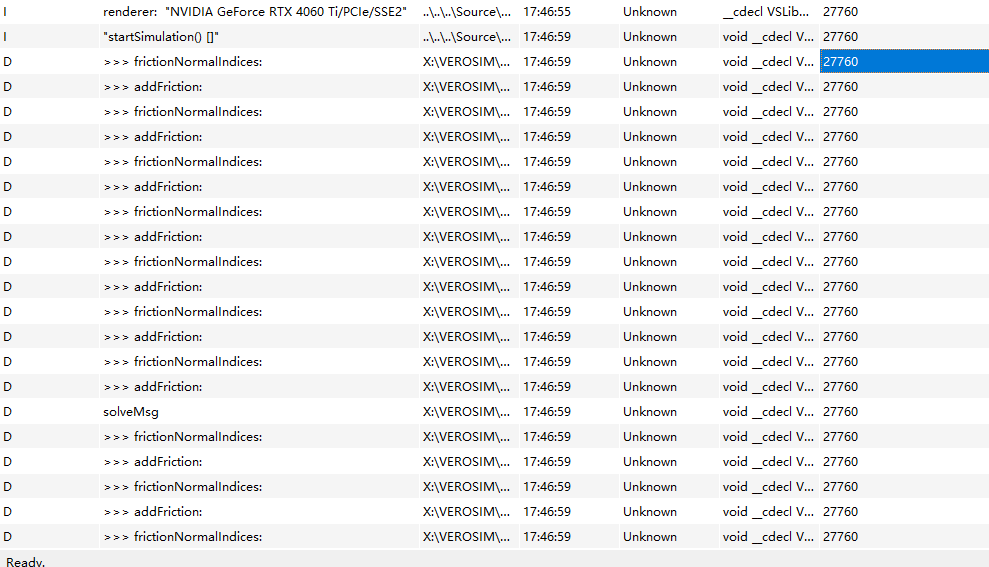

*Tips：持续完善文档，记录每一次优化与踩坑体会，有助于后续论文撰写与项目迭代！*


**论文注册时间：01.08.2025**

# 毕业设计每周工作总结

#### 未来24周计划

- [x] 准备工作
  - [x] 学习C++
  - [x] 学习多体动力学仿真
- [ ] 英语演讲答辩能力
- [ ] 理解文献和chrono参考代码(3)
- [ ] 熟悉VEROSIM的求解器代码结构(1)
- [ ] 实现QP的建模和Interior-Point简单求解(4)
- [ ] 应用APGD求解器(8)
  - [ ] 等式约束(hinge, prismatic, rigid, ball and socket)
  - [ ] contact and friction
  - [ ] Motor，limit及其它的约束类型
- [ ] 分析结果，优化算法(4)
  - [ ] 简单模型
  - [ ] 大规模模型
  - [ ] 实际模型(Harvester)
- [ ] 写论文(4)


## 26.05.2025-30.05.2025
- [x] APGD文献 （CCP → LCP →QP）
- [x] Chrono 源码 找到主函数以及运行流程

## 02.06.2025-06.06.2025

- [x] 继续文献
- [x] 安装VEROSIM，学习建模，了解RBDynamX的求解器结构 （02.06）
- [x] APGD相关文献算法（初级和高级）
- [x] QP问题求解MBD(相关论文)怎么从LCP或CCP建模QP问题，QP问题如何被求解，等式约束和不等式约束
- [x] Chrono debug APGD 设置断点


## 09.06.2025-13.06.2025

- [x] QP问题求解MBD(相关论文)怎么从LCP或CCP**建模QP问题**，QP问题如何被求解，等式约束和不等式约束
- [x] Chrono debug APGD 设置断点
  - [x] 详细看APGD算法，及相关函数


- [x] 学习VEROSIM建模，了解RBDynamX的求解器结构 （02.06）
- [x] SOCCP second order 正交圆锥


## 16.06.2025-20.06.2025

- [x] 论文细节 关于APGD
- [x] 代码细节，以及代码结构
- [x] 了解RBDynamX的求解器结构 思考程序设计


## 23.06.2025-27.06.2025

- [x] chrono代码实现细节，输入输出
- [x] VEROSIM代码实现细节
- [x] chrono中QP问题怎么被构建出来的 


## 30.06.2025-04.07.2025

- [x] 实现QP建模
- [x] 实现APGD
- [x] CCP建模 chrono里给CCP建模，与VEROSIM中的LCP建模比较区别在哪


## 周任务（07.06.2025 – 07.11.2025）
- [x] VEROSIM 实现 CCP / QP 建模  
- [x] 实现并集成 APGD 求解器

---

**本周思考**
1. **优先级**：先把 APGD 插到现有的 LCP 建模流程里，实现对接；  
2. **可配置性**：把 APGD 加入求解器枚举与下拉选项，方便在运行时自由切换；  
3. **后续准备**：完成 QP 建模（基于 Chrono 风格），为并行化、性能优化打基础。

---

### Data : 2025-07-10

---
#### TASK:求解器集成

 **APGD 求解器集成步骤**

1. 源码接入
- 将 `RBDSolverAPGD.h/cpp` 添加到项目中，确保它们参与编译；  
- 在 `RBDClusterLagrangeMultipliers.cpp` 中加入：
  ```cpp
  #include "RBDSolverAPGD.h"
 - 执行全量 Rebuild，确保无编译或链接错误。

2. 扩展求解器枚举

在 **RBDScene.h** 中：

```cpp
enum CONSTRAINTSOLVERTYPE {
  CST_LAGRANGEDANTZIG,
  CST_LAGRANGEGS,
  CST_LAGRANGEAUTO,
  CST_LAGRANGEINTERACTIVEDANTZIG,
  CST_LAGRANGEINTERACTIVEGS,
  CST_LAGRANGEINTERACTIVEAUTO,
  CST_LAGRANGEDANTZIGEXP,
  CST_IMPULSEBASED,
  CST_PENALTY,
  CST_SEQUENTIALIMPULSE,
  CST_LAGRANGEAPGD   // ← 新增 APGD
};
```

3. 集群工厂中开启 APGD

在 **RBDScene.cpp** 的 `createNewCluster()` 方法里：

```cpp
else if (t == CST_LAGRANGEAPGD) {
  // 为非交互式 Lagrange 乘子集群
  return new RBDClusterLagrangeMultipliers(this);
  // 如需调试/单步，可改为：
  // return new RBDClusterLagrangeMultipliersInteractive(this);
}
```


4. 在 doTimeStep() 中植入 APGD 支持

在 **RBDClusterLagrangeMultipliers::doTimeStep(...)** 的 solver 选择 switch 中添加：

```cpp
case RBDScene::CST_LAGRANGEAPGD:
  myLcp = new RBDLcpAPGD(
    matA.rows(),                   // LCP 维度
    numberEqualityConstraints,     // nub
    myScene->numberIterations(),   // maxIters
    myScene->getTol(),             // tol（需在 RBDScene 中暴露）
    myScene->getAccel()            // accel（需在 RBDScene 中暴露）
  );
  break;
```

其余分支保持不变，并做好失败时增加 CFM 或退化到 GS 的回退策略。

 5. 界面 & 配置同步

 5.1 Qt 下拉菜单

在 `VSPluginRBDynamXOptions.cpp`：

```cpp
constraintSolverValues.append({
  "apgd",
  tr("Lagrange Multipliers, APGD")
});
```

 5.2 读取并应用设置

在 `MainSimStateExtension::slotSyncSettings()` 中：

```cpp
else if (solverName.toLower() == "apgd")
  myRBDScene->setConstraintSolverType(
    VSLibRBDynamX::RBDScene::CST_LAGRANGEAPGD
  );
```

---

下一步 & 建议

* **测试对比**：用单摆、双摆等场景对比 APGD 与 Dantzig/GS 的收敛性和效率；
* **日志输出**：在 `RBDLcpAPGD::solve()` 内打印残差、迭代次数，便于定位收敛瓶颈；
* **界面调优**：将 `tol`、`maxIters`、`accel` 参数也暴露到 GUI；
* **性能分析**：跑大规模约束场景，统计内存占用与迭代耗时，为并行化与 GPU 加速打基础。


### 2025-07-11

#### TASK:测试对比

将新增的对默认的lagrangmultipliers的求解器（加Dantzig）效果做对比：

 - 默认的求解器是正常的单摆，符合物理特性。
 - APGD基于LAGRANGEMUITIPLIERS的LCP建模的方式去写的求解器，得到的单摆结果：就是直接下落。

问题猜测：

同一个单摆模型，用默认的 Lagrange‐multiplier+Dantzig/GS 求解器能正常振动，
但用你接进去的 APGD 解算器就直接自由落体”，

**APGD效果视频：**
<video width="640" height="360" controls>
  <source src="./MA_weeklyplan_image/APGD_LCP_SOLVER.mp4" type="video/mp4">
  你的浏览器不支持 Video 标签。
</video>

**基本上说明你的 APGD 分支在求解约束力的时候返回了全零（或者极小）的 λ**，
导致根本**没把摆杆的杆约束力施加上去**，物体直接受重力加速度下落。


 - 单摆的绳长保持不变属于等式约束（holonomic equality constraint）。
 - 约束方程写作：

单摆的 holonomic equality constraint（等式约束）写作：

$$
g(\mathbf{q})
=
\bigl\lVert\,\mathbf{x}_{\text{质点}} - \mathbf{x}_{\text{支点}}\bigr\rVert
- L
= 0.
$$


## 周任务（14.06.2025-18.07.2025）
- [ ] Debug APGD求解器的自由落体问题
- [ ] 测试其他的等式约束的关节

### 2025.07.14


#### TASK :调试定位问题原因
 - 通过调试的方法去定位为什么会出现自由裸体的这个情况？

目前对于问题的设想是：
 - 1.是不是求出来的lagrange也就是约束力的值太小了？
求证：通过Qdebug 来显示这个值的大小
如何使用Qdebug:
```cpp
qDebug() << "test" << xprev;  //xprev是需要打印出来的变量 
```

最后计算出来的结果（即最终的解向量 $x$ 和 $w$）
 - (*x)[i] 是你的解向量
 - (*w)[i] 是 $w = Ax + b$ 的结果

换到一个 Qt 容器里才能用 qDebug() 一次性打印，最常见的做法是先构造一个 QVector<double>，然后 append 每个分量，最后再打印：
```
//调试信息
// 计算误差 ‖xnew - xprev‖∞
        err = 0;
        for (int i = 0; i < n; ++i)
            err = std::max(err, std::abs(xnew[i] - xprev[i]));
        // ——— 调试打印，每 10 步看看 λ0、λrod、err ———
        if (k % 30 == 0) {
            qDebug() << "iter" << k
                << " LA[0]=" << xprev[0]
                //<< " λrod=" << xprev[rodIndex]   // 请确保 rodIndex 已定义为“杆长约束”在向量中的下标
                << " err=" << err;
        }


        if (err < tol) break;

```

LA[0] 就是你第 0 号约束（也就是单摆的杆长等式约束）的拉格朗日乘子——物理上它对应的是杆上的张力 𝑇
这是单摆的初始值：

第一次迭代（iter 0）LA[0]≈0：因为你从水平方向（或某个初始角度）“松手”那一刻，杆几乎不需要任何张力来维持摆球的位置，所以乘子近乎 0。

随着迭代推进，LA[0] 慢慢上升并收敛到 ~0.11：那就是 APGD 算出来的、在该时刻保持杆长不变所需的张力大小。

err 下降到很小，说明解在收敛。

值很正常

**杆约束力公式**

单摆杆上的张力 \(T\)（即第 0 号拉格朗日乘子 \(\lambda_0\)）满足：

$$
T = \lambda_0 = m\!\left(\frac{v^2}{L} + g \cos\theta\right)
$$

- \(m\)：摆球质量  
- \(v\)：摆球速度  
- \(L\)：摆长  
- \(g\)：重力加速度  
- \(\theta\)：摆角


这是单摆完全脱离后的值：


原因猜测：具体为什么会“完全脱离”？
 - 第一轮迭代 λ₀≈0：APGD 从零初始猜测（warm-start 关掉时）开始，第一步就投影把 λ₀＝0 保持住，此时根本就没有任何约束力拉住摆球，它就自由落体离开原点。
 - 物体位移过大：在时间积分那一小步里，摆球已经因为重力加速移动，杆长严重被拉长。下一次你再调用 APGD solve()，所有约束都违反得很严重。
 - 后续迭代才“补张力”
APGD 在第 30、60、90 步才慢慢把 λ₀ 迭代到 90、130、132 这样巨大的值（对应非常大的拉力），以求把摆球拉回到正确的杆长。但此时你已经错过了时间步长，摆球已经移动太远，运动已经不连贯，所以看起来就是“脱离”


**为什么不一开始就拉住？**
 - 初始猜测为 0：默认你没开启 warm-start，xprev 被清零，第一次迭代就把 λ₀ 投影到 0
 - 步长 α 或迭代次数不足：APGD 在几次迭代里根本没法把 λ₀ 
 - 误差阈值 tol 太大：当 err < tol 时你就提前退出了，可能这时 λ 还远没到正确值


问题确定，开始求解

**方法1. 开启 Warm-start：**

所析，第一步迭代时 λ₀ 被投影回 0，完全没有初始张力。
在 APGD 创建后调用：
```
solver.EnableWarmStart(true);
```
这样会使用上一步结束时的 λ 值作为新步的初始猜测，从而在刚开始迭代时就能提供一定的张力缓冲。\
我需要重新添加一个函数，使他满足这个功能

完成了这个函数后需要在RBDClusterLagrangeMultipliers.cpp启动
```
	case (RBDScene::CST_LAGRANGEAPGD):
		{
			// APGD 求解器
			myLcp = new RBDLcpAPGD(
				matA.rows(),                   // LCP 维度
				numberEqualityConstraints,     // 均等约束数量 nub
				myScene->numberIterations(),   // 最大迭代次数
				1e-6,                          // 收敛容忍度 tol
				0.9                            // Nesterov 加速系数 accel
			);
			// **这里启用 warm-start**
			myLcp->EnableWarmStart(true);
			break;
		}
		default:
```

很复杂！！！！！！！

完成，但是结果并不理想。
<video width="640" height="360" controls>
  <source src="./MA_weeklyplan_image/warmstart.mp4" type="video/mp4">
  你的浏览器不支持 Video 标签。
</video>

>*这个把上一个时间步计算的最优结果带入并不违背APGD算法，伪码里的 γ₀ 本来就是一个“外部给定”的初始猜测（Algorithm 1 的输入里就写了 γ₀）。
它并没有硬性要求把 γ₀ 设为 0，零向量只是最常见也最简单的 choice。*

所以第一种方法暂时失败，可以作为之后优化的一种尝试。


> 控制变量，在进行第二个方法前关掉第一个方法


### 2025.07.15

#### TASK:尝试不同方法

**方法2. 调整最大迭代次数和容忍误差**
```cpp
// 先关闭 warm-start
solver.EnableWarmStart(false);

// 再设置迭代次数和容忍度

// 在这VSPluginRBDynamXMainSimStateExtension.cpp更改
// 所以我直接选择快速暴力的解法，直接写死

// 1) 用派生类指针接收 new 出来的对象
			RBDLcpAPGD* apgd = new RBDLcpAPGD(
				matA.rows(),                 // LCP 维度
				numberEqualityConstraints,   // nub
				500, // maxIters
				1e-10,                        // tol
				0.9                          // accel
			);
```
暂时暴力求解，直接写死。

**效果**

1.关闭warmStart，调整迭代次数从100到500：
<video width="640" height="360" controls>
  <source src="./MA_weeklyplan_image/only500iters.mp4" type="video/mp4">
  你的浏览器不支持 Video 标签。
</video>

通过观察debug的值：

发现最初的迭代次数并不满足500次，所以判断时过早满足了容忍值，所以提前结束了迭代，所以，我们选择更新他的精度
为1e-10

2.关闭warmStart，调整迭代次数从100到500，并tol = 1e-10 :
<video width="640" height="360" controls>
  <source src="./MA_weeklyplan_image/iters500+1e-10tol.mp4" type="video/mp4">
  你的浏览器不支持 Video 标签。
</video>


可以发现效果好一些，没有出现上面的视频的左端受力的自由落体，贴近一点实际情况，但是因为精度很高，
所以仿真速度会慢很多。
观察Qdegug的值可以看到：


>通过对上面的对比，我觉得最最开始第一时间步长的计算值很重要。

所以我猜测初始值不应该从零开始，是所以我在第三次尝试打开warmstart来进行初始值的优化

3.开启warmStart，调整迭代次数从100到500，并tol = 1e-10 :
发现效果和关闭warmStart，调整迭代次数从100到500一摸一样，所以我这边个人的判断是应该把LA[O]的值设置为1开始，
就像伪代码中所写的，所以我进行更改初始值为1.
```cpp
// warm-start 相关
if (!first_step) {
    if (auto* apgd = dynamic_cast<RBDLcpAPGD*>(myLcp)) {
        apgd->SetLambda(prev_lambda);
    }
}
else {
    // 第一次也要初始化，改成全 1 向量
    if (auto* apgd = dynamic_cast<RBDLcpAPGD*>(myLcp)) {
        prev_lambda.assign(matA.rows(), 1.0);  // ← 由 0.0 改成 1.0
        apgd->SetLambda(prev_lambda);
    }
    first_step = false;
}

```
效果没有变化，虽然初始值是1，但是在第一个时间不长中，计算出来的最优解还是很小，所以导致没有约束力？？


既然方法2失败，我们继续使用方法3


**方法3. 缩小时间步长**


即便 λ 再准，一步积分时间太大也会把摆球拉得太远，约束一时跟不上，

**修改源代码，加入double Lk, tk, theta;**

**在修改这个的时候我发现，我之前的步长设置和加速因子的设置是个定值，并不符合原来的算法设计，
所以我选择去重新完善cpp源代码查看效果。**
设置还是基于尝试3：开启warmStart，调整迭代次数从100到500，并tol = 1e-10 ，
这次速度快很多，但是不断重试 CFM 并打印 “solveMsg”。

>这是一种「边调参边重试」的鲁棒性增强策略——如果 APGD（或其它 LCP 求解器）第一次没解出来，就不断往矩阵对角线上加大 CFM（相当于松弛约束），直到能得到一个可行解；如果 CFM 太大还不行，就直接用零力近似，保证仿真继续跑下去。


从日志看，APGD 在第 0 步时用 γ₀＝1 开始，err＝1 正常；到了第 30 步，它竟然把 LA[0] 跑到 −0.07，err 一下子飙到 6.9e7，然后更后面直接爆到 1e174 这种天文数字，最后落到你的那段 solveMsg 循环里不停重试 CFM 并打印 “solveMsg”。
##### 根本原因
你在 solve() 里把伪码中的 back-tracking line-search 那一块暂时用
```
bool cond = true;
if (cond) break;

```
给“短路”掉了，导致：\
1.永远只做一次投影:\
不管当前步长 t=1/Lk 到底是否合适，代码都“认为”下降条件满足，马上就跳出 while(true)。\
2.步长没收敛调整:\
因为从没进入那段 L_temp *=2; t=1/L_temp; 的循环，t 一直保持初始的 1/L₀——而这个 t 可能对你的 A 矩阵根本不适合，第一次迭代就可能一步跨得太大，造成 xnew 远远偏离可行区间，再往后每步都在“极度震荡”或指数爆炸。\
3.最终 solve() 失败:\
当 err 无限放大之后，solve() 返回 false，控制流就跑到 while (!myLcp->solve() || !myLcp->validSolution()) 里，不停加 CFM（也没用），最终就退化到零解或卡在“solveMsg”里。

**解决办法 ：你需要把那段 cond = true; if (cond) break; 换成真正的能量下降检测**


fine，改完直接卡死，真是个天才！！！
应该是走进了一个死循环，得不出结果就一直在尝试。现在给这个循环最大的尝试次数，让他20次后跳出。

不卡死了，但是效果还是不行，所以我在想，是不是摩擦力的原因，而且他一直报错： **“APGD backtrack reached BT_MAX, force accept”**
就说明 Armijo 条件始终不满足，所以每次都翻倍 L_temp 到上限才强制跳出。

所以我需要重新看一下它整个的LCP的建模过程，加一下debug
```
	// —— 上面已经填充好了 frictionNormalIndices 和 addFriction ——

		// ===== 在这里插入调试打印 =====
		qDebug() << ">>> frictionNormalIndices:";
		for (int i = 0; i < frictionNormalIndices.size(); ++i)
			qDebug() << i << ":" << frictionNormalIndices[i];

		qDebug() << ">>> addFriction:";
		for (int i = 0; i < addFriction.size(); ++i)
			qDebug() << i << ":" << addFriction[i];
		// ===== 调试打印结束 =====
```

这两个容器的 .size() 根本是 0，摩擦相关的数组根本没分配过长度（它们的 size() 一直是 0），
那我暂时不想更改它的这个建模方式，我想先不用摩擦力，我的apgd文件需要更改。\
专门为APGD写一个函数关闭所有的摩擦建模投影。

```
apgd->EnableFriction(false);    // <— 这一行，关闭摩擦
```

**新思路：去参考一下正常的迭代求解器，去看他计算出来的约束力的大小，从而去确定到底计算错误在哪里？？**

**方法4. 优化步长（α）与预调度因子**


**方法5. 使用 Baumgarte 或 约束柔性化**

方法4.5暂时放弃尝试


### 2025.07.16

#### TASK:更换实验思路

按照昨天预设的实验思路，今天首先去看被的正常运行的求解器所得到的正确结果是怎样的。\
所以对Dantzig求解器进行调试。

```cpp
 #endif
	delete[] schlupf;
	//delete[] rightSide;


// 1) Print out the current working directory (where the file will land)
qDebug() << "[RBDLcpDantzig] Current working directory:" 
         << QDir::currentPath();

// 2) Dump λ (x vector) to “dantzig_lambda.dat”
{
    QFile file("dantzig_lambda.dat");
    if (!file.open(QIODevice::WriteOnly | QIODevice::Text)) {
        qWarning() 
          << "[RBDLcpDantzig] ERROR: could not open " 
          << "dantzig_lambda.dat" 
          << " for writing";
    }
    else {
        QTextStream out(&file);
        out.setRealNumberPrecision(6);
        out.setRealNumberNotation(QTextStream::FixedNotation);
        for (int i = 0; i < x->size(); ++i) {
            out << (*x)[i] << "\n";
        }
        file.close();
        qDebug() 
          << "[RBDLcpDantzig] Successfully wrote" 
          << x->size() 
          << "lambda values to dantzig_lambda.dat";
    }
}

// 3) (Optional) Still print them in the debug console
{
    QString xs; xs.reserve(x->size()*16);
    for (int i = 0; i < x->size(); ++i)
        xs += QString(" %1").arg((*x)[i], 0, 'f', 6);
    qDebug() << "[RBDLcpDantzig] Final x:" << xs;
}


	delete[] myLo;
	myLo = 0;
```

把APGD和Dantzig都存下来做对比

| Run |   约束分量  | Dantzig λ |   APGD λ  | 差值 (APGD–Dantzig) |
| --: | :-----: | :-------: | :-------: | :---------------: |
|   0 | λ₀ ~~(下界)~~ | –0.028331 |  0.028331 |      0.056662     |
|   1 | λ₁ ~~(上界)~~ | –0.000000 | –0.000000 |      0.000000     |


从刚才贴出的两组数据看，APGD 和 Dantzig 对同一约束（单摆长度约束上下界）算出的 λ₀／λ₁ 是完全相反的：


~~**为什么会有上下界？**~~

~~物理上，你的单摆杆长必须 刚好等于 某个长度 L。把这个 “
𝑔(𝑞)=0和-g(q)=0”（等式）转成互补格式时，通常写成：这两条分别保证“不短于”和“不长于”。~~

如何修正：

1.保证初始可行：
 - 把 useWarmStart=false 时，明确把 xprev[0]=xprev[1]=0，确保起始时 λ₀=λ₁=0。
 - 检查 projectBounds：对第 0、1 分量都用 max(val, 0)，不要给第 1 个分量用上界错误的负值。（未启用）


“每次新开一次仿真，就删掉上一次仿真产生的日志文件；但在同一次仿真内部的多个步长调用中，不重复删除”：使用flag：

```
	static bool first = true;
	if (first) {
		first = false;
		QFile::remove("dantzig_lambda.dat");
	}
```

你的物理模型里，Dantzig 那边的 b 实际上是 
−b APGD
​
 ，或者你在 APGD 里不小心把符号搞反了，那么肯定会出现一模一样大小但符号相反的 λ。


```
 grad[i] = sum - b[i];       // ← 改成 sum - b[i]
    f_y += 0.5 * yk[i] * rowSum - yk[i] * b[i];
    …
    f_x += 0.5 * xnew[i] * rowSum - xnew[i] * b[i];

```


### 2025.07.17

#### TASK:如下表。
 - [x] 解决初始全是0的问题
 - [x] 解决杆子脱离的情况   
 - [ ] QP建模


现在遇到的问题计算得到的力为0，排除一切后去debug是不是步长计算的错误：

不是步长的问题，是一些参数初始化，使用了默认值，初始化的问题。


**NEW ISSUE**:现在前期已经正常摆动，但是还是在从右边摆动到左边会出现脱离，效果请看视频：
<video width="640" height="360" controls>
  <source src="./MA_weeklyplan_image/robDetached.mp4" type="video/mp4">
  你的浏览器不支持 Video 标签。
</video>

现在开始寻找这个结果出现的原因：

猜测：约束力算歪了，导致球体被“甩”出铰链。
 - 缺少约束漂移修正（Baumgarte 稳定化）
 - 迭代不够 & 容差太松

| Index |  APGD λ |    Dantzig λ    |
| :---: | :-----: | :-------------: |
|   0   | −7.6286 |     −0.1942     |
|   1   |  8.9401 |      0.0823     |
|  2–5  |   \~0   | 0, 0, 0, −0.001 |


APGD 算出的 λ 过大，导致“铰链”瞬间被“甩”开——约束力根本把摆杆拉偏离了长度约束。


我在想，我是不把RHS 符号用反了（梯度公式写错），因为可能是和chrono的建模设计是相反的，修改一下试试。

排除这个问题，没错，但是代码跑飞了，可能是迭代？？

ok，成功解决！！！


**将杆子的迭代次数增加后，可以计算得到正确的结果，所以现在APGD基于LCP无摩擦力的建模下已经成功运行**

从100次提高到500次

效果如下视频：
<video width="640" height="360" controls>
  <source src="./MA_weeklyplan_image/APGD_LCP_SUSS_NO_FIRC.mp4" type="video/mp4">
  你的浏览器不支持 Video 标签。
</video>


现在尝试添加摩擦力并进行其他关节等式约束的情境下测试。


> 按我对理论的理解，目前LCP建模加上摩擦力并不影响QP建模的结果，因为无外乎是从系统矩阵中提取出来两个参数，也就是补矩阵和
> 右端项用构建QP建模，从而计算最佳的结果。


### 任务定义
所以从现在来看：目前的工作可以从新定义为两部分：
 - 1.尝试添加上摩擦力，重新去进行投影模型，检查是不是投影部分的功能是不是存在问题。
 - 2.对其他的等式约束做测试，完成阶段性的工作（求解器）


### 2025.07.18

#### TASK:关于摩擦力

和粘性摩擦（viscous friction）区别

constViscousFriction：摩擦力/扭矩跟角速度成正比，速度越大阻力越大。

constCoulombFriction：摩擦力/扭矩是一个常数，只跟运动方向（正向或反向）有关，跟速度无关。


在仿真里它的作用

当铰链开始转动时，系统会先克服这个恒定的扭矩（类似静摩擦），如果施加的驱动力矩小于它，就会卡住不动；

一旦启动运动，不管速度是多少，它都会持续施加同样大小的阻力扭矩（类似动摩擦）。

在你的截图里它被设置成 0.1，意味着只要关节有转动趋势，就会有一个 0.1 （扭矩单位）的恒定阻力扭矩去“刹车”它。把它设为 0 就等同于完全取消了这种库仑摩擦。


之所以在 debug 输出里看不到“铰链摩擦”的值，主要有两个原因：

 - 1.那些 addFriction / frictionNormalIndices 日志是针对「碰撞接触」的摩擦求解。
     - 铰链关节的恒定扭矩摩擦（constCoulombFriction）并不是 Contact LCP 那一路走的，而是在铰链约束自己的迭代器（joint solver）里直接当成一个附加扭矩加到系统里，跟接触摩擦完全分开。
 - 2.你还没把摩擦“开关”打开：inputFrictionScale 默认为 0 


这周总结：主要的任务还是完成的，虽然遇到很多波折，但是推进还算顺利，所以今天就可以看会八股，然后搞一下摩擦力调试的事情。


## [Week 11](./MA_WP_CH/WP11.md)   Time:25.06.2025-01.08.2025

- [x] 测试其他的等式约束的关节
- [x] 加入摩擦力，做这些测试，按道理来时没问题


## [Week 12](./MA_WP_CH/WP12.md)   Time:25.06.2025-01.08.2025

>**考证：我查了下 APGD在处理大规模碰撞问题时比PGS快一个数量级  ,有可能是因为CCP摩擦你还木有加进去  或者其他人用了并行运算**

> *情况说明：因为本周一和周二，个人出去玩请假两天，所以需要在周末补工作量，所以将周计划调整到周五到下周五*

- [x] 解决问题3个
  - [x] 1.为什么在迭代次数增加后反而会出现刚体弹飞的现象
  - [x] 2.为什么在加入摩擦力后，所有的碰撞算法是正常的，在没加入contact friction 的时候，第二个和第三个碰撞算法是不可行的。
  - [x] 3.求证是否可以微调参数，来增加实时性
- [ ] motor velocity的模型测试
- [ ] 关节内部的friction(另外三个)测试，不用作fix的
- [ ] spring damping 测试（优先级低）
- [ ] APGD算法部分的论文
- [ ] 证明算法更好（100刚体），想办法，出图，数据罗列等，去证明这个问题。
- [ ] CCP转化QP建模(可以后续去做)