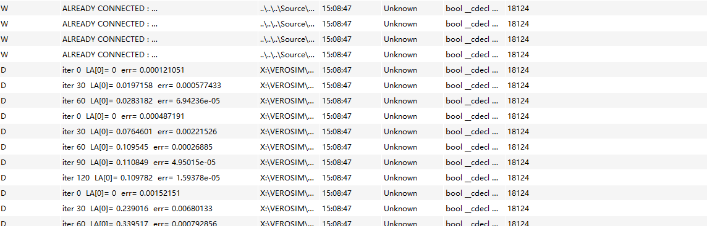

*Tips：持续完善文档，记录每一次优化与踩坑体会，有助于后续论文撰写与项目迭代！*


# 毕业设计每周工作总结

#### 未来24周计划

- [x] 准备工作
  - [x] 学习C++
  - [x] 学习多体动力学仿真
- [ ] 英语演讲答辩能力
- [ ] 理解文献和chrono参考代码(3)
- [ ] 熟悉VEROSIM的求解器代码结构(1)
- [ ] 实现QP的建模和Interior-Point简单求解(4)
- [ ] 应用APGD求解器(8)
  - [ ] 等式约束(hinge, prismatic, rigid, ball and socket)
  - [ ] contact and friction
  - [ ] Motor，limit及其它的约束类型
- [ ] 分析结果，优化算法(4)
  - [ ] 简单模型
  - [ ] 大规模模型
  - [ ] 实际模型(Harvester)
- [ ] 写论文(4)


## 26.05.2025-30.05.2025
- [x] APGD文献 （CCP → LCP →QP）
- [x] Chrono 源码 找到主函数以及运行流程

## 02.06.2025-06.06.2025

- [x] 继续文献
- [x] 安装VEROSIM，学习建模，了解RBDynamX的求解器结构 （02.06）
- [x] APGD相关文献算法（初级和高级）
- [x] QP问题求解MBD(相关论文)怎么从LCP或CCP建模QP问题，QP问题如何被求解，等式约束和不等式约束
- [x] Chrono debug APGD 设置断点


## 09.06.2025-13.06.2025

- [x] QP问题求解MBD(相关论文)怎么从LCP或CCP**建模QP问题**，QP问题如何被求解，等式约束和不等式约束
- [x] Chrono debug APGD 设置断点
  - [x] 详细看APGD算法，及相关函数


- [x] 学习VEROSIM建模，了解RBDynamX的求解器结构 （02.06）
- [x] SOCCP second order 正交圆锥


## 16.06.2025-20.06.2025

- [x] 论文细节 关于APGD
- [x] 代码细节，以及代码结构
- [x] 了解RBDynamX的求解器结构 思考程序设计


## 23.06.2025-27.06.2025

- [x] chrono代码实现细节，输入输出
- [x] VEROSIM代码实现细节
- [x] chrono中QP问题怎么被构建出来的 


## 30.06.2025-04.07.2025

- [x] 实现QP建模
- [x] 实现APGD
- [x] CCP建模 chrono里给CCP建模，与VEROSIM中的LCP建模比较区别在哪


## 周任务（07.06.2025 – 07.11.2025）
- [x] VEROSIM 实现 CCP / QP 建模  
- [x] 实现并集成 APGD 求解器

---

### 本周思考
1. **优先级**：先把 APGD 插到现有的 LCP 建模流程里，实现对接；  
2. **可配置性**：把 APGD 加入求解器枚举与下拉选项，方便在运行时自由切换；  
3. **后续准备**：完成 QP 建模（基于 Chrono 风格），为并行化、性能优化打基础。

---

### Data : 2025-07-10

---

### APGD 求解器集成步骤

#### 1. 源码接入
- 将 `RBDSolverAPGD.h/cpp` 添加到项目中，确保它们参与编译；  
- 在 `RBDClusterLagrangeMultipliers.cpp` 中加入：
  ```cpp
  #include "RBDSolverAPGD.h"
 - 执行全量 Rebuild，确保无编译或链接错误。

#### 2. 扩展求解器枚举

在 **RBDScene.h** 中：

```cpp
enum CONSTRAINTSOLVERTYPE {
  CST_LAGRANGEDANTZIG,
  CST_LAGRANGEGS,
  CST_LAGRANGEAUTO,
  CST_LAGRANGEINTERACTIVEDANTZIG,
  CST_LAGRANGEINTERACTIVEGS,
  CST_LAGRANGEINTERACTIVEAUTO,
  CST_LAGRANGEDANTZIGEXP,
  CST_IMPULSEBASED,
  CST_PENALTY,
  CST_SEQUENTIALIMPULSE,
  CST_LAGRANGEAPGD   // ← 新增 APGD
};
```

#### 3. 集群工厂中开启 APGD

在 **RBDScene.cpp** 的 `createNewCluster()` 方法里：

```cpp
else if (t == CST_LAGRANGEAPGD) {
  // 为非交互式 Lagrange 乘子集群
  return new RBDClusterLagrangeMultipliers(this);
  // 如需调试/单步，可改为：
  // return new RBDClusterLagrangeMultipliersInteractive(this);
}
```

#### 4. 在 doTimeStep() 中植入 APGD 支持

在 **RBDClusterLagrangeMultipliers::doTimeStep(...)** 的 solver 选择 switch 中添加：

```cpp
case RBDScene::CST_LAGRANGEAPGD:
  myLcp = new RBDLcpAPGD(
    matA.rows(),                   // LCP 维度
    numberEqualityConstraints,     // nub
    myScene->numberIterations(),   // maxIters
    myScene->getTol(),             // tol（需在 RBDScene 中暴露）
    myScene->getAccel()            // accel（需在 RBDScene 中暴露）
  );
  break;
```

其余分支保持不变，并做好失败时增加 CFM 或退化到 GS 的回退策略。

#### 5. 界面 & 配置同步

##### 5.1 Qt 下拉菜单

在 `VSPluginRBDynamXOptions.cpp`：

```cpp
constraintSolverValues.append({
  "apgd",
  tr("Lagrange Multipliers, APGD")
});
```

##### 5.2 读取并应用设置

在 `MainSimStateExtension::slotSyncSettings()` 中：

```cpp
else if (solverName.toLower() == "apgd")
  myRBDScene->setConstraintSolverType(
    VSLibRBDynamX::RBDScene::CST_LAGRANGEAPGD
  );
```

---

## 下一步 & 建议

* **测试对比**：用单摆、双摆等场景对比 APGD 与 Dantzig/GS 的收敛性和效率；
* **日志输出**：在 `RBDLcpAPGD::solve()` 内打印残差、迭代次数，便于定位收敛瓶颈；
* **界面调优**：将 `tol`、`maxIters`、`accel` 参数也暴露到 GUI；
* **性能分析**：跑大规模约束场景，统计内存占用与迭代耗时，为并行化与 GPU 加速打基础。


### 2025-07-11

### 测试对比

将新增的对默认的lagrangmultipliers的求解器（加Dantzig）效果做对比：

 - 默认的求解器是正常的单摆，符合物理特性。
 - APGD基于LAGRANGEMUITIPLIERS的LCP建模的方式去写的求解器，得到的单摆结果：就是直接下落。

### 问题猜测：

同一个单摆模型，用默认的 Lagrange‐multiplier+Dantzig/GS 求解器能正常振动，
但用你接进去的 APGD 解算器就直接自由落体”，

**APGD效果视频：**
<video width="640" height="360" controls>
  <source src="./MA_weeklyplan_image/APGD_LCP_SOLVER.mp4" type="video/mp4">
  你的浏览器不支持 Video 标签。
</video>

**基本上说明你的 APGD 分支在求解约束力的时候返回了全零（或者极小）的 λ**，
导致根本**没把摆杆的杆约束力施加上去**，物体直接受重力加速度下落。


 - 单摆的绳长保持不变属于等式约束（holonomic equality constraint）。
 - 约束方程写作：

单摆的 holonomic equality constraint（等式约束）写作：

$$
g(\mathbf{q})
=
\bigl\lVert\,\mathbf{x}_{\text{质点}} - \mathbf{x}_{\text{支点}}\bigr\rVert
- L
= 0.
$$


## 周任务（14.06.2025-18.07.2025）
- [ ] Debug APGD求解器的自由落体问题
- [ ] 完成CCP建模，去名字为RBDClusterLagrangeMultipliersQP

### 2025.07.14


### TASK
 - 通过调试的方法去定位为什么会出现自由裸体的这个情况？

目前对于问题的设想是：
 - 1.是不是求出来的lagrange也就是约束力的值太小了？
求证：通过Qdebug 来显示这个值的大小
如何使用Qdebug:
```cpp
qDebug() << "test" << xprev;  //xprev是需要打印出来的变量 
```

最后计算出来的结果（即最终的解向量 $x$ 和 $w$）
 - (*x)[i] 是你的解向量
 - (*w)[i] 是 $w = Ax + b$ 的结果

换到一个 Qt 容器里才能用 qDebug() 一次性打印，最常见的做法是先构造一个 QVector<double>，然后 append 每个分量，最后再打印：
```
//调试信息
// 计算误差 ‖xnew - xprev‖∞
        err = 0;
        for (int i = 0; i < n; ++i)
            err = std::max(err, std::abs(xnew[i] - xprev[i]));
        // ——— 调试打印，每 10 步看看 λ0、λrod、err ———
        if (k % 30 == 0) {
            qDebug() << "iter" << k
                << " LA[0]=" << xprev[0]
                //<< " λrod=" << xprev[rodIndex]   // 请确保 rodIndex 已定义为“杆长约束”在向量中的下标
                << " err=" << err;
        }


        if (err < tol) break;

```

LA[0] 就是你第 0 号约束（也就是单摆的杆长等式约束）的拉格朗日乘子——物理上它对应的是杆上的张力 𝑇
这是单摆的初始值：

第一次迭代（iter 0）LA[0]≈0：因为你从水平方向（或某个初始角度）“松手”那一刻，杆几乎不需要任何张力来维持摆球的位置，所以乘子近乎 0。

随着迭代推进，LA[0] 慢慢上升并收敛到 ~0.11：那就是 APGD 算出来的、在该时刻保持杆长不变所需的张力大小。

err 下降到很小，说明解在收敛。

值很正常

**杆约束力公式**

单摆杆上的张力 \(T\)（即第 0 号拉格朗日乘子 \(\lambda_0\)）满足：

$$
T = \lambda_0 = m\!\left(\frac{v^2}{L} + g \cos\theta\right)
$$

- \(m\)：摆球质量  
- \(v\)：摆球速度  
- \(L\)：摆长  
- \(g\)：重力加速度  
- \(\theta\)：摆角


这是单摆完全脱离后的值：


原因猜测：具体为什么会“完全脱离”？
 - 第一轮迭代 λ₀≈0：APGD 从零初始猜测（warm-start 关掉时）开始，第一步就投影把 λ₀＝0 保持住，此时根本就没有任何约束力拉住摆球，它就自由落体离开原点。
 - 物体位移过大：在时间积分那一小步里，摆球已经因为重力加速移动，杆长严重被拉长。下一次你再调用 APGD solve()，所有约束都违反得很严重。
 - 后续迭代才“补张力”
APGD 在第 30、60、90 步才慢慢把 λ₀ 迭代到 90、130、132 这样巨大的值（对应非常大的拉力），以求把摆球拉回到正确的杆长。但此时你已经错过了时间步长，摆球已经移动太远，运动已经不连贯，所以看起来就是“脱离”


**为什么不一开始就拉住？**
 - 初始猜测为 0：默认你没开启 warm-start，xprev 被清零，第一次迭代就把 λ₀ 投影到 0
 - 步长 α 或迭代次数不足：APGD 在几次迭代里根本没法把 λ₀ 
 - 误差阈值 tol 太大：当 err < tol 时你就提前退出了，可能这时 λ 还远没到正确值


问题确定，开始求解
#### 方法1. 开启 Warm-start：
所析，第一步迭代时 λ₀ 被投影回 0，完全没有初始张力。
在 APGD 创建后调用：
```
solver.EnableWarmStart(true);
```
这样会使用上一步结束时的 λ 值作为新步的初始猜测，从而在刚开始迭代时就能提供一定的张力缓冲。\
我需要重新添加一个函数，使他满足这个功能

完成了这个函数后需要在RBDClusterLagrangeMultipliers.cpp启动
```
	case (RBDScene::CST_LAGRANGEAPGD):
		{
			// APGD 求解器
			myLcp = new RBDLcpAPGD(
				matA.rows(),                   // LCP 维度
				numberEqualityConstraints,     // 均等约束数量 nub
				myScene->numberIterations(),   // 最大迭代次数
				1e-6,                          // 收敛容忍度 tol
				0.9                            // Nesterov 加速系数 accel
			);
			// **这里启用 warm-start**
			myLcp->EnableWarmStart(true);
			break;
		}
		default:
```

很复杂！！！！！！！

完成，但是结果并不理想。
<video width="640" height="360" controls>
  <source src="./MA_weeklyplan_image/warmstart.mp4" type="video/mp4">
  你的浏览器不支持 Video 标签。
</video>

>*这个把上一个时间步计算的最优结果带入并不违背APGD算法，伪码里的 γ₀ 本来就是一个“外部给定”的初始猜测（Algorithm 1 的输入里就写了 γ₀）。
它并没有硬性要求把 γ₀ 设为 0，零向量只是最常见也最简单的 choice。*

所以第一种方法暂时失败，可以作为之后优化的一种尝试。


> 控制变量，在进行第二个方法前关掉第一个方法


### 2025.07.14

#### 方法2. 调整最大迭代次数和容忍误差
```cpp
// 先关闭 warm-start
solver.EnableWarmStart(false);

// 再设置迭代次数和容忍度

// 在这VSPluginRBDynamXMainSimStateExtension.cpp更改
// 所以我直接选择快速暴力的解法，直接写死

// 1) 用派生类指针接收 new 出来的对象
			RBDLcpAPGD* apgd = new RBDLcpAPGD(
				matA.rows(),                 // LCP 维度
				numberEqualityConstraints,   // nub
				500, // maxIters
				1e-10,                        // tol
				0.9                          // accel
			);
```
暂时暴力求解，直接写死。

**效果**

1.关闭warmStart，调整迭代次数从100到500：
<video width="640" height="360" controls>
  <source src="./MA_weeklyplan_image/warmstart.mp4" type="video/mp4">
  你的浏览器不支持 Video 标签。
</video>

通过观察debug的值：

发现最初的迭代次数并不满足500次，所以判断时过早满足了容忍值，所以提前结束了迭代，所以，我们选择更新他的精度
为1e-10

2.关闭warmStart，调整迭代次数从100到500，并tol = 1e-10 .


通过调整迭代次数，并没有优化刚才的效果，所以


#### 方法3. 缩小时间步长
#### 方法4. 优化步长（α）与预调度因子
#### 方法5. 使用 Baumgarte 或 约束柔性化