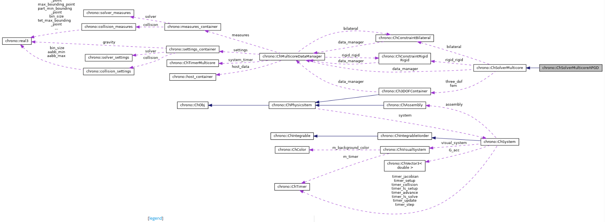

# chrono中multicore的并行化设计



## 1. 集中式DataManager + SoA 大数组

在整个并行化流程中，核心思想就是这个DataManager数据管理系统。

他的工作：它管“全局状态 + 稀疏大数组”。

ChMulticoreDataManager 是 多核后端的总控/数据枢纽 ： 
* 把碰撞检测、求解器、物理对象状态需要的所有大块数据，集中放在一个「结构化的数组仓库」里（host_container host_data）；
* 再提供一些尺寸信息（num_* 族）、计时器/配置/统计、以及材质混配策略等。

>Tips : 一切跨模块共享的数据（刚体/粒子状态、接触、稀疏矩阵 D/D_T/M/M_inv/M_invD、右端向量 v/hf/gamma/E 等）。
  
核心成员是 host_container，它是“结构化数组（SoA）”——为了并行和缓存友好，每一类量都放成一大块线性数组，而不是面向对象的分散指针。

### SOA
在这里补充一下什么是SOA，和SOA的作用:

**SoA（Structure of Arrays，数组的结构）**是一种内存布局，把“同一字段”的数据按连续的大数组存放；与之相对的是 AoS（Array of Structures，结构体的数组），把每个对象的所有字段打包成一个结构体，再把很多结构体连成数组。

* AoS 示例（每个刚体一条记录，字段挨在一起）
  ```
    struct RigidBody { real3 pos; quaternion rot; real3 vel; real mass; /* ... */ };
    std::vector<RigidBody> bodies; // bodies[i] 就是第 i 个刚体的“整包”数据
  ```
* SoA 示例（每个字段一大块数组）
  ```
    struct HostContainer {
        custom_vector<real3> pos_rigid;
        custom_vector<quaternion> rot_rigid;
        custom_vector<real3> vel_rigid;
        custom_vector<real> mass_rigid;
        /* ... 其它字段 ... */
    } host;
    // 第 i 个刚体的位置是 host.pos_rigid[i]，姿态是 host.rot_rigid[i] …
  ```
pos_rigid / rot_rigid / ct_force / ct_torque / gamma / E / D / D_T ... 都是大而连续的“字段数组”，这就是标准的 SoA

**SoA 的核心作用（为什么仿真里爱用它）?**
1. 缓存/预取友好
    
    大多数数值核是“对一个字段做同构遍历”（例如对全部速度做一次更新、对全部法向冲量做投影）。

* SoA 让这类循环顺序扫描一大片连续内存，L1/L2 命中率高，CPU 预取能跟上。
* AoS 在这种循环中会“跨字段跳跃”，把无关字段也拖进缓存，浪费带宽。

2. SIMD / SIMT/ GPU 合并访问
* 向量化/AVX 需要连续数据；GPU 需要 coalesced（合并）访问。
* SoA 把同一字段排成大块，线程束/向量寄存器能一次抓到 N 个元素；AoS 则会被“结构体步长”打散。

3. ...剩余的好处在这里不做展开了，之后看到在进行补充。

### host_container：每块数据是做什么的？

1) 接触相关（NSC/SMC 双路线的共享与区分）
2) 物体/自由度
3) 约束类型与映射
4) 稀疏矩阵与动态向量（Blaze）


ChMulticoreDataManager/host_container = 多核 NSC/SMC 的“数据中台”。


## 2. 稀疏算子化的 Schur 乘

“Blaze”就是一个高性能的 C++ 线性代数库。（可能和VSM 数学库相似，但是有待考察）。

这个问题之前就说过，在提上日程的过程中，主要是算子化，可以减小缓存，也可以为之后并行化做好准备。

这部分在笔记[chrono求解器部分的结构](./chrono求解器部分的结构.md)有所提到过，核心思想
如下：

> chrono中的建模阶段是通过对不同块的矩阵进行偏移，也就是编码，然后不组装大矩阵Z，看求解器需要不，如果是直接线性求解器，类比VEROSIM中的dantzig，那么我就按照编号把大矩阵组装好，然后进行线性的求解，但是对于APGD这种迭代的求解器暂时不需要大矩阵，那么他在APGD调用相关数据时，比如N和R时，就可以根据偏移编码，读取出数据，从而进行计算，怎么编写的目的是为“既能装配、也能算子式”的通用接口层，方便不同类型求解器插拔。


**Multicore 只是在 SoA 数据布局上把这套算子化思路进一步做了“视图化/批处理化”。**

这里的“视图化”（views）指的是：不复制数据，而是用“切片视图”去引用SoA大数组里的一个连续（或规则）片段，并把这个片段当成“像独立矩阵/向量一样”的对象来操作。

读写都直接作用在原数组上 + 上层拿“窗口”来用（宏定义） + 底层仍是一份大数组

优点： 
* 零拷贝 + 批处理 ： 
把“成千上万个约束里所有的切向分量”一次性拿出来当成一个大 Submatrix/Subvector，一次循环就能做完“投影/缩放/加权”等批量操作。无需把每个约束挨个取字段、拼小数组。

* 语义清晰（宏定义）： 提供了移植代码的思路 ，
逻辑上你就写“对 T 块做摩擦盒投影，对 N 块做非负投影，对 B 块跳过投影”。代码层面体现为对 _DT_、_DN_、_EB_ 这样的“窗口对象”做运算，物理块和代码块一一对应。

* 缓存/并行友好： 
视图让你顺序地扫一整个物理块（SoA 连续内存），避免在 AoS 里“跨字段跳来跳去”。OpenMP 只要包一层 #pragma omp parallel for 就能把块内循环并起来。

## 3. OpenMP 数据并行 + 线程自适应

* 大头循环（清力、收集/回散状态、粒子重映射、接触建图/回填等）用 #pragma omp parallel for 做数据并行；线程数由系统侧集中管理，并提供计时窗口 + 试探/回退的动态调优（例如每 10～50 帧评估一次）。

* 并行的“计算密集内核”多在装配/碰撞/数据层；**迭代内部未强绑 OMP，便于替换不同算法**（PGS/BB/CG/APGD…）。


## 4. 模块边界清晰（碰撞 ↔ 物理 ↔ 求解器）

碰撞系统在 PreProcess() 把内部 cd_data 的指针直接指向 DataManager 的外部状态数组（避免复制），Run() 后 PostProcess() 把接触/材料信息回填，再交给求解器（NSC/SMC 任选）。

关于这部分我找到了相关的文献，有待查看。

[CHRONO: a parallel multi-physics library for rigid-body, flexible-body, and fluid dynamics](https://ms.copernicus.org/articles/4/49/2013/?utm_source=chatgpt.com)
### ChSolverMulticoreAPGD.cpp:

## 代码移植的可行性分析

* 数据层（SoA & DataManager）：  把“分散在对象/容器里的状态与接触数据”下沉为一套集中式 SoA 大数组，并建立与 UI/对象世界的双向映射。
* 碰撞系统对接
* 约束装配（稀疏 + 视图宏）
* 求解器并行（APGD/PGS/SIPGS 等）
* 积分器
（其中每部分都要做，稳定性测试和线程调试）


>下面这部分来源于cursorm,考虑删除
### 并行总体架构（Multicore 模块）
- **数据核心（DataManager）**: `ChMulticoreDataManager` 持有所有跨模块共享的数据数组（状态、接触、稀疏矩阵、右端项等），并集中管理定时器、设置项与统计信息。求解器、碰撞系统、系统装配均通过它共享数据，避免频繁传参与复制。
- **时间步流水线**: `ChSystemMulticore::AdvanceDynamics()` 驱动一次完整时间步：
  - `Setup()`：缓存步长与容差、统计 DoF、刷新活跃体计数。
  - `Update()`：按严格次序装配（清力→约束加载→刚体/轴/马达/3DOF 更新→注入约束→收集双边约束映射）。
  - `collision_system->PreProcess/Run/PostProcess/ReportContacts()`：连接到 DataManager 的外部状态数组，运行宽/窄相，回填测量与接触材料合成输入。
  - `solver->RunTimeStep()`：调用多核迭代求解器（NSC/SMC 变体）处理法向/切向/自旋与双边约束的 Schur 系统。
  - 收敛后并行回散速度、位置到实体，再推进 `ch_time`，可选动态线程调优。
- **并行范式**: 以 OpenMP 为主，通过 `#pragma omp parallel for` 在多处对大数组（刚体/粒子/接触）进行数据并行；线程数集中由 `omp_set_num_threads` 管理，并提供基于计时器的动态调优。未见 TBB/线程池/显式 `std::thread` 在该子模块中使用。

### 关键并行位置与职责
- **系统更新与回散（scatter）**
  - 并行更新并回散刚体速度/姿态，刷新碰撞同步位姿。
```138:159:chrono/src/chrono_multicore/physics/ChSystemMulticore.cpp
#pragma omp parallel for
for (int i = 0; i < assembly.bodylist.size(); i++) {
    if (data_manager->host_data.active_rigid[i] != 0) {
        auto& body = assembly.bodylist[i];
        body->Variables().State()(0) = velocities[i * 6 + 0];
        // ...
        body->VariablesQbIncrementPosition(this->GetStep());
        body->VariablesQbSetSpeed(this->GetStep());
        body->Update(ch_time, true);
        // update the position and rotation vectors
        pos_pointer[i] = (real3(body->GetPos().x(), body->GetPos().y(), body->GetPos().z()));
        rot_pointer[i] =
            (quaternion(body->GetRot().e0(), body->GetRot().e1(), body->GetRot().e2(), body->GetRot().e3()));
    }
}
```
  - 并行清零所有变量的力向量。
```281:298:chrono/src/chrono_multicore/physics/ChSystemMulticore.cpp
#pragma omp parallel for
for (int i = 0; i < (signed)data_manager->num_rigid_bodies; i++) {
    assembly.bodylist[i]->VariablesFbReset();
}
// ...
for (int i = 0; i < (signed)data_manager->num_rotmotors; i++) {
    rotmotorlist[i]->VariablesFbReset();
}
```
  - 并行装配刚体状态与力，并同步碰撞模型位姿。
```341:381:chrono/src/chrono_multicore/physics/ChSystemMulticore.cpp
#pragma omp parallel for
for (int i = 0; i < assembly.bodylist.size(); i++) {
    auto& body = assembly.bodylist[i];
    body->Update(ch_time, false);
    body->VariablesFbLoadForces(GetStep());
    body->VariablesQbLoadSpeed();
    // scatter qb/hf/pos/rot/active/collide 到全局数组
    // ...
    if (body->GetCollisionModel())
        body->GetCollisionModel()->SyncPosition();
}
```

- **碰撞系统（Multicore 自定义）**
  - 预处理阶段将 `cd_data` 指向 DataManager 的“外部状态数组”，避免复制。
```44:78:chrono/src/chrono_multicore/collision/ChCollisionSystemChronoMulticore.cpp
void ChCollisionSystemChronoMulticore::PreProcess() {
    // Set pointers to state arrays
    cd_data->state_data.pos_rigid = &data_manager->host_data.pos_rigid;
    // ...
    // Update collision detection settings
    const auto& settings = data_manager->settings.collision;
    // ...
}
```
  - 碰撞后处理时，按粒子数量并行回填排序速度并写回系统速度向量（粒子三自 3 DoF 对齐）。
```106:114:chrono/src/chrono_multicore/collision/ChCollisionSystemChronoMulticore.cpp
#pragma omp parallel for
for (int i = 0; i < (signed)data_manager->num_particles; i++) {
    int index = cd_data->particle_indices_3dof[i];
    data_manager->host_data.sorted_vel_3dof[i] = data_manager->host_data.vel_3dof[index];
    v[body_offset + i * 3 + 0] = data_manager->host_data.vel_3dof[index].x;
    v[body_offset + i * 3 + 1] = data_manager->host_data.vel_3dof[index].y;
    v[body_offset + i * 3 + 2] = data_manager->host_data.vel_3dof[index].z;
}
```
  - 并行将每个接触对映射到接触容器（用于材料合成/接触加载）。
```139:149:chrono/src/chrono_multicore/collision/ChCollisionSystemChronoMulticore.cpp
#pragma omp parallel for
for (int i = 0; i < (signed)num_contacts; i++) {
    auto b1 = bids[i].x;
    auto b2 = bids[i].y;
    auto s1 = int(sids[i] >> 32);
    auto s2 = int(sids[i] & 0xffffffff);
    container_mc->AddContact(i, b1, s1, b2, s2);
}
```

- **求解器层（Schur-Product + 投影）**
  - 求解器基类与多种算法（APGD/BB/MinRes/CG/Jacobi/GS）通过函数子 `ChSchurProduct`、`ChProjectConstraints` 解耦“矩阵-向量乘”和“锥投影”。具体迭代内部未直接出现 OMP 指令，多线程主要来自装配/碰撞/数据级并行；求解器调用的是 Blaze 稀疏结构，计算密集部分走 Schur-Product 回调。
```86:127:chrono/src/chrono_multicore/solver/ChSolverMulticore.h
class CH_MULTICORE_API ChSolverMulticore {
  // Solve(...) 接受 ChSchurProduct 与 ChProjectConstraints，迭代在各子类实现
};
class CH_MULTICORE_API ChSchurProduct { /* 负责 AX */ };
class CH_MULTICORE_API ChProjectConstraints { /* 负责投影 */ };
```

### 线程数管理与动态调优
- **设置接口**: `ChSystemMulticore::SetNumThreads` 使用 `omp_get_num_procs()` 做上限提示，并集中 `omp_set_num_threads(num_threads_chrono)`，同时将 Eigen 线程数对齐传入基类接口（为稀疏直解器等准备）。
```694:704:chrono/src/chrono_multicore/physics/ChSystemMulticore.cpp
int max_avail_threads = omp_get_num_procs();
if (num_threads_chrono > max_avail_threads) {
    std::cout << "WARNING! Requested number of threads (" << num_threads_chrono << ") ";
    std::cout << "larger than maximum available (" << max_avail_threads << ")" << std::endl;
}
omp_set_num_threads(num_threads_chrono);
```
- **运行时线程调优（可选）**: 基于最近 10 帧/50 帧 `step` 计时窗口做“试探+回退”的线程数调整，每次尝试 ±2 线程；确保在 `[min_threads, max_threads]` 内。
```582:614:chrono/src/chrono_multicore/physics/ChSystemMulticore.cpp
if (frame_threads == 50 && detect_optimal_threads == false) {
    // 提升 2 线程并记录基线
    current_threads += 2;
    omp_set_num_threads(current_threads);
} else if (frame_threads == 10 && detect_optimal_threads) {
    // 比较新窗口耗时，若变差则回退
    if (old_timer < current_timer) {
        current_threads -= 2;
        omp_set_num_threads(current_threads);
    }
}
if (current_threads < data_manager->settings.min_threads) {
    current_threads = data_manager->settings.min_threads;
    omp_set_num_threads(data_manager->settings.min_threads);
}
```

### 数据流与矩阵装配（对并行的支撑）
- 使用 Blaze 的 `CompressedMatrix`/`DynamicVector` 存储 `D`, `D_T`, `M`, `M_inv`, `M_invD` 与向量 `v`, `hf`, `gamma`, `E`，并通过大量宏定义快速获取子块/子向量视图，减少临时对象与拷贝，便于在求解器/装配阶段进行高效批量访问。
```108:173:chrono/src/chrono_multicore/ChDataManager.h
#define _D_ data_manager->host_data.D
#define _M_invD_ data_manager->host_data.M_invD
#define _D_T_ data_manager->host_data.D_T
// ... 大量 submatrix/subvector 宏，按接触与双边区段进行切片视图
```

### 你需要知道的并行边界
- 碰撞检测（宽/窄相）与接触映射是数据并行热点；3-DoF 粒子的排序/拷贝也以 OMP 并行方式批处理。
- 刚体/轴/马达/粒子更新、力装配、状态回散均使用 OMP 并行循环。
- 迭代求解器的并行化主要通过“装配好的稀疏结构 + 回调”的方式间接受益，未见显式每步 OMP；真正的线程数控制集中在系统侧。
- 未使用 TBB/线程池；GPU/CUDA 不在该 `chrono_multicore` 子模块直接介入（GPU 有独立子模块）。

### 简短结论
- **核心思想**：以 DataManager 为中心的 SoA 数据布局 + OpenMP 数据并行（遍历大数组）+ 运行时线程数调优；碰撞系统与物理装配共享外部状态数组，避免复制；求解器以函数子抽象 Schur 乘与锥投影，复用稀疏视图高效访问。
- **并行收益点**：刚体/粒子批处理、接触生成与材料预处理、状态回散、部分碰撞后数据重映射；线程数可自调以逼近平台最优。

- 以上并行相关关键位置均已在代码引用中标注。

小结
- DataManager 聚合数据与设置，贯穿装配-碰撞-求解。
- OpenMP 并行覆盖清力、刚体/粒子更新、接触映射、粒子速度重映射与回散。
- 线程控制集中在 `ChSystemMulticore`，支持基于计时的动态调优。
- 求解器通过 SchurProduct/Projector 抽象，配合 Blaze 稀疏结构进行高效迭代。