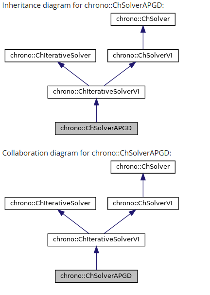
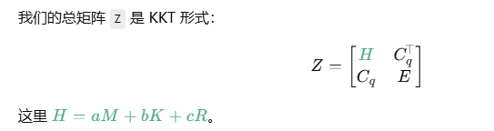
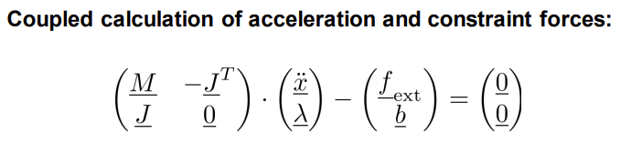
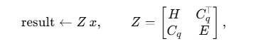

## Simulation system

### ChSystem 与两种系统

* **ChSystemNSC**（Non-Smooth Contacts, DVI/硬接触）：接触约束走互补问题（LCP/VI），可用较大步长、效率高。
* **ChSystemSMC**（SMooth Contacts, 软接触/罚函数）：接触可变形，常与弹簧-阻尼模型、FEA耦合。

### Time steppers（时间积分器）

* **EULER\_IMPLICIT\_LINEARIZED**（默认）

  * 一阶、**无内迭代**、快；**支持 DVI(硬接触)**；FEA 给一阶精度；约束靠稳定化。
* **HHT**

  * 隐式、**有内迭代**、二阶、可调数值阻尼；**目前不能用于 DVI 硬接触**；适合 FEA/SMC；约束因内迭代收敛“闭合得更严”。
* **NEWMARK**

  * 与 HHT 类似；除“梯形法则”特参外整体是一阶；多用于 FEA/SMC。

> 经验：**DVI/硬接触 ⇒ EULER\_IMPLICIT\_LINEARIZED**；**软接触/FEA/需要二阶与阻尼 ⇒ HHT/NEWMARK**。

### Solvers（求解器）★重点

时间积分器每步都会调用“求解器”来求未知的加速度与反力。它往往是**计算热点**。

**推荐的迭代求解器与特性：**

* **PSOR**

  * 最常见入门选择；实现简单、收敛精度偏低，**质量比奇怪时易卡**；
  * **支持 DVI/硬接触**；
  * 适合小规模、精度要求不高的场景。
* **APGD**（加速投影梯度）

  * **收敛好**，高精度仿真常用；**支持 DVI/硬接触**；
  * 对大问题更稳健，建议优先于 PSOR。
* **BARZILAIBORWEIN**（BB） （后期是否考虑？）

  * 收敛也不错；**支持 DVI/硬接触**；
  * 与 APGD 相近，有时在大质量比下更鲁棒。
* **MINRES**

  * 适合 **FEA**；**当前不支持 DVI/硬接触**；
  * 配合对称稀疏线性系统，常与预条件配合使用。
* **ADMM + PardisoMKL**

  * 同时支持 **FEA 与 DVI**；
  * 需要内部线性解算器，最佳是 **PardisoMKL**（需单独模块），否则退化到 **ChSolverSparseQR**。

## chrono 求解器结构

## 代码

ChVersion : 版本号头文件”（version header）

Chplatform: Chrono 的“跨平台胶水” ，ChApiEXPORT/IMPORT 解决不同平台/构建方式下动态库符号可见性问题；CH_DEPRECATED 用于标记弃用 API并在编译期发出友好提醒。

ChApiCE: ChApi 是一个“可见性贴纸”宏——你把它贴在要对外公开的类/函数前面，它会在编库时展开成“导出符号”，在用库时展开成“导入符号”；如果是静态库或非 Windows，它通常什么也不做。

ChClassFactory:工厂机制

ChSystemDescriptor: 

  * CH_FACTORY_REGISTER(ChSystemDescriptor):注册进 Chrono 的类工厂（ClassFactory）这个类能被按名字动态创建/持久化；

  * CH_SPINLOCK_HASHSIZE:并发用的自旋锁分片大小;

  * ChSystemDescriptor() and ~ChSystemDescriptor():构造/析构把计数/参数复位、容器清空，但不负责删除外部对象。

  * ComputeFeasabilityViolation: 扫一遍所有约束，统计“最坏的违反量”和“（单边）互补残差的最坏值”，用于判断这一仿真步的约束是否“解干净了”。

  * CountActiveVariables and CountActiveConstraints:“统计 + 编号（写偏移）”的工具，用来把当前步中激活的变量/约束映射到全局向量里的正确位置。

  * UpdateCountsAndOffsets : 一次性刷新“计数 + 偏移”并开启缓存。

  * PasteMassKRMMatrixInto：把变量侧的大块 𝐻（质量/刚度/阻尼的组合）贴到全局稀疏矩阵 Z 的指定位置。
  如图所示：。

  * PasteConstraintsJacobianMatrixInto and PasteConstraintsJacobianMatrixTransposedInto: 把雅可比和雅可比转置贴到全局稀疏矩阵。

  * PasteComplianceMatrixInto ： 约束顺应矩阵（compliance matrix）E贴到一个稀疏大矩阵 Z 的指定位置。

  

  * BuildSystemMatrix:一次线性化方程组装成“整块稀疏矩阵 Z 和右端向量 rhs”

  * BuildFbVector: 按活跃变量（刚体/节点等）的全局偏移，把每个变量贡献的“已知力”写入系统级向量 𝑓

  * BuildBiVector:按活跃约束的全局偏移，把每条约束的右端项写入系统级向量 𝑏

  * BuildDiVector(Dvector) :一次性得到系统 RHS 的拼接向量 𝑑={𝑓;−𝑏}（注意下半部分有负号），直接与 𝑍∗𝑦−𝑑 的实现对接。

  * BuildDiagonalVector:构造系统矩阵 𝑍 的“对角近似”向量，用于对角预条件或尺度化。

  * FromVariablesToVector： 从所有“活跃”变量中把它们当前的未知量状态收集起来，拼成系统级变量向量 𝑞，写进 mvector。

  * FromVectorToVariables： 把外部给出的系统级变量向量（长度应等于活跃自由度总数）散回每个变量对象的 State()。

  * FromConstraintsToVector and FromVectorToConstraints:对“约束乘子向量 𝑙”做收集/回填（gather/scatter）的两段工具函数,和上面写的一样。

  * FromUnknownsToVector and FromVectorToUnknowns: 整根未知量向量 ，q 和 l; 操作同上。

  * SchurComplementProduct：Schur 补矩阵的矩阵-向量乘， 完全matrix-free， 不显式组装 N。

  * SystemProduct： 按块结构“算子式”地计算整块KKT矩阵 𝑍与向量 𝑥的乘积。
  

  * ConstraintsProject： 把“乘子向量”投影回可行集合。
  * UnknownsProject ： 同上
  * WriteMatrixBlocks：把系统矩阵的各个“基本砖块”与 RHS 分别导出到磁盘。
  * WriteMatrix： 显式装配法——直接调用装配函数得到稀疏矩阵 𝑍 和右端 rhs，写盘。
  * WriteMatrixSpmv：算子（SPMV）重建法——不给出 𝑍，而是对每个标准基向量 𝑒𝑖 计算一次。

## 总结一下chrono的建模逻辑：

如果问的是“在建模阶段（BeginInsertion→EndInsertion）到底有没有把整块大矩阵 Z 真正组装出来？”

——答案是：**没有。**

在建模阶段只是把**对象化的稀疏数据**（变量、约束、K/R/M 块）登记到 `ChSystemDescriptor` 里，并给它们**编号/写偏移**。此时系统里保存的是：

* 每个变量块自己的 $M$、$M^{-1}$、已知项 `Force()`；
* 每条约束自己的一行雅可比 $J_i$、右端 $b_i$、以及可选的对角 CFM（顺应）项 $E_{ii}$；
* 可选的 `ChKRMBlock` 子块矩阵（刚度/阻尼等）。
  这些都只是**分散的小块/对象**，**不**是整块 $Z$。偏移是在 `EndInsertion()` 后统一计算好的。

  K/R/M 块就是把变量侧“惯性-阻尼-刚度”这三件事打包成一类通用稀疏子块。
  E 就是约束的“顺应/正则化矩阵”（compliance，也叫 CFM = Constraint Force Mixing）。

**什么时候才“真的组装大矩阵 Z”？**

只有在你**明确调用组装**相关接口或用**直接线性求解器**时，才会把整块

$$
Z=\begin{bmatrix}H & J^{\top}\\ J & E\end{bmatrix},\quad
\text{rhs}=\{f;\,-b\}
$$

**显式**贴到一个稀疏矩阵里。对应接口是 `BuildSystemMatrix(&Z,&rhs)`，内部顺序就是：
`PasteMassKRMMatrixInto(H)` → `PasteConstraintsJacobianMatrixInto(J)` → `PasteConstraintsJacobianMatrixTransposedInto(J^T)` → `PasteComplianceMatrixInto(E)`，然后 `BuildDiVector(rhs)` 生成 $\{f;-b\}$。

* 你在 `WriteMatrix(...)` 里也能看到，它就是先调 `BuildSystemMatrix` 再写盘的：这说明**显式装配是在需要时才做**。
* 另外还有 `WriteMatrixBlocks(...)`，是把 $H,J,E,f,b$ **分块**导出（也不是整块 $Z$）。

**迭代求解时并不需要显式 Z**

* **MINRES / 其它 Krylov**：用 `SystemProduct(result, x)` 做**算子式乘法**（SPMV）来代替显式 $Z$ 乘法；这就是“矩阵-向量乘不组装矩阵”的做法。`WriteMatrixSpmv(...)` 甚至用“对每个单位向量做一次 `SystemProduct`”按列**重建** $Z$ 来做调试对比。&#x20;
* **PSOR / VI/CCP**（乘子空间）：用 `SchurComplementProduct(result, l)` 直接算 $Nl=(J\,M^{-1}J^{\top}+E)l$，**也不需要**显式组装 $N$。

同样APGD也不需要使用大矩阵Z；只用过便宜，也就是编号，做乘子计算。

ChSolverAPGD：