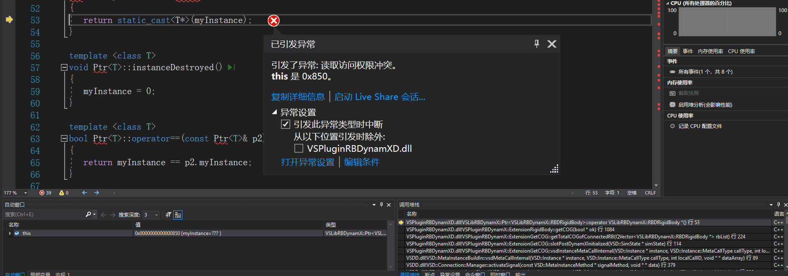

> tips: 关键点在于:FaellerVorrueckeFahrzeug -> childNodes -> Physical System -> childNodes -> FaellerVorrueckeFahrzeug (RBD) -> childNodes -> Interconnections (RBD - RBD) -> childNodes -> **HingeJoint: Motorwagen_RBD <--> Mittelgelenk_RBD** -> extension -> JointHinge: Motorwagen_RBD <--> Mittelgelenk_RBD   set isLocked


HingeJoint（铰链）：两刚体之间本来有 6 个相对自由度（DoF）。铰链会约束 5 个（3 个平移 + 2 个旋转），只留下 1 个旋转自由度，就是“绕铰轴转动”。

把铰链设为 Locked：把最后这 1 个旋转自由度也禁掉 → 变成 Fixed/Weld Joint（刚性焊接） 的效果。两边不能再发生任何相对运动。


通过断点调试，问题没有出现在代码里，就是因为一设 isLocked 引擎就会把原来的 Hinge 销毁并换成 Fixed/锁死版本，从而重建了刚体的 constraint 列表，形成了一个union。这个和你树里的关节矛盾，所以直接报错。你手里的旧容器/旧指针还在被迭代 → 元素越界/悬空；

我之前的用轮子判断也是崩溃的
所以判断是因为树里面的刚体和isLocked之后不符合



崩溃不是在你的 ExtensionCheckRollover 里，而是发生在 VSPluginRBDynamXD.dll 里的一个别的扩展——名字就写在栈上：
```
VSPluginRBDynamX::ExtensionGetCOG::slotPostDynamXInitialized(...)
→ VSPluginRBDynamX::ExtensionGetCOG::getTotalCOGofConnectedRB(...)
→ VSPluginRBDynamX::ExtensionRigidBody::getCOG(...)
→ VSLibRBDynamX::Ptr<...>::operator T*()   // 这里炸，this = 0x850

```
一旦把关节设为 isLocked，引擎会把 Hinge 换成 Fixed/焊接，重建约束容器；凡是还拿着旧容器/旧元素去遍历的代码，都会在 Ptr::operator T*() 这种地方爆。

问题出现在外部ExtensionRigidBody::getCOG()，在ExtensionCheckRollover中的算的COG没有走到这一步呢。

定位问题：为什么一点isLocked就不进入我的代码的地方了。


9.22
定位形成一个union后，39个刚体变成38个了。

Union 刚体，而 Union 是场景临时生成的聚合节点，没有对应的 ExtensionRigidBody


[COG] ext=null for "Union_(Motorwagen_RBDRB_Motorwagen_(++)+Mittelgelenk_RBDRB_Mittelgelenk_(+))"

# 1. 静态稳定判据的力学基础（为什么用“COM 投影 ∈ 支撑域”）

* 车辆受到重力 $\mathbf{W}=m\mathbf{g}$。在**准静态**（或低速、加速度很小）下，支撑面（地面）上的接触力合力 $\mathbf{R}$ 会抵消重力：$\mathbf{R}+\mathbf{W}=\mathbf{0}$。
* **等效条件**：若把 $\mathbf{W}$ 沿重力方向投到地面平面，记 COM（质心）在该平面上的投影点为 $\text{proj}(\mathrm{COM})$；则**存在**一组非负的接触支持力（轮-地法向力），使得其**力矩合**可与重力矩平衡的**充要条件**之一是

  $$
  \text{proj}(\mathrm{COM}) \in \text{ground support polygon}.
  $$

  直观理解：支撑反力的“可行锥”包含了重力的反方向，且合力的“作用线”要能穿过支撑多边形内部。若投影**跑出**支撑域，多边支撑无法产生所需稳定力矩，系统绕临界边翻覆。

> 这就是经典的**ZMP/支撑多边形**思想在“静态/准静态”下的简化版本。

---

# 2. 我们在代码里做了哪些几何运算？

## 2.1 用重力定义“水平参考平面”

* 从仿真场景读到重力向量 $\mathbf{g}$（若异常为零，则兜底 $(0,0,-1)$）。
* 令平面法向 $\mathbf{n} = -\hat{\mathbf{g}} = -\mathbf{g}/\|\mathbf{g}\|$。
* 构造与 $\mathbf{n}$ 正交的二维正交基 $(\mathbf{u}, \mathbf{v})$：

  * 取一个不与 $\mathbf{n}$ 平行的参考向量 $\mathbf{r}$（例如 $z$ 轴或 $y$ 轴），
  * $\mathbf{u} = \frac{\mathbf{r}\times \mathbf{n}}{\|\mathbf{r}\times \mathbf{n}\|}$,
    $\mathbf{v} = \mathbf{n}\times \mathbf{u}$。
* 这个 $(\mathbf{u},\mathbf{v})$ 平面**总是垂直于重力**，天然适配斜坡、侧坡、起伏地形；不依赖“世界的固定水平”。

> 结论：无论地面怎么倾斜，只要重力方向正确，判据不受场景“坐标系水平与否”的影响。

## 2.2 支撑点与支撑域（AABB）

* 用碰撞对 $\text{currentPairs}$ 判断哪些**轮胎着地**，取这些轮胎节点世界位置 $\mathbf{P}_k$。
* 投影到 $(\mathbf{u},\mathbf{v})$：
  $p_{u,k}=\mathbf{P}_k\cdot\mathbf{u}$,  $p_{v,k}=\mathbf{P}_k\cdot\mathbf{v}$。
* 取这些投影点的**轴对齐最小包围盒**（AABB）：
  $[u_{\min},u_{\max}]\times[v_{\min},v_{\max}]$。
* 轻微向内“收缩”一个固定量 $s$（不超过最短边一半），得到**收缩后的支撑盒**，抑制“贴线抖动”。

> 注：AABB 是对真实**支撑多边形**（应取凸包）的保守近似，优点是计算超快；缺点是某些不规则接触分布时略保守。需要更严谨可把 AABB 换成**凸包 + 点在多边形内**测试。

---

# 3. 整车质心（COM）的计算与投影

* 选取“属于本车装配树”的所有非固定刚体 $i$，读取其质量 $m_i$ 与世界坐标 $\mathbf{x}_i$，算**质量加权质心**：

  $$
  \mathrm{COM}=\frac{\sum_i m_i\mathbf{x}_i}{\sum_i m_i}.
  $$
* 投到 $(\mathbf{u},\mathbf{v})$ 平面：
  $c_u=\mathrm{COM}\cdot\mathbf{u}$, $c_v=\mathrm{COM}\cdot\mathbf{v}$。
* **几何安全裕度**（离支撑盒的最近边界距离）：

  $$
  d_u=\min(c_u-u_{\min},\,u_{\max}-c_u),\quad
  d_v=\min(c_v-v_{\min},\,v_{\max}-c_v),
  $$

  $$
  \text{margin}=\min(d_u,\,d_v).
  $$

  margin 为负表示投影跑出支撑盒。

> 重要：COM 的**高度**不影响此静态判据（投影只用水平坐标）。高度在**动态**翻覆（大加速度/俯仰/侧倾角速度时）会通过惯性项影响“等效力/力矩”，那是 ZMP/瞬时支撑力分布才需要考虑的内容（见 §6）。

---

# 4. 判定阈值、滞回与去抖（为什么能“止闪烁”）

* 记收缩后的支撑盒边长 $W_u=u_{\max}-u_{\min},\,W_v=v_{\max}-v_{\min}$，最短边 $W_\text{min}=\min(W_u,W_v)$。
* 我们定义两个阈值（单位米）：

  $$
  T_{\text{enter}}=\max(0.12,\,0.12\,W_\text{min}),\qquad
  T_{\text{exit}}=\max(0.18,\,0.18\,W_\text{min}).
  $$

  * **进入危险**：$\text{margin}<T_{\text{enter}}$
  * **退出危险**：$\text{margin}>T_{\text{exit}}$
    这就是**滞回**（enter < exit），避免在临界附近来回跳。
* **连续帧去抖**：

  * 进入危险需要连续 $N_d$ 帧满足（默认 3）才置 `true`；
  * 解除危险需要连续 $N_s$ 帧满足（默认 5）才置 `false`；
  * 落在 $[T_{\text{enter}}, T_{\text{exit}}]$ 的“中立区”不改状态，同时清零计数器。
* 预热 `_warmup` 帧把状态锁在安全，避免初始化/暂停恢复时的瞬态抖动。

> 小推导：在**水平地面**、近似“矩形轮距×轴距”的车辆上，若 COM 水平偏移量达到**半宽**就会绕边翻。我们用 $12\%/18\%$ 的**最短边比例**（或绝对 $12/18$ cm）作为“危险/安全”阈值，既有尺度自适应，又能覆盖小车与大车。

---

# 5. 退化与极端情况的处理

* 若**没有轮胎着地**（ng=0）：没有支撑点 ⇒ 必然失稳，判危险。
* 若 AABB 的某一维度 $\le 0$（或很小）：意味着只有**共线**或**单点**支撑，稳定裕度逼近 0，按危险处理（或提前进入中立/危险，视策略）。

---

# 6. 适用边界与扩展（何时足够，何时需要“更物理”）

### 什么时候足够？

* **低速、慢变**（越野缓慢爬坡、侧坡行驶、缓慢转向、吊臂缓慢摆动…）。
* 你只需要一个\*\*“是否已翻/将翻”**的**稳健\*\*开关，抗噪、不卡顿、易调。

### 什么时候需要更物理（ZMP/惯性力）？

* **急加速/急刹/急转弯**时，惯性力 $\mathbf{F}_\text{inert}=m\mathbf{a}$ 的投影与重力合成一个**等效负载**，它的**作用线**（或 ZMP）相对支撑域的位置才是严格判据。
  简化可把 $\mathbf{g}$ 换成“**等效重力**” $\mathbf{g}_\text{eff}=\mathbf{g}-\mathbf{a}$（非严格，但工程上常这么做），或直接从接触求和反力算 ZMP。
* **大角速度**引起的陀螺/离心效应，或**高 COM 急摆动**的动力学力矩，都超出静态判据，需要动力学层的 ZMP/反力矩计算。

---

# 7. 若要从 AABB 升级到“凸包判定”

* 算支撑点的**凸包**（如 Andrew/Graham 扫描）；
* 再做**点在凸多边形内**测试（射线法/叉积同侧法）；
* margin 可替换为到凸包边的最小距离；
* 其它流程（滞回/去抖）保持不变。
* 这样在非矩形/不规则着地分布时**更精确**，但计算稍重。

---

# 8. 典型应用场景的“脑补图”和调参建议

* **侧坡行驶**：$\mathbf{n}=-\hat{\mathbf{g}}$ 自动随坡面；COM 投影向坡低侧移动，margin 变小；当 < $T_{\text{enter}}$ 连续若干帧 ⇒ 报警。
* **越野砾石/台阶**：支撑点可能只剩对角两轮，AABB 变窄；阈值自动收紧（按最短边比例）。必要时增大 `wantShrink` 到 $0.07\sim0.10$ m。
* **急转弯**（动态）：静态判据会**滞后**（有时晚于真正极限）。若想提前量，保留此算法但**适当增大** `enterTh`（比如 15%/0.15m），或引入 $\mathbf{g}_\text{eff}$。
* **暂停→继续**：开 `_warmup=5~10` 帧；`needDangerFrames=3`、`needSafeFrames=5~7` 比较稳。
* **高噪场景**（传感/接触对频繁变化）：加大 `wantShrink` 与 `needSafeFrames`，并适度调高 `exitTh`。

---

# 9. 小结（拿来即用的理解）

* **核心判据**：把**整车 COM**投影到**重力正交平面**，看它是否位于**支撑域**内并留有**裕度**。
* **工程增强**：AABB 近似 + 向内收缩 + **滞回** + **连续帧去抖** + **预热**。
* **适用范围**：静态/准静态稳健判覆；在强动态时可替换重力为等效重力或上升到 ZMP 级别。

这份逻辑跟你现有代码 1:1 对应，方便以后查式子/改参数/换支撑域实现（AABB→凸包）。
