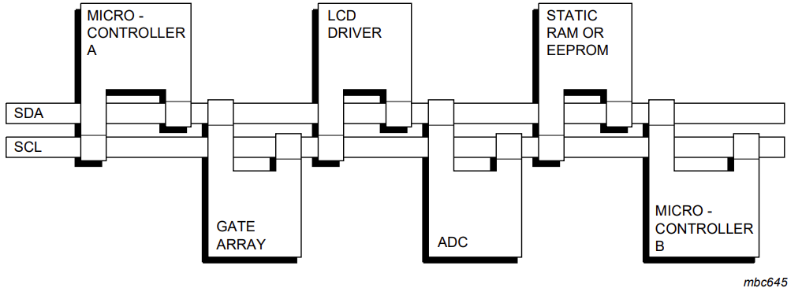
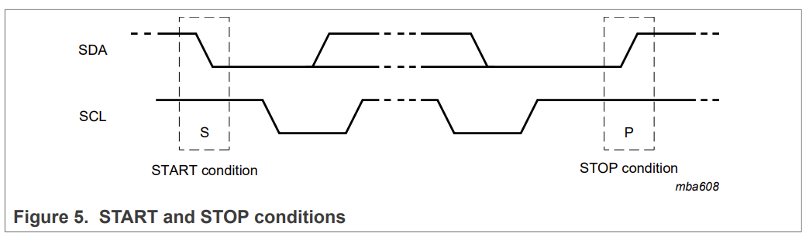
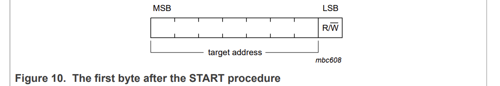
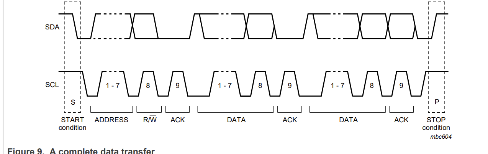

# I2C（Inter-Integrated Circuit）

[官方文档](https://www.nxp.com/docs/en/user-guide/UM10204.pdf)


## 1.I2C 协议基础架构

物理层设计

* 双线制通信：

SDA（Serial Data Line）：数据传输线，双向开漏输出

SCL（Serial Clock Line）：时钟信号线，由主设备控制

它使用一种主从结构，其中有一个主设备（Master）和一个或多个从设备（Slave）。主设备控制通信过程，而从设备被动地接受主设备的控制并进行数据的发送和接收。

下面是I2C通信的基本步骤：

1. 主设备发送一个开始信号，表示开始通信。
2. 主设备发送一个从设备的地址和读/写位。地址用于选中特定的从设备，读/写位用于指示数据的方向（读或写）。
3. 选中的从设备确认收到地址并发送应答信号。
4. 主设备继续发送或接收数据。
5. 数据传输完成后，主设备发送停止信号，表示通信结束。




## 2.I2C的特性

I2C具有以下几个重要的特性，使其成为广泛应用的串行通信协议：

1. 双向通信: I2C支持双向数据传输，即主设备既可以发送数据给从设备，也可以接收从设备发送的数据。
2. 多主模式: I2C允许多个主设备连接到同一条总线上，通过仲裁机制来选择唯一的主设备进行通信，其余的主设备则成为从设备。
3. 多从模式: I2C总线可连接多个从设备，每个从设备都有唯一的7位或10位地址，主设备通过地址来选择要与之通信的从设备。
4. 速率灵活: I2C总线的速率可以根据应用需求进行灵活调整，常见的速率有100 kHz、400 kHz和1 MHz。
5. 低成本: I2C总线只需要两根线来进行通信，降低了硬件成本和复杂性。

**缺点** ：
* 速率较SPI慢；
* 数据帧限制为8位


## 3.I2C的应用场景


1. 传感器与微控制器之间的通信: 例如温度传感器、湿度传感器、加速度计等。传感器作为从设备连接到总线上，微控制器作为主设备进行数据采集和控制。

2. 存储器芯片: I2C被用于与存储器芯片（如EEPROM和RTC芯片）进行通信，实现数据的读写和时钟的管理。

3. 控制外设设备: I2C可以用于与各种外围设备进行通信，如LED驱动器、LCD控制器、扩展IO芯片等，实现控制和数据传输。

4. 显示器控制器: 很多液晶显示器控制器也使用I2C协议进行配置和控制，如OLED显示屏、液晶显示模块等。

5. 工业自动化领域: I2C在工业自动化领域广泛应用，例如工业传感器、PLC等。


## 4.I2C的注意事项


1. 电平兼容性: 主设备和从设备的电平必须兼容，以确保正常的通信。请注意检查数据手册，了解电平要求并进行必要的电平转换。

2. 电容和电阻: I2C总线上的电容和电阻对通信速度和稳定性有重要影响。确保总线上的负载电容和上拉电阻的数值符合设备规范，以避免通信问题。

3. 时钟速率选择: 选择合适的时钟速率，以兼顾通信速度和系统稳定性。过高的时钟速率可能导致通信误差，而过低的时钟速率则会降低通信效率。

4. 仲裁机制: 当多个主设备同时尝试访问总线时，I2C使用仲裁机制来决定哪个设备能够继续进行通信，其他设备则等待。

5. 异常处理: I2C通信过程中可能发生异常，如从设备无响应、通信超时等。在编写代码时，要考虑异常处理机制，以确保系统能够正确处理这些异常情况。


## 5.I2C通信传输机制

I2C通信步骤可以理解为：满足开始条件--寻找地址--数据传送--满足终止条件

满足开始条件：空闲状态下，SCL为高电平时，将总线的SDA从高电平拉低成低电平，即满足起始条件，之后总线进入繁忙状态。

满足终止条件：空闲状态下，SCL为高电平时，将总线的SDA从低电平拉高至高电平，即满足终止条件，在满足终止条件一段时间后，总线进入空闲。

(起始和停止条件一般都由主机产生)



寻找地址：通信开始时（起始条件或者重复起始条件之后），主机发送一个地址帧来指定与之通信的从机，在发送停止条件之前，指定的从机一直有效。

主机寻址是拿着大喇叭广播的过程，即发送地址到每个与其连接的从设备，从设备接收到地址之后与自己的地址进行比较。

I2C通信寻址有7位和10位寻址方式，并且支持两种寻址模式的器件可以连接到同一条总线。

在7位寻址模式中，起始条件之后的第一个字节由目标地址和传输方向组成，目标地址占7位，1位读/写位， R/ W，0表示发送/写,1表示请求数据/读。





(在10位寻址模式中，地址帧占两个字节，第一个字节的前五个最高有效位为11110（默认值）用于标识10位地址模式，后两位为××，有4种模式组合。)

数据传输：

数据的传输遵循下图所示的格式：起始(S)-地址（Address）-传输方向（R/W）-停止（P）



主机在起始条件S后发送了一个从机地址。这个地址共有7位，紧接着的第8位是数据方向位： R/ W，0表示发送/写,1表示请求数据/读。

地址匹配一致接收到ACK位后，主机根据 R/ W定义的方向一帧帧传输数据，以8位为一个数据帧长度，先发最高有效位（MSB）

数据传输一般由主机产生的停止位P终止，但是如果主机仍希望在总线上通讯它可以产生重复起始条件Sr和寻址另一个从机，而不是首先产生一个停止条件。在这种传输中可能有不同的读/写方式结合。


速记：

1. 开始信号（Start Signal）：通信开始时，主设备发送一个低电平的SCL时钟脉冲，然后再发送一个低电平的SDA数据线脉冲。这个SDA的下降沿表示I2C总线上的一个开始信号，表明接下来是一次新的通信。

2. 从设备地址和读/写位传输：主设备发送从设备地址到I2C总线。I2C地址由7位或10位组成，取决于使用的设备。地址的最低位用于指示读（1）或写（0）操作。主设备发送地址后，等待从设备的应答。

3. 仲裁机制和应答（Acknowledge）：从设备收到地址后，它以一个低电平的SDA应答位来确认接收到地址。主设备检测到这个应答位，以确定从设备是否存在。如果从设备存在并正确收到地址，则发送一个应答（0）信号；如果未正确接收到地址，则不发送应答（1）信号。

4. 数据的传输遵循下图所示的格式：起始(S)-地址（Address）-传输方向（R/W）-停止（P）。

5. 停止信号（Stop Signal）：通信完成后，主设备发送一个停止信号，它由一个高电平的SCL时钟脉冲和一个高电平的SDA数据线脉冲组成。这个SDA的上升沿表示I2C总线上的一个停止信号，表明通信结束。


## 结合我的工作谈一谈：

我之前工作时候，参与设计了MCU与EC之间的通信，用的就是I2C，其中MCU做主，EC做从，现在基于我当时写的AURIX 代码，把 I²C 讲透：

下面把头文件 + 源文件串成一条“从上到下”的 I²C 驱动流程图，按“做了什么 → 线上发生了什么（时序/协议）”来讲。


SCL（时钟）、SDA（数据）都用[开漏（open-drain）](./opendrain&pushpull.md)驱动，靠上拉电阻拉成高电平。

```c
#define EC_SCL_PIN IfxI2c0_SCL_P13_1_INOUT
#define EC_SDA_PIN IfxI2c0_SDA_P13_2_INOUT
#define I2C_BAUDRATE 100000
#define EC_I2C_ADDRESS 0x68
```

引脚：EC_SCL_PIN / EC_SDA_PIN 接到 I²C0 外设；I²C是开漏 + 上拉的“线与”总线。

速率：I2C_BAUDRATE = 100 kHz（Standard-mode）。

地址：EC_I2C_ADDRESS = 0x68（7 位）。上线发的是 ADDR[6:0] + R/W。

寄存器表（EC RAM）：0x00 CHIPID、0x01 PWR_STATUS、0x02 HEARTBEAT、0x03 SYSTEMMODE… —— 读写都以“先指针，后数据”的套路进行。


~~~c
// 偏移、长度、属性
#define RAMOFFS_OF_CHIPID     0x00
#define LENGTH_OF_CHIPID      1
#define RAMOFFS_OF_PWR_STATUS 0x01
#define LENGTH_OF_PWR_STATUS  1
#define RAMOFFS_OF_HEARTBEAT  0x02
#define LENGTH_OF_HEARTBEAT   1
#define RAMOFFS_OF_SYSTEMMODE 0x03
#define LENGTH_OF_SYSTEMMODE  1
~~~

传输是以8位为单元数据传输的，先传输最高位(MSB)，主芯片发出start信号之后，然后发出9个时钟传输数据。
（1）开始信号（S）：SCL为高电平时，SDA高电平向低电平跳变，开始传送数据。
（2）结束信号（P）：SCL为高电平时，SDA由低电平向高电平跳变，结束传送数据。
（3）响应信号(ACK)：接收器在接收到8位数据后，在第9个时钟周期，拉低SDA
SDA上传输的数据必须在SCL为高电平期间保持稳定，SDA上的数据只能在SCL为低电平期间变化。如图

这是一块“内存映射寄存器表”：I²C 访问套路是先告诉从机要访问哪个偏移（RegOff）→ 再读/写数据。

放到波形上，就是常见的“寄存器读写事务”：

写寄存器：START → ADDR+W → RegOff → Data…（每字节后从机ACK）→ STOP

读寄存器：START → ADDR+W → RegOff → REPEATED START → ADDR+R → 读N字节（前N-1个主机ACK，最后1个主机NACK）→ STOP


## Q & A


## Reference

[I2C（IIC）通信协议详解与应用](https://www.cnblogs.com/Goforyouqp/p/17606930.html)

[I2C通信概述](https://zhuanlan.zhihu.com/p/712401154)