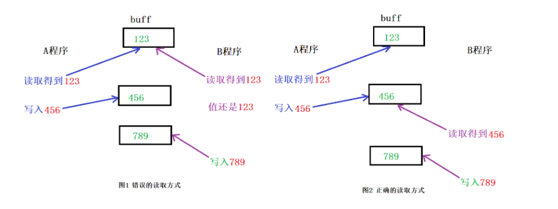

---
layout: note
title: "RTOS 基础"
date: 2025-07-07
excerpt: "入门实时操作系统（RTOS）的核心概念、调度模式与典型应用，为后续深入嵌入式系统开发和项目实践打下基础。"
categories: embedded
tags:
  - RTOS
  - 嵌入式
  - 实时操作系统
---

# RTOS 基础

本文介绍实时操作系统（RTOS, Real-Time Operating System）的基本概念与典型任务调度模式。内容涵盖 RTOS 的作用、常见架构、任务优先级与时间管理机制，帮助你建立对嵌入式实时系统的完整认知，并为实际工程开发和面试打好理论基础。

---


<!--
> 基于Freertos的RTOS，来写的本篇文章

## 1. RTOS 的作用

在裸机系统中，所有的程序基本都是自己写的，所有的操作都是在一个无限的大循环 里面实现。
现实生活中的很多中小型的电子产品用的都是裸机系统，而且也能够满足需求。 
但是为什么还要学习 RTOS 编程，偏偏还要整个操作系统进来？

随着产品 要实现的功能越来越多，单纯的裸机系统已经不能够完美地解决问题，反而会使编程变得 更加复杂，如果想降低编程的难度，我们可以考虑引入 RTOS 实现多任务管理，这是使用 RTOS 的最大优势。

一般学习的第一步都是用API来实现多任务管理，RTOS的API是一个抽象的概念，实际上RTOS的API是对底层硬件的封装。

为了方便调试，还是需要去了解 RTOS 的底层原理。

FreeRTOS 版权

* FreeRTOS 由美国的 Richard Barry 于 2003 年发布，Richard Barry 是 FreeRTOS 的拥有 者和维护者，在过去的十多年中 FreeRTOS 历经了 9 个版本，与众多半导体厂商合作密切， 累计开发者数百万，是目前市场占有率最高的 RTOS。
* FreeRTOS 于 2018 年被亚马逊收购，改名为 AWS FreeRTOS，版本号升级为 V10，且 开源协议也由原来的 GPLv2+修改为 MIT，与 GPLv2+相比，MIT 更加开放，你完全可以理 解为是为所欲为的免费。V9 以前的版本还是维持原样，V10 版本相比于 V9 就是加入了一 些物联网相关的组件，内核基本不变。亚马逊收购 FreeRTOS 也是为了进军眼下炒的火热 的物联网和人工智能。


FreeRTOS 是一款 “开源免费”的实时操作系统，遵循的是 GPLv2+的许可协议。这里说 到的开源，指的是你可以免费得获取到 FreeRTOS 的源代码，且当你的产品使用了 FreeRTOS 且没有修改 FreeRTOS 内核源码的时候，你的产品的全部代码都可以闭源，不用开源，但是当 你修改了 FreeRTOS 内核源码的时候，就必须将修改的这部分开源，反馈给社区，其它应用部 分不用开源。免费的意思是无论你是个人还是公司，都可以免费地使用，不需要掏一分钱。


## 2. RTOS 的移植

FreeRTOS 包含 Demo 例程和内核源码（比较重要，我们就需要提取该目录下的大部分 文件）。
FreeRTOS 文件夹下的 Source 文件夹里面包含的是 FreeRTOS 内 核的源代码，
我们移植 FreeRTOS 的时候就需要这部分源代码；FreeRTOS 文件夹下的 Demo 文件夹里面包含了 FreeRTOS 官方为各个单片机移植好的工程代码，FreeRTOS 为了 推广自己，会给各种半导体厂商的评估板写好完整的工程程序，这些程序就放在 Demo 这 个目录下，这部分 Demo 非常有参考价值。


**往裸机工程添加 FreeRTOS 源码**

首先在裸机工程模板根目录下新建一个文件夹，命名为“FreeRTOS”，并且在 FreeRTOS 文件夹下新建两个空文件夹，
分别命名为“src” 与“port”，src 文件夹用于保存 FreeRTOS 中的核心源文件，也就是我们常说的 ‘.c 文件’，
**port 文件夹用于保存内存管理以及处理器架构相关代码**，这些代码 FreeRTOS 官方已经提供给我们的，直接使用即可，在前面已经说了，FreeRTOS 是软件，我们的开发版是硬件，软硬件必须有桥梁来连接，这些与处理器架构相 关的代码，可以称之为 RTOS 硬件接口层，它们位于 FreeRTOS/Source/Portable 文 件夹下。
“include”文件夹，它是我们需要用到 FreeRTOS 的一些头文件，将它直接拷贝。


-->

## 8.1 内存管理


| 文件名        | 优点                  | 缺点            | 说明                                                                                   |
| ---------- | ------------------- | ------------- | ------------------------------------------------------------------------------------ |
| `heap_1.c` | 分配简单，时间确定           | 只分配，不回收       | **最基础**的策略。只支持线性分配，比如像栈一样一直向后分配，**没有释放机制**。优点是**极快且稳定**，适合初始化阶段或一次性分配内存的场景（如游戏关卡加载）。 |
| `heap_2.c` | 动态分配，最佳匹配           | 有碎片，时间不定      | 引入了**空闲块管理机制**，会尝试“最优匹配”（如 best-fit），更智能，但缺点是**可能产生碎片**，比如有很多小块被占用却无法合并，且查找耗时不确定。    |
| `heap_3.c` | 调用标准库函数（如 `malloc`） | 速度慢，时间不定      | 直接使用 `malloc/free` 等系统库函数，优点是**通用性强**，缺点是**系统开销大、不适用于硬实时系统**。适合通用 C 程序或操作系统级分配。      |
| `heap_4.c` | 相邻空闲内存可合并           | 可解决碎片问题，但时间不定 | 在 `heap_2` 的基础上新增了**空闲块合并功能**（coalescing），可以合并相邻的空闲块来减少碎片，但合并过程需要遍历，仍然**耗时不确定**。     |
| `heap_5.c` | 支持分隔的内存块（多区域）       | 可解决碎片问题，但时间不定 | 在 `heap_4` 上扩展，支持**多内存区域/分区分配（如小对象池、大块池）**。适合复杂系统如 RTOS，效率和内存利用率进一步提高。               |


> 这些 heap_*.c 文件是实现不同策略的堆内存管理器，类似于我们平时使用的 malloc/free，但它们更接近底层，可以用于嵌入式或自定义内存池等场景。


### 8.1.1 关于heap_1.c

heap_1.c 是 FreeRTOS 提供的最简单的内存管理器实现。它只支持线性分配内存，不能释放已分配的内存块。适用于那些只需要一次性分配内存的场景，比如游戏关卡加载等。由于没有释放机制，它的内存使用效率较低，但速度非常快且稳定。

它只实现了 pvPortMalloc，没有实现 vPortFree。 如果你的程序不需要删除内核对象，那么可以使用 heap_1。FreeRTOS 在创建任务时，需要 2 个内核对象：task controlblock(TCB)、stack。（TCB任务控制块和栈）。


在 FreeRTOS 中，每当你调用 `xTaskCreate()`（或类似的 API）来创建一个新任务时，内核会为该任务分配两块关键资源：

1. **TCB（Task Control Block，任务控制块）**
   TCB 是一个结构体，保存了任务的所有管理和调度信息，包括：

   * 任务状态（就绪／运行／阻塞／挂起）
   * 优先级（`uxPriority`）
   * 任务名（`pcTaskName`）
   * 指向任务栈顶和栈底的指针
   * 上下文寄存器保存区（用于切换时保存 CPU 寄存器）
   * 任务句柄（`TaskHandle_t`）
   * 任务通知／事件／消息队列／信号量等同步对象的引用

   内核通过 TCB 来跟踪每个任务，决定哪个任务该运行、该阻塞，以及保存／恢复任务的上下文。

2. **Stack（任务栈）**
   每个任务都有自己独立的栈空间，用于保存：

   * 函数调用时的返回地址
   * 局部变量
   * 临时寄存器数据
   * 中断／异常发生时的寄存器上下文

   当任务被上下文切换（context switch）出去时，FreeRTOS 会把 CPU 寄存器的值压入这块栈里；当任务重新切回时，再从栈里恢复寄存器。这个栈空间通常由你在创建任务时传入的 `usStackDepth`（以 `StackType_t` 为单位）决定，或由你传入的指针指定。


为什么 heap\_1 只实现 `pvPortMalloc` 而没有 `vPortFree`

FreeRTOS 提供了多种内存管理方案（heap\_1、heap\_2、heap\_3、heap\_4、heap\_5），它们都用来给内核对象（如 TCB、stack）、队列、定时器等分配内存。

* **heap_1**

  * 只有 `pvPortMalloc()`，没有 `vPortFree()`。
  * 适合那些运行时不需要销毁／删除内核对象（任务、队列、信号量等）的系统。
  * 实现简单、占用最少。

如果你的程序在运行过程中从不删除任务、队列或其他对象，就可以用 heap\_1，省去内存管理的复杂性；但如果需要动态删除，就得选用支持释放的方案，如 **heap\_2**（简单的 malloc/free）、**heap\_4**（更高效的碎片整理）等。

---

## 8.2 RTOS移植与中断管理  (因地制宜)

关于移植的过程是有官方样例的。

[英飞凌 AURIX™ TC3xx 系列单片机上移植 FreeRTOS 实时操作系统](https://zhuanlan.zhihu.com/p/1900486114571171676)

---
## 8.3 中断机制

中断是嵌入式系统中非常重要的概念，RTOS 中的中断处理需要特别注意。FreeRTOS 提供了一些机制来安全地处理中断和任务切换。

在RTOS中，需要应对各类事件。这些事件很多时候是通过硬件中断产生。假设当前系统正在运行Task1任务，用户按下了按键，触发了按键中断。

* 硬件负责： CPU跳到固定地址去执行代码，这个固定地址通常被称为中断向量
* 软件负责: 
    * 1. 保存现场：Task1被打断，需要先保存Task1的运行环境，比如各类寄存器的值；
    * 2. 调用处理函数（这个函数就被称为ISR，interrupt service routine）;
    * 3. 恢复现场：ISR执行完毕后，需要恢复Task1的运行环境，继续执行Task1。

---
## 8.4 消息队列

消息队列是 FreeRTOS 中用于任务间通信的重要机制。它允许一个任务将数据发送到另一个任务，或者从另一个任务接收数据。消息队列具有先进先出（FIFO）的特性，确保数据的顺序性。

在裸机系统中，两个程序间需要共享某个资源通常使用全局变量来实现；但在含操作系统(下文就拿FreeRTOS举例)的开发中，则使用消息队列完成。那么这两者有啥区别呢？

  其实在FreeRTOS系统中也能够像裸机似的，使用**全局变量实现多程序共享某个资源（这里资源就可称为临界资源）**，则多个程序都能随时访问同一个临界资源，这时若两个程序同时访问同一个临界资源来完成两次资源读写操作，假如两个程序读取操作是同时完成，但是写入操作有先后之别，那么最后实际完成的操作就会是一个。例如下图：



看完上图后，大家可能会想：两者结果相同，无所谓了。但是呢，如果此时再来个C程序恰好读取到的值为456，那么是不是跟最终结果789存在偏差呢！！！

因此，在FreeRTOS系统中，引入了消息队列来实现某个资源共享，**其不仅仅实现临界资源共享，也给临界资源提供保护，使得程序更加稳定。**

有多个消息发送到消息队列时，通常将先进入队列的消息先传给任务，也就是说，任务一般读取到的消息是最先进入消息队列的消息，即先进先出原则（FIFO），但也支持后进先出原则（LIFO）


---
## 面试常见问题

1. **RTOS 的作用是什么？为什么要使用 RTOS？**

   RTOS 主要用于管理多任务，提供任务调度、时间管理、资源共享等功能。它使得嵌入式系统能够同时处理多个任务，提高系统响应速度和资源利用率。RTOS 特别适合实时性要求高的应用，如工业控制、汽车电子等。

2. **FreeRTOS中的调度策略是什么？**

   FreeRTOS使用抢占式调度策略。这意味着如果有更高优先级的任务变得可运行（例如，它刚刚完成了一个等待操作），当前运行的任务将被中断，调度器将切换到更高优先级的任务。这确保了关键任务能够及时响应。


3. **如何在FreeRTOS中创建任务？**

   在 FreeRTOS 中，可以使用 `xTaskCreate()` 函数来创建任务。该函数需要传入任务函数指针、任务名称、栈大小、任务参数、优先级和任务句柄等参数。创建成功后，任务将被添加到就绪队列中等待调度执行。

```c
#include "FreeRTOS.h"
#include "task.h"

void vBlinkTask(void *pvParameters)
{
    const TickType_t xDelay = pdMS_TO_TICKS(500);
    for (;;)
    {
        // 翻转 LED
        ToggleLED();
        // 延时 500 ms（让出 CPU）
        vTaskDelay(xDelay);
    }
}

int main(void)
{
    // 硬件初始化
    SystemInit();
    LED_Init();

    // 创建 Blink 任务
    BaseType_t xResult;
    TaskHandle_t xBlinkHandle = NULL;
    xResult = xTaskCreate(
        vBlinkTask,          // 任务函数
        "Blink",             // 任务名
        128,                 // 栈深度：128 words
        NULL,                // 入口参数
        tskIDLE_PRIORITY+1,  // 优先级：比空闲任务高一级
        &xBlinkHandle        // 任务句柄
    );

    if (xResult == pdPASS)
    {
        // 启动调度器，开始多任务
        vTaskStartScheduler();
    }
    else
    {
        // 创建失败：可能内存不足
        ErrorHandler();
    }

    // 不会走到这里
    for (;;);
}
```


4. **FreeRTOS如何管理内存？**
 
    FreeRTOS提供了几种内存管理方案。默认情况下，它使用一个单一的固定大小的堆，但你也可以实现自己的内存管理策略，比如使用动态内存分配。此外，FreeRTOS还提供了4种不同的内存分配方法，包括使用静态分配和动态分配的块。

    [内存管理](#81-内存管理)


5. **FreeRTOS如何处理中断？**

    在FreeRTOS中，中断处理程序应该尽可能快速地执行并返回，以最小化中断服务例程（ISR）的执行时间。在ISR中，应避免执行复杂的操作或阻塞调用。如果需要执行长时间运行的任务，应将任务推迟到普通的任务上下文中执行。此外，FreeRTOS提供了一种机制，允许从中断上下文中安全地调用任务。

    [中断机制](#83-中断机制)


6. **FreeRTOS中的队列是什么？它们有什么用途？**

    队列是FreeRTOS中的一种中间件，它允许任务之间通过发送和接收消息来通信。队列是一种先进先出（FIFO）的数据结构，任务可以向队列发送数据，其他任务则可以从队列中取出数据。队列对于任务解耦和同步非常有用，因为它们允许任务以异步的方式交换信息。

    [消息队列](#84-消息队列)


7. **FreeRTOS中的信号量有哪些类型？**

    FreeRTOS中有三种主要类型的信号量：二值信号量、计数信号量和递归信号量。二值信号量用于锁定资源，类似于互斥锁，它们只能有两个状态：获取或释放。计数信号量可以用于管理多个相同的资源，或者用来同步多个任务。递归信号量是计数信号量的一种特殊形式，允许同一个任务多次获取同一个资源。

    * Binary Semaphore：异步事件通知，常在 ISR 与任务间使用。
    * Counting Semaphore：管理 N 份相同资源，或允许累积多个事件。
    * Recursive Mutex：同一任务可重复加锁，解决层层调用时的自锁问题，并具备优先级继承。


8. **如何配置FreeRTOS的内核？** （一般有官方参考）
    配置FreeRTOS内核通常包括定义堆栈大小、设置时钟滴答率、**定义任务优先级、选择调度策略**等。这通常在系统的初始化代码中完成，使用vPortDefineObjects、vPortSetupTimerInterrupts、vPortStartScheduler等函数。此外，还需要根据硬件和应用需求配置中断和外设。

    FreeRTOS 源码包里的 Demo 目录或者官方文档通常提供了详细的配置示例。


9. **FreeRTOS中的软件定时器是什么？它们如何工作？**
    
    软件定时器是FreeRTOS提供的一种机制，允许任务在将来的某个时间点被唤醒。软件定时器不是真正的硬件定时器，而是使用FreeRTOS的调度器和 **时钟滴答（SysTick）** 来模拟的。任务可以创建一个软件定时器，并将其与任务函数关联。当定时器到期时，关联的任务将被添加到就绪列表中，以便在下一个调度点执行。


## References

* [英飞凌 AURIX™ TC3xx 系列单片机上移植 FreeRTOS 实时操作系统](https://zhuanlan.zhihu.com/p/1900486114571171676)
* [FreeRTOS 秋招面试问题及答案](https://zhuanlan.zhihu.com/p/1917295242819908301)
* [【RTOS】中断机制](https://blog.csdn.net/qq_43340911/article/details/138909001)
* [FreeRTOS中消息队列](https://blog.csdn.net/qq_53960242/article/details/128795993)