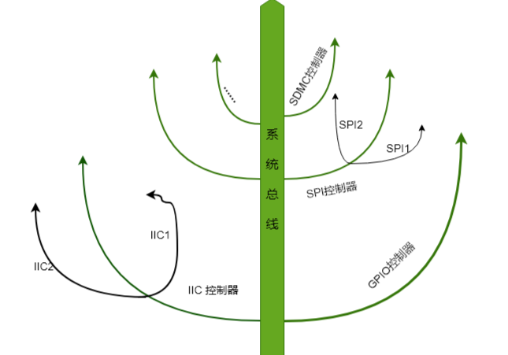

## 历史因素

在linux的早期是不存在设备树的，大家都在对应的arch文件夹中增加自己芯片的板机信息，使得文件过多，从而导致linux的文件过于冗杂，因此
设备树应运而生，将这些硬件信息从linux分离出来，用专属的文件格式来进行描述，dtsi，类似与头文件，一般用.dts描述板机信息（也就是开发板上有多少个IIC设备、SPI设备等），dtsi描述SOC级信息（也就是SOC有几个CPU、主频是多少、多少个外设控制寄存器信息等）。

## info

Device Tree Source：采用了树形结构来描述开发板信息，比如CPU数量、内存基地址、IIC接口上接了那些设备、SPI接口上接了那些设备等。

设备树源文件扩展名为.dts  --(DTC工具)--(编译)-->>> 得到.dtb文件

语法一般包括：.dtsi头文件， 设备节点

https://zhuanlan.zhihu.com/p/665624816
