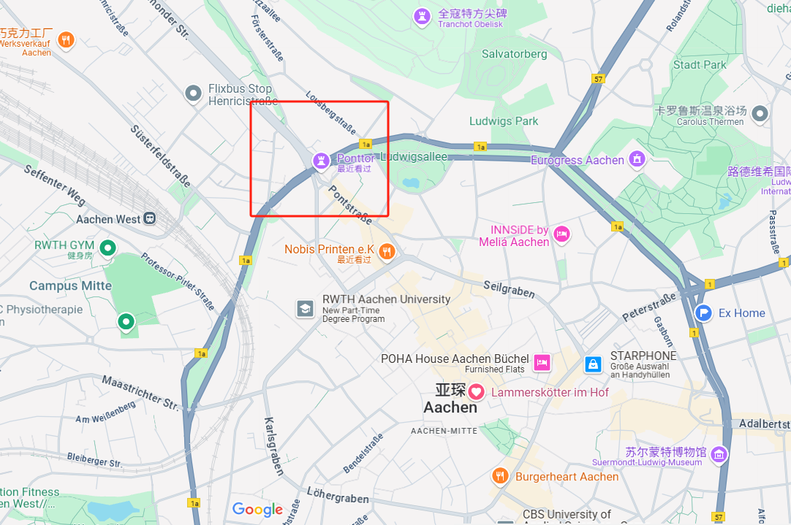
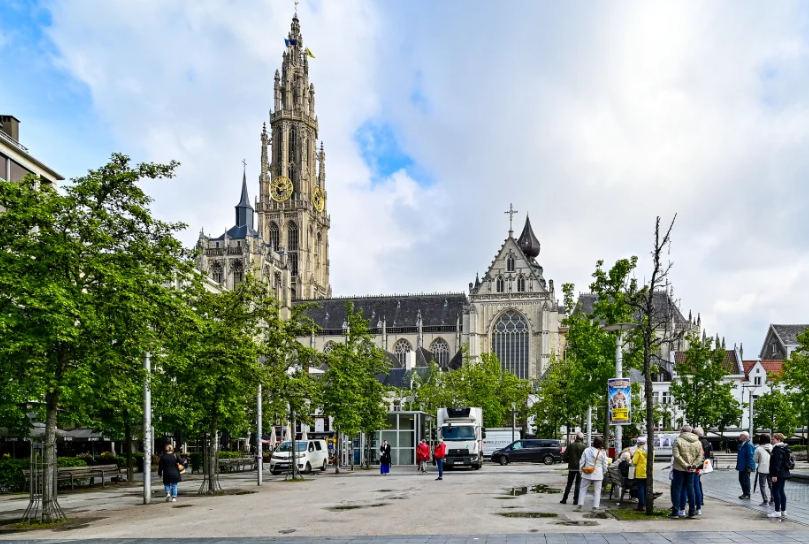
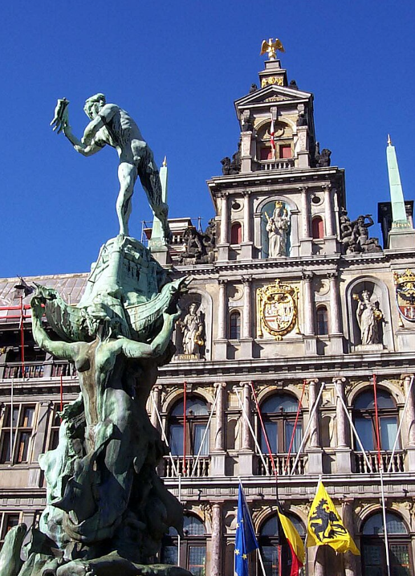
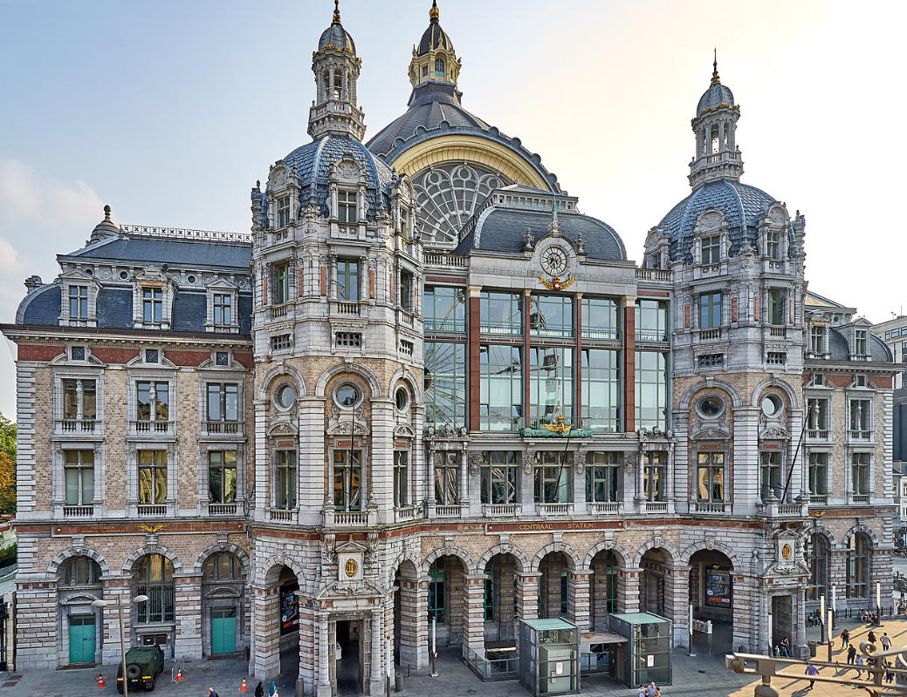
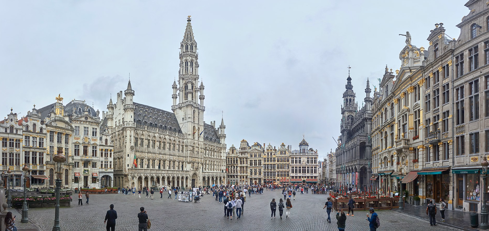
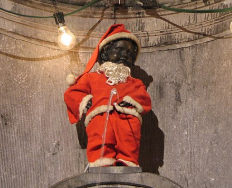

---
title: 比利时两日自驾游攻略
date: 2025-07-20
author: 张子健
layout: note
categories: [旅行, 比利时]
tags: [自驾, 布鲁日, 根特, 亚琛出发]
excerpt: 亚琛出发，两天自驾游览比利时五城的详细攻略，包括路线、美食、停车和景点讲解。

---

# 🇧🇪 合理规划 · 比利时自驾 2 日游（住布鲁塞尔）

## 📌 行程总览

| 日期           | 行程                    | 停留城市          | 晚上住宿   |
| ------------ | --------------------- | ------------- | ------ |
| **7月20日（日）** | 亚琛 → 鲁汶 → 安特卫普 → 布鲁塞尔 | 3 城打卡 + 回布鲁塞尔 | 布鲁塞尔   |
| **7月21日（一）** | 布鲁塞尔 → 根特 → 布鲁日 → 亚琛  | 2 城深游 + 回德国    | 亚琛（返回） |

---

## 📅 Day 1：7月20日（周日）
从杜塞尔多夫（Düsseldorf）到亚琛（Aachen）的路程大约 **1 小时**，建议早上 **8:00 出发**，以避开交通高峰。

**Aachen避免进去市区限行区域，建议在之后的观光中骑小滑板车或步行游览。**

导航地址：**Turmstraße 1, Aachen**

> 🏠 这是我家，不在市区限行范围内，方便会合和出发。

> 🕘 我们预计在 **9:00 左右碰面**。

---

### 🕗 09:00 亚琛出发

* ✅ **建议**：

  * 提前一晚加满油，整理行李
  * 早餐吃饱，轻装出行
* 🛣️ **路线**：走 **E40/E314** 高速直达鲁汶（Leuven），全程约 **1.5 小时**，路线看导航，都可以

### 🚩 10:30 – 13:00 【鲁汶 Leuven】

⛪ **鲁汶市政厅**：被誉为“比利时最美哥特建筑”，极致雕花
📚 **大学图书馆**：美国资助重建，是战争记忆的象征
🍺 若早上想尝试当地特色，可拍照留念 **旧市场广场**

**所有的停车建议都是GPT生成的，可能不完全准确，请提前确认。**

🅿️ 停车建议：Parking Ladeuzeplein（中心）
📍 地址：Herbert Hooverplein 15，€2/h

🍴 推荐午餐：麦当劳（McDonald's）或 KFC（快餐）

> 我第一次去鲁汶时就吃了麦当劳还有 KFC，感觉还不错。

🅿️ 停车建议：Q-Park Groenplaats（中心）
或预算优先选择 P+R Linkeroever + 地铁进城

---

### 🚗 13:00 出发 → 安特卫普（Antwerpen）

全程约 **60 公里**，预计行驶时间 **1 小时**

---

### 🚩 14:00 – 16:30 【安特卫普 Antwerpen】

🎨 **圣母大教堂（Onze-Lieve-Vrouwekathedraal）**

> 高耸的哥特式教堂塔楼是城市地标，内部收藏有鲁本斯的经典祭坛画。

> 🔍 **与中国有关？**	
> 圣母大教堂的修复工作曾得到中国政府的支持，尤其是在2008年汶川地震后，比利时和中国之间的文化交流得到了进一步加强。	

🏛️ **大广场（Grote Markt）** 和市政厅

> 广场中央的布拉博喷泉象征着安特卫普建城的传说——巨人之手被砍断后扔入河中，“Antwerpen”即“扔手”之意。

🚉 **安特卫普中央火车站（Antwerpen-Centraal）**

> 被誉为“世界最美火车站之一”，气势恢宏、宫殿般的车站建筑。
> 🔍 **与中国有关？**
> 安特卫普火车站的部分扩建工程资金，**确实与清朝晚期的“庚子赔款”有关**。比利时是庚子赔款的分配国之一，这笔赔款在比利时部分用于教育与公共建设，其中就包括火车站现代化工程的推进。

> 📸 建议一定去主站大厅打卡拍照——圆顶穹顶 + 金色钟表极其壮观。

🛍️ **梅尔大街（Meir）**

> 主购物街，连接火车站与市中心，有 Zara、H\&M 也有本地甜点店。

我觉得可以不去。

🍰 推荐下午茶：（GPT推荐的，我不知道XD）

* **Normo Coffee**（极简工业风）
* **Frites Atelier**（主厨级薯条店）

**所有的停车建议都是GPT生成的，可能不完全准确，请提前确认。**

🅿️ 停车建议：Q-Park Groenplaats（地下车库）
📍 Groenplaats 46, 2000 Antwerpen，约 €3/h
或预算有限选择：**P+R Linkeroever**（免费 + 电车进城）

非常好，我将基于你这段完成的内容，继续生成接下来的行程部分：**从安特卫普出发 → 布鲁塞尔（傍晚抵达并游览 + 住宿）**，保持一致的 Markdown 风格与语气：

---

### 🚗 16:30 出发 → 布鲁塞尔（Brussels）

全程约 **45 公里**，预计行驶时间 **50 分钟**。

> 如果遇上节假日（如国王节前后）或周日傍晚，布鲁塞尔进城可能有轻微拥堵，请预留缓冲时间。

---

### 🚩 17:30 – 20:00 【布鲁塞尔 Brussels】

🏛️ **大广场（Grand Place）**

> 被誉为“欧洲最美广场”，是布鲁塞尔的城市核心。四周环绕金灿灿的公会大楼、市政厅、国王之家。
> 傍晚灯光亮起后气氛非常好，是拍照留念的绝佳时间段。

**Tip：可以试试旁边的华夫饼，还蛮不错的。**

👶 **小尿童雕像（Manneken Pis）**

> 布鲁塞尔最可爱的城市象征，小巧但有趣，常被穿上各种节日服装（如果正好赶上换装可以拍照留念）。

背景故事：
 - 其中一个是1142年，霍德弗里德三世领军对抗外敌，
就在军队落败之际，公爵将自己的小儿子放在摇篮里挂在树下，用来激励军队士气，最后得以击败了敌军，
得以凯旋。
 - 另外一个流行的故事是一位叫于连（荷兰语：Julianske，法语：Julien）的男童半夜起来尿尿，
 看到邻居的房子伸出一条燃烧中的引信（一说是遇到法军正要以火药炸城），小孩找不到水源扑灭，
 灵机一动用洒尿把引信熄灭解救受困的人，为了感念这个小童而在原地做个石雕像永远保留，供后人凭吊。

>目前的这尊青铜小于连像建于1619年，由比利时雕刻家老热罗姆·迪凯努瓦
（荷兰语：Hiëronymus Duquesnoy de Oudere，法语：Jérôme Duquesnoy l'Ancien）所打造的，
保存在布鲁塞尔城市博物馆。目前布鲁塞尔大广场附近原址展示的是1965年的版本。雕像曾被盗窃达七次之多。

🌿 **Mont des Arts 蒂尔登山丘花园**

> 推荐爬上阶梯，在高处俯瞰布鲁塞尔城市中轴线（含市政塔楼、老城区）。
> 夏季傍晚非常适合散步 + 观景拍照。

个人建议：如果时间有限，可以不去。没听说过，而且感觉有点像巴黎荣军院，可以不去。

🛍️ **圣于贝尔长廊（Galeries Royales Saint-Hubert）**

> 欧洲最早的玻璃穹顶商业街之一，两侧有巧克力店、咖啡厅、手工艺品小店。走累了可以在这休息。

🍽️ 晚餐推荐：（GPT，也可以麦麦）

* **Chez Léon**（Rue des Bouchers 18）

  > 地道比利时风味：青口锅（Moules Frites）、炖牛肉（Carbonade）、配比利时啤酒。适合体验正餐。

* **Noordzee Mer du Nord**（Place Sainte-Catherine）

  > 比利时特色立食海鲜摊：煎扇贝、炸比目鱼块、鱼汤，体验轻松惬意的街头晚餐。

---

### 🛏️ 住宿：布鲁塞尔市区

建议提前确认是否：

* 提供停车位或推荐附近车库
* 允许免费/优惠过夜停车

**所有的停车建议都是GPT生成的，可能不完全准确，请提前确认。**

🅿️ 停车建议：Interparking Grand Place（地下车库）
📍 Rue du Marché aux Herbes 104, 1000 Bruxelles，约 €3/h
或考虑选酒店本身自带地下停车位（市区常见）

---

## ✅ Day 2 行程规划：7月21日（周一 · 比利时国王节）

> 📢 **国王节提示**：早上 **10点左右** 在皇家宫殿（Royal Palace）附近通常有仪仗交接/庆典活动，适合顺路打卡一波。布鲁塞尔中心可能局部封路，但步行不受影响。

---

### 🚩 08:30 – 10:30 【布鲁塞尔（节日氛围早游）】

🎉 **国王节活动建议路线**：

1. 🚶‍♂️ 从酒店出发步行前往 **皇家广场（Place Royale）**
2. 👑 **布鲁塞尔王宫（Royal Palace）** 外观打卡（如有升旗仪式，可停留观赏）
3. 🌳 穿过 **布鲁塞尔公园（Parc de Bruxelles）**，散步放松
4. 🎭 如果附近有国王节舞台或活动（如现场表演），可现场决定是否多停留

☕ 建议早餐后找家街边咖啡店坐一会儿，感受布鲁塞尔人节日的早晨（推荐 **Aksum Coffee House**）

🕙 10:30 回酒店取车，准备出城

---

### 🚗 10:30 出发 → 根特（约60km，1小时）

---

### 🚩 11:30 – 13:00 【根特 Gent】 （可选择性放弃）

> 时间稍压缩，但可重点看城堡 + 教堂。

> 小城市，精华景点集中，适合快速打卡。

🏰 **格拉文斯汀城堡**（外观 or 快速参观）
⛪ **圣巴夫大教堂**（入内看《神秘的羔羊》真迹，约需20分钟）

🚤 如时间富余、天气好，可选坐一次 **运河船**（约35分钟）

☕ 推荐快拿一杯咖啡打包走人：**Take Five Espresso**

🅿️ 停车建议：Parking Ramen

---

### 🚗 13:00 出发 → 布鲁日（约50km，45分钟）

---

### 🚩 13:45 – 16:30 【布鲁日 Brugge】

**TIP：布鲁日是比利时最受欢迎的旅游城市之一，但是时间不够的话可以抛弃根特，直接游览布鲁日。**

🔔 **钟楼 Belfry**：如不排队可考虑登塔
🏞️ **白天鹅水道 + 情人桥**：重点漫步区
🏛️ **市政厅 + 圣血教堂**：步行范围内全打卡
🍫 **巧克力采购时间**：The Chocolate Line or Dumon 都不错

🍴 推荐晚午餐（简化为 45 分钟内解决）：

* **Gran Kaffee De Passage**（本地菜+环境好）
* 或 **That's Toast**（Brunch 风味，轻快）

🅿️ 停车建议：Parking 't Zand

---

### 🚗 16:30 出发 → 亚琛（约230km，2.5小时）

预计抵达时间：**19:00 正常情况下可回到德国**

> ⚠️ 若你希望 20:00 前到家，建议布鲁日不晚于 16:30 出发

---

## 🗺️ 📍 导航链接总览（点击即跳转 Google Maps）

| 路线段落                     | 出发地 → 目的地                                                                                                            | 谷歌地图导航 |
| ------------------------ | -------------------------------------------------------------------------------------------------------------------- | ------ |
| 杜塞尔多夫 → 亚琛（Turmstraße 1） | [Düsseldorf → Turmstraße 1, Aachen](https://www.google.com/maps/dir/Düsseldorf/Turmstraße+1,+52072+Aachen,+Germany/) |        |
| 亚琛 → 鲁汶                  | [Aachen → Leuven](https://www.google.com/maps/dir/Turmstraße+1,+Aachen,+Germany/Leuven,+Belgium/)                    |        |
| 鲁汶 → 安特卫普                | [Leuven → Antwerp](https://www.google.com/maps/dir/Leuven,+Belgium/Antwerp,+Belgium/)                                |        |
| 安特卫普 → 布鲁塞尔              | [Antwerp → Brussels](https://www.google.com/maps/dir/Antwerp,+Belgium/Brussels,+Belgium/)                            |        |
| 布鲁塞尔 → 根特                | [Brussels → Ghent](https://www.google.com/maps/dir/Brussels,+Belgium/Ghent,+Belgium/)                                |        |
| 根特 → 布鲁日                 | [Ghent → Bruges](https://www.google.com/maps/dir/Ghent,+Belgium/Bruges,+Belgium/)                                    |        |
| 布鲁日 → 亚琛（返程）             | [Bruges → Aachen](https://www.google.com/maps/dir/Bruges,+Belgium/Turmstraße+1,+Aachen,+Germany/)                    |        |

---

